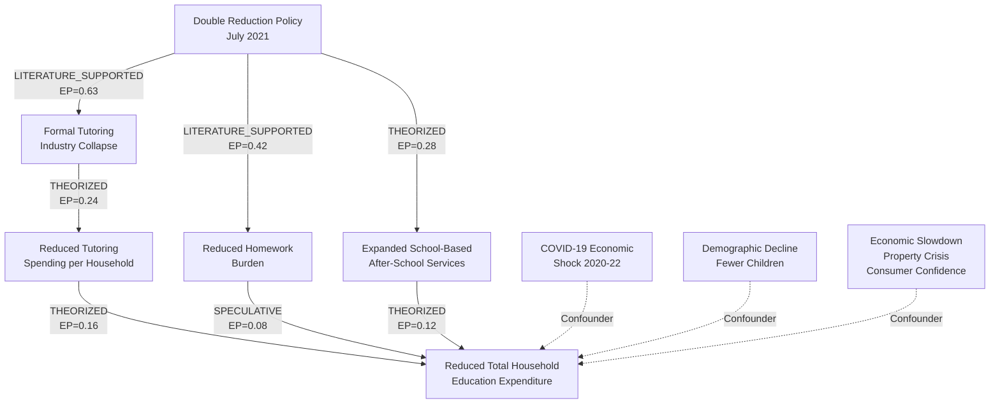
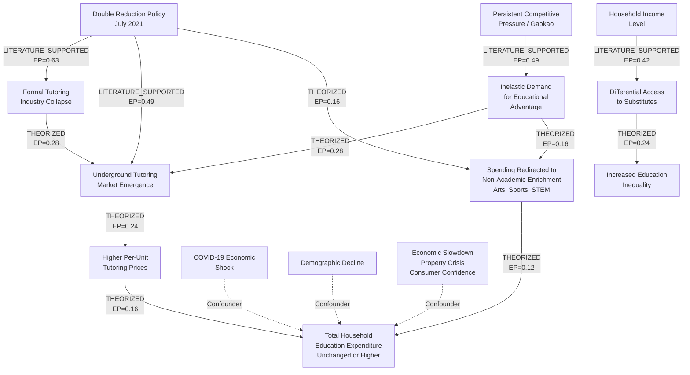
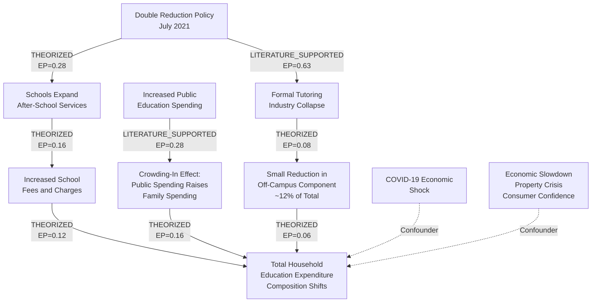

# DISCOVERY.md -- Phase 0, Steps 0.1-0.2

**Analysis:** china_double_reduction_education
**Question:** Did China's Double Reduction policy truly reduce household education expenditure?
**Generated:** 2026-03-29
**Agent:** hypothesis-agent (Phase 0, Steps 0.1-0.2)

---

## Summary

China's Double Reduction (shuangjian) policy, issued July 2021, banned for-profit academic tutoring for compulsory-education students with the stated goal of reducing family education burden. The central analytical question is whether this intervention actually reduced total household education expenditure, or whether spending was merely redirected into alternative channels (underground tutoring, in-school fees, non-academic enrichment, overseas pathways). Competing causal structures suggest the policy may have reduced visible tutoring spending while leaving total education expenditure unchanged or even increasing it for certain income strata, due to demand inelasticity and substitution effects. Empirical evidence is mixed: the formal tutoring industry collapsed (89% decline in job postings within 4 months), but underground tutoring emerged rapidly, and in-school expenses -- which constitute approximately 73% of household education costs at the national average (CIEFR-HS 2019 wave; this share varies by income quintile and urban/rural location, and may have shifted between the 2017 and 2019 waves) -- were never targeted by the policy.

---

## Question Decomposition

### Domain

| Level | Domain |
|-------|--------|
| Primary | Education policy / public economics |
| Secondary | Behavioral economics (household decision-making under regulation) |
| Adjacent | Labor economics (tutoring industry employment), sociology of education (inequality, status competition), political economy (central vs. local government implementation) |

### Entities

- **Policy:** Double Reduction policy (Opinions on Further Reducing the Homework Burden and Off-Campus Training Burden of Students in Compulsory Education, July 24, 2021)
- **Government actors:** State Council, Ministry of Education, provincial/municipal education bureaus, 12-department enforcement coalition
- **Households:** Chinese families with children in compulsory education (grades 1-9, ages 6-15)
- **Students:** Approximately 160 million compulsory-education students
- **Tutoring industry:** For-profit academic tutoring firms (New Oriental, TAL Education, VIPKid, thousands of smaller firms), estimated USD 70-300 billion industry pre-policy (range reflects wide variation across sources; the $300B upper bound is from Mordor Intelligence while lower estimates from other industry reports place the figure at $70-100B)
- **Underground tutoring market:** Informal, unlicensed private tutors and covert operations (~3,000 illegal operations detected in Q2 2022 alone)
- **Schools:** Public and private compulsory-education schools
- **Measurable variables:**
  - Total household education expenditure (yuan/year)
  - Off-campus tutoring expenditure (subset)
  - In-school fees and charges (subset, approximately 73% of total per CIEFR-HS national average; this composition varies by income quintile, urban/rural location, and survey wave -- see caveat below)
  - Non-academic enrichment spending (arts, sports, STEM camps)
  - Tutoring industry revenue and employment
  - Student homework hours and academic outcomes
  - Parental anxiety / subjective burden measures

### Relationships (Stated vs. Implied)

**Stated in the question:**
- Double Reduction policy -> household education expenditure (hypothesized negative/reducing relationship)

**Implied relationships (require testing):**
- Policy -> formal tutoring industry shutdown -> reduced tutoring spending (direct channel)
- Policy -> underground tutoring emergence -> redirected spending (substitution channel)
- Policy -> increased school-based services -> increased school fees (crowding-in channel)
- Policy -> competitive pressure persistence -> spending redirection to non-academic enrichment
- Income level -> differential policy impact (heterogeneous effects)
- Urban/rural location -> differential policy impact
- Policy enforcement intensity -> actual behavioral change (implementation fidelity)

### Timeframe

| Aspect | Value |
|--------|-------|
| Policy announcement | July 24, 2021 |
| Pre-policy baseline | 2016-2021 (CIEFR-HS waves, CFPS waves) |
| Post-policy observation | 2021-2025 |
| Analysis type | Mixed (historical comparison, current assessment) |
| Key inflection dates | July 2021 (policy announcement), September 2021 (enforcement begins), June 2024 (underground tutoring crackdown deadline) |

### Concerns

The question's framing -- "truly reduce" (zhenzheng jianshao) -- implies skepticism about the policy's stated effectiveness. The questioner likely suspects one or more of:

1. The policy reduced visible/formal tutoring spending but not total education expenditure
2. Spending was redirected rather than eliminated
3. The policy may have increased inequality by making tutoring available only to wealthy families who can afford private tutors
4. Official claims of success may not match household-level reality
5. The distinction between reducing the tutoring industry and reducing family financial burden is being conflated in policy discourse

A satisfying answer would need to:
- Quantify total household education expenditure before and after the policy (not just tutoring spending)
- Decompose spending into subcategories to detect substitution effects
- Disaggregate by income level and geography to detect heterogeneous effects
- Distinguish between formal industry metrics (which clearly declined) and household-level spending (which may not have)

### Hidden Assumptions

1. **Education expenditure is well-defined and measurable.** In reality, underground tutoring payments are cash-based and invisible to surveys. The true post-policy spending may be systematically underreported. Survey instruments designed pre-policy may not capture new spending categories (e.g., "study companion" services, educational travel, technology-mediated informal tutoring).

2. **The policy was uniformly implemented.** Implementation varies dramatically across provinces, between urban and rural areas, and between tier-1 cities and smaller cities. Treating the policy as a single binary treatment ignores this heterogeneity.

3. **Household education expenditure is the right outcome variable.** The policy's stated goals also include reducing homework burden and student stress. Expenditure is one dimension of "burden" -- time burden, psychological burden, and opportunity cost are others. Focusing on expenditure alone may miss the policy's broader effects.

4. **Correlation between policy timing and spending changes implies causation.** Many confounders coincide with the policy period: COVID-19 economic effects (2020-2022), demographic decline (falling birth rates), economic slowdown, and housing market downturn all independently affect household spending patterns.

5. **The tutoring industry's collapse equals household savings.** The formal industry lost 3 million jobs and billions in revenue, but this does not mean those funds stayed in household bank accounts. They may have been redirected to other education-adjacent spending.

6. **Compulsory education spending is the relevant scope.** Some families may have shifted spending toward earlier (preschool) or later (high school, overseas preparation) stages to compensate, creating spillover effects outside the policy's compulsory-education scope.

---

## First Principles

### Principle 1: Demand Inelasticity Under Status Competition

**Statement:** When education is a positional good used for social stratification, demand for educational investment is highly inelastic with respect to regulatory supply restrictions.

**Domain:** Behavioral economics, sociology of education

**Applicability:** China's gaokao (college entrance exam) system creates intense zero-sum competition. Education spending is driven not by absolute learning needs but by relative positioning against peers. A policy that restricts one channel of investment (tutoring) does not reduce the underlying competitive pressure -- it redirects investment to available substitutes.

**Conditions where it would NOT apply:** If the policy simultaneously reduced competitive pressure (e.g., by reforming the gaokao or university admissions), or if families lack substitutes and cannot redirect spending. Also less applicable if families are liquidity-constrained and the banned channel was their only option.

**Generality:** DOMAIN-SPECIFIC -- applies broadly to education systems with high-stakes sorting exams, but not to systems with lower competitive intensity.

### Principle 2: Regulatory Displacement (The Balloon Effect)

**Statement:** When regulation suppresses a market without eliminating the underlying demand, the activity migrates to unregulated channels, often at higher cost and lower quality.

**Domain:** Regulatory economics, public policy (parallels: prohibition, drug policy, financial regulation)

**Applicability:** The Double Reduction policy banned for-profit academic tutoring but did not reduce parental demand for academic advantage. Economic theory predicts the activity shifts underground, where prices rise due to scarcity and illegality risk premiums. Reports of 3,000+ illegal tutoring operations by Q2 2022 and continued parental demand support this mechanism.

**Conditions where it would NOT apply:** If enforcement is comprehensive enough to eliminate all substitutes (unlikely), or if the policy changes underlying preferences rather than just constraining supply.

**Generality:** UNIVERSAL -- this principle operates across any regulated market where demand persists after supply restriction. Drug prohibition, financial regulation, immigration policy all exhibit this pattern.

### Principle 3: Compositional Fallacy in Policy Evaluation

**Statement:** A policy can succeed at reducing a specific subcategory of expenditure while failing to reduce the aggregate, if spending shifts across categories within the same budget.

**Domain:** Public economics, program evaluation methodology

**Applicability:** The Double Reduction policy targeted off-campus academic tutoring, which represents only approximately 12% of total household education expenditure (per CIEFR-HS 2019 national average). In-school expenses (approximately 73% of total) were not targeted. Even a complete elimination of tutoring spending would leave the majority of education expenditure untouched. Moreover, if the policy induces substitution into other categories (non-academic enrichment, school fees, educational technology), total spending may remain constant or increase. **Caveat:** The 73/12/15 composition (in-school/tutoring/other) is a national average from the 2019 CIEFR-HS wave. It varies by income quintile (higher-income families allocate more to tutoring), by urban/rural location, and may have shifted between the 2017 and 2019 survey waves. Downstream phases must not treat this composition as an invariant structural parameter.

**Conditions where it would NOT apply:** If tutoring spending constituted the majority of household education expenditure, or if the policy also addressed in-school fees. Also less applicable if there are no available substitutes within the education spending category.

**Generality:** UNIVERSAL -- any policy evaluation that measures a subcategory rather than the aggregate risks this fallacy.

### Principle 4: Implementation Fidelity Gradient

**Statement:** The actual effect of a centrally mandated policy attenuates as it passes through layers of government, with local economic conditions, bureaucratic capacity, and political incentives modulating enforcement.

**Domain:** Political science, public administration

**Applicability:** China's Double Reduction policy was issued centrally but implemented by provincial and municipal education bureaus. Tier-1 cities (Beijing, Shanghai) with greater administrative capacity and political visibility likely enforced more strictly than tier-3/4 cities or rural areas. This creates a natural variation in treatment intensity that can be exploited analytically but also means "the policy" is not a single treatment.

**Conditions where it would NOT apply:** If enforcement were truly uniform, or if the policy relied on self-enforcement mechanisms (e.g., tax incentives) rather than regulatory prohibition.

**Generality:** CONTEXT-DEPENDENT -- applies to centralized policy systems with multi-level implementation.

---

## Causal DAGs

### DAG 1: Policy Success -- Direct Reduction Through Supply Destruction

This DAG represents the optimistic narrative: the policy successfully destroyed the formal tutoring industry, and this translated into genuine household savings.

#### Edge Table -- DAG 1

| Edge | Label | Truth | Relevance | EP | Justification |
|------|-------|-------|-----------|-----|---------------|
| Policy -> Formal Industry Collapse | LITERATURE_SUPPORTED | 0.90 | 0.70 | 0.63 | Empirically documented: 89% decline in tutoring job postings, 50% decline in firm entries, New Oriental laid off 60,000 staff (Biting the Hand that Teaches, ScienceDirect 2025). High relevance as the primary intended mechanism. |
| Industry Collapse -> Reduced Tutoring Spending | THEORIZED | 0.60 | 0.40 | 0.24 | Plausible but not directly measured at household level. Industry revenue declined, but household surveys may not capture the full picture. Underground substitution partially offsets. Moderate relevance -- tutoring is only ~12% of total education spending. |
| Reduced Tutoring Spending -> Reduced Total Expenditure | THEORIZED | 0.40 | 0.40 | 0.16 | Requires no substitution into other categories. Empirically questionable given CIEFR-HS finding that in-school costs dominate (73%). Only moderately relevant because it assumes no reallocation. |
| Policy -> Reduced Homework Burden | LITERATURE_SUPPORTED | 0.70 | 0.60 | 0.42 | Multiple surveys document reduced homework hours post-policy (Larbi & Fu 2025, SAGE). Relevance is moderate -- homework burden is related but distinct from expenditure. |
| Reduced Homework -> Reduced Total Expenditure | SPECULATIVE | 0.20 | 0.40 | 0.08 | Weak link: reduced homework might reduce demand for tutoring help, but the causal chain is indirect and unsubstantiated. |
| Policy -> School-Based Services | THEORIZED | 0.40 | 0.70 | 0.28 | Policy mandated expansion of school-based after-school care. Implementation varies. Relevance is high because this is a direct policy mechanism. |
| School-Based Services -> Total Expenditure | THEORIZED | 0.30 | 0.40 | 0.12 | Direction ambiguous: school services could reduce need for external tutoring (lowering costs) or could come with new fees (raising costs). |

#### DAG 1 Metadata

- **Core narrative:** The policy worked as intended. By destroying the formal tutoring industry, it eliminated a major source of household education spending. Combined with expanded school services and reduced homework, families genuinely spend less on education.
- **Key differentiator:** Assumes the formal industry collapse translates directly to household savings with minimal substitution.
- **Testable prediction:** Total household education expenditure (all categories) should show a statistically significant decline post-July 2021 relative to pre-policy trend, after controlling for COVID and demographic confounders. The decline should be largest for families that previously spent the most on tutoring.
- **Kill condition:** If total household education expenditure remains flat or increases post-policy, even as formal tutoring spending declines, this DAG is falsified. If underground tutoring spending plus formal tutoring spending equals or exceeds pre-policy tutoring spending, the supply destruction did not translate to savings.

---

### DAG 2: Regulatory Displacement -- Substitution and Underground Migration

This DAG represents the skeptical narrative: the policy destroyed the visible tutoring industry but household spending was redirected to underground tutoring, non-academic enrichment, and other channels, leaving total expenditure unchanged or higher.

#### Edge Table -- DAG 2

| Edge | Label | Truth | Relevance | EP | Justification |
|------|-------|-------|-----------|-----|---------------|
| Policy -> Formal Industry Collapse | LITERATURE_SUPPORTED | 0.90 | 0.70 | 0.63 | Same as DAG 1. Shared edge. |
| Policy -> Underground Market Emergence | LITERATURE_SUPPORTED | 0.70 | 0.70 | 0.49 | Ministry of Education itself reported ~3,000 illegal tutoring operations in Q2 2022 (Sixth Tone, 2022). Relevance is high as this is the core alternative channel. |
| Industry Collapse -> Underground Market | THEORIZED | 0.70 | 0.40 | 0.28 | Supply-side displacement: laid-off tutoring workers and shuttered firms have incentive to operate covertly. Moderate relevance as a mediating pathway. |
| Underground Market -> Higher Prices | THEORIZED | 0.60 | 0.40 | 0.24 | Standard economics: illegality creates scarcity premium and risk premium. Anecdotal reports of tutor prices doubling or tripling post-ban, but no systematic price data. |
| Higher Prices -> Total Expenditure Unchanged/Higher | THEORIZED | 0.40 | 0.40 | 0.16 | If quantity consumed drops but price per unit rises, total spending effect is ambiguous. Depends on price elasticity. |
| Policy -> Non-Academic Enrichment Redirection | THEORIZED | 0.40 | 0.40 | 0.16 | Parents may redirect educational ambition into non-academic channels (arts, sports, coding camps) not covered by the ban. Plausible but limited direct evidence. |
| Non-Academic Enrichment -> Total Expenditure | THEORIZED | 0.30 | 0.40 | 0.12 | Substitution keeps total spending constant. Evidence is largely anecdotal. |
| Competitive Pressure -> Inelastic Demand | LITERATURE_SUPPORTED | 0.70 | 0.70 | 0.49 | Well-documented in education economics literature. China's gaokao system and status competition create persistent demand for educational advantage (Zhang & Bray 2020, Park et al. 2016). |
| Inelastic Demand -> Underground Market | THEORIZED | 0.70 | 0.40 | 0.28 | Logical consequence of demand persistence under supply restriction. Standard regulatory economics prediction. |
| Inelastic Demand -> Non-Academic Redirection | THEORIZED | 0.40 | 0.40 | 0.16 | Substitution channel when primary channel is blocked. |
| Income Level -> Differential Access | LITERATURE_SUPPORTED | 0.70 | 0.60 | 0.42 | VoxChina (2024) documents lowest-income quartile spends 56.8% of income on education vs. 10.6% for highest. (Caveat: this figure is sourced from CIEFR-HS via VoxChina and may represent education spending as a share of total household expenditure rather than income; the original Wei (2024) paper should be verified in Phase 1.) Wealthy families have more substitution options. |
| Differential Access -> Inequality | THEORIZED | 0.60 | 0.40 | 0.24 | If wealthy families access underground tutoring while poor families cannot, educational inequality increases. Theoretically grounded but requires empirical verification. |

#### DAG 2 Metadata

- **Core narrative:** The policy succeeded in destroying the visible tutoring industry but failed to reduce household education spending because it did not address the underlying demand. Spending migrated to underground tutoring (at higher prices), non-academic enrichment, and other channels. The policy may have worsened inequality by making tutoring a privilege of the wealthy.
- **Key differentiator:** Introduces underground market emergence, price effects, and spending substitution as mediating pathways that break the link between industry collapse and household savings. Adds an inequality channel absent from DAG 1.
- **Testable prediction:** (a) Total household education expenditure should show no significant decline post-policy, or should decline less than the reduction in formal tutoring spending. (b) The composition of spending should shift: formal tutoring down, but underground tutoring + non-academic enrichment up. (c) The spending pattern should be heterogeneous by income: high-income families maintain or increase spending, low-income families may reduce it (not by choice but by loss of access).
- **Kill condition:** If total household education expenditure declines by approximately the same amount as formal tutoring spending declines (i.e., no substitution), this DAG is falsified. If underground tutoring markets are negligible and non-academic enrichment spending does not increase, the substitution mechanism is not operative.

---

### DAG 3: Compositional Shift -- In-School Cost Crowding-In

This DAG focuses on an under-discussed mechanism: the policy may have shifted the burden from off-campus tutoring to in-school fees, as schools expanded services or as public education funding structures changed.

**Structural constraint (not a causal edge):** In-school costs constitute approximately 73% of total household education expenditure (CIEFR-HS 2019 national average). This is a compositional identity that constrains the maximum impact of any policy targeting only off-campus tutoring (~12% of total). This structural fact is a boundary condition for DAG 3's testable predictions, not a causal relationship, and is therefore not represented as a directed edge in the DAG.

#### Edge Table -- DAG 3

| Edge | Label | Truth | Relevance | EP | Justification |
|------|-------|-------|-----------|-----|---------------|
| Policy -> Formal Industry Collapse | LITERATURE_SUPPORTED | 0.90 | 0.70 | 0.63 | Shared edge across all DAGs. |
| Policy -> Schools Expand Services | THEORIZED | 0.40 | 0.70 | 0.28 | Policy mandated school-based after-school care expansion. Implementation quality varies by locality. |
| School Service Expansion -> Increased Fees | THEORIZED | 0.40 | 0.40 | 0.16 | Schools may charge for expanded services. Some localities subsidize, others pass costs to parents. Evidence is scattered. |
| Increased Fees -> Total Expenditure Composition | THEORIZED | 0.30 | 0.40 | 0.12 | If school fees rise as tutoring fees fall, net effect on total expenditure is unclear. |
| Public Spending -> Crowding-In | LITERATURE_SUPPORTED | 0.70 | 0.40 | 0.28 | ScienceDirect (2025): "The increase in public education funding has not only failed to reduce the economic burden of family education, but has increased family education expenditure. Public education expenditure has a significant crowding-in effect on family education expenditure in compulsory education." |
| Crowding-In -> Total Expenditure | THEORIZED | 0.40 | 0.40 | 0.16 | If public spending raises family spending norms and expectations, total expenditure increases despite the tutoring ban. |
| In-School Costs Dominance -> Total Expenditure | *STRUCTURAL CONSTRAINT* (see note above) | -- | -- | -- | CIEFR-HS data: in-school expenses = ~73% of total education expenditure; extracurricular/tutoring = ~12%. This is a compositional identity, not a causal edge. It constrains the maximum effect of tutoring-targeted policy on total expenditure. Reclassified from causal edge to structural annotation per review. |
| Industry Collapse -> Small Off-Campus Reduction | THEORIZED | 0.40 | 0.20 | 0.08 | Even if tutoring spending goes to zero, this is ~12% of total -- a small effect on the aggregate. |
| Small Off-Campus Reduction -> Total Expenditure | THEORIZED | 0.30 | 0.20 | 0.06 | Marginal effect on total, easily overwhelmed by changes in the much larger in-school component. |

#### DAG 3 Metadata

- **Core narrative:** The policy targeted the wrong component of household education spending. Off-campus tutoring was only ~12% of total education expenditure. The dominant cost (73%) is in-school fees and charges, which the policy did not address. Moreover, increased public education spending has a documented crowding-in effect that raises rather than reduces family spending. The policy may have succeeded in its narrow goal (reducing tutoring) while failing at the broader goal (reducing family financial burden).
- **Key differentiator:** Focuses on the compositional structure of education spending rather than behavioral substitution. Even without any underground tutoring, the policy's scope was too narrow to meaningfully affect total expenditure.
- **Testable prediction:** (a) Off-campus tutoring spending should decline post-policy. (b) In-school spending should remain stable or increase. (c) Total education expenditure should show at most a small decline (~12% ceiling), likely less due to partial substitution. (d) Public education spending growth should positively correlate with household spending growth (crowding-in).
- **Kill condition:** If total household education expenditure declines by substantially more than the tutoring component (suggesting the policy triggered broader spending reductions through attitude change or reduced competitive norms), this DAG's "narrow scope" narrative is falsified.

---

### DAG Comparison

| Dimension | DAG 1: Policy Success | DAG 2: Regulatory Displacement | DAG 3: Compositional Shift |
|-----------|-----------------------|-------------------------------|---------------------------|
| Core mechanism | Supply destruction -> household savings | Supply destruction -> underground migration + substitution | Narrow targeting -> small compositional effect |
| Total expenditure prediction | Significant decline | No decline or increase | Small decline at most (~12% ceiling) |
| Underground tutoring role | Minimal or negligible | Central mechanism | Not the key issue |
| In-school costs role | Unchanged | Not addressed | Dominant and possibly increasing |
| Inequality prediction | Reduction (equal access to fewer services) | Increase (rich access underground, poor lose access) | Depends on school fee structure |
| Key shared edge | Policy -> Industry Collapse (all three) | Policy -> Industry Collapse | Policy -> Industry Collapse |
| Key unique edge | Industry Collapse -> Total Expenditure Reduction (direct) | Competitive Pressure -> Inelastic Demand -> Underground | Public Spending -> Crowding-In -> Total Expenditure (plus structural constraint: in-school costs ~73% of total) |

**What evidence would distinguish the DAGs:**

1. **Total household education expenditure trajectory post-2021:** Significant decline favors DAG 1; flat or increase favors DAG 2/3.
2. **Underground tutoring spending data:** If measurable and large, favors DAG 2; if negligible, weakens DAG 2.
3. **Composition of spending shift:** If in-school costs rise as tutoring falls, favors DAG 3; if all categories decline, favors DAG 1.
4. **Income-stratified analysis:** If high-income families maintain spending while low-income families reduce, strongly favors DAG 2 (inequality channel).
5. **Public education spending correlation with household spending:** Positive correlation (crowding-in) favors DAG 3.

**DAGs are not mutually exclusive.** In reality, all three mechanisms likely operate simultaneously with different weights across income strata and geographies. The analytical task is to estimate the relative magnitude of each mechanism.

**Note on joint EP and truncation thresholds.** Computing joint EP along multi-step causal chains (e.g., Policy -> Industry Collapse -> Reduced Tutoring -> Reduced Total Expenditure: 0.63 * 0.24 * 0.16 = 0.024) produces values below the hard truncation threshold (0.05) for all chains by construction. This is expected at Phase 0, where pre-data EP estimates are deliberately conservative. The truncation thresholds apply to Phase 3 sub-chain expansion decisions, not to Phase 0 DAG selection or viability. Individual edge EP values (not joint chain EP) are the relevant metric for Phase 0 prioritization and data acquisition targeting.

---

## Data Requirements Matrix

| Variable | DAG(s) | Role | Data Type | Temporal Granularity | Spatial Granularity | Min Time Span | Priority | Source Candidates |
|----------|--------|------|-----------|---------------------|--------------------:|---------------|----------|-------------------|
| Total household education expenditure | 1,2,3 | Outcome (dependent) | Survey microdata (yuan/year) | Annual | Provincial or household-level | 2016-2024 | CRITICAL | CFPS, CIEFR-HS, CHIP, NBS household survey |
| Off-campus tutoring expenditure | 1,2,3 | Mediator | Survey microdata (yuan/year) | Annual | Provincial or household-level | 2016-2024 | CRITICAL | CFPS, CIEFR-HS |
| In-school fees and charges | 3 | Mediator | Survey microdata (yuan/year) | Annual | Provincial or household-level | 2016-2024 | CRITICAL | CIEFR-HS, NBS |
| Non-academic enrichment spending | 2 | Mediator | Survey microdata (yuan/year) | Annual | Household-level | 2018-2024 | IMPORTANT | CFPS, CIEFR-HS |
| Tutoring industry revenue/employment | 1,2 | Treatment indicator | Industry statistics | Quarterly or annual | National | 2018-2024 | IMPORTANT | NBS, Ministry of Education, industry reports |
| Underground tutoring activity indicators | 2 | Mediator | Enforcement data, survey estimates | Annual | Provincial | 2021-2024 | IMPORTANT | Ministry of Education enforcement reports, media reports |
| Household income level | 2,3 | Confounder / effect modifier | Survey microdata | Annual | Household-level | 2016-2024 | CRITICAL | CFPS, NBS |
| Urban/rural classification | All | Effect modifier | Categorical | Static per wave | Household-level | N/A | IMPORTANT | CFPS, NBS |
| Province / city tier | All | Effect modifier | Categorical | Static per wave | Provincial | N/A | IMPORTANT | NBS classification |
| Public education expenditure (government) | 3 | Independent variable | Administrative data (yuan) | Annual | Provincial | 2010-2024 | IMPORTANT | NBS, Ministry of Finance education budget reports |
| Student homework hours | 1 | Mediator | Survey data | Annual | Household-level | 2018-2024 | USEFUL | CFPS, PISA (2018, 2022), CIEFR-HS |
| Parental anxiety / subjective burden | 1 | Outcome (secondary) | Survey Likert scale | Annual | Household-level | 2018-2024 | USEFUL | CFPS, specialized surveys |
| Number of children per household | All | Confounder | Demographic | Annual | Household-level | 2016-2024 | CRITICAL | CFPS, NBS |
| Policy enforcement intensity by locality | All | Treatment intensity | Administrative / index | Annual | Provincial or city-level | 2021-2024 | IMPORTANT | Ministry of Education reports, policy documents |
| Gaokao/zhongkao competition metrics | 2 | Independent variable | Administrative (admission rates) | Annual | Provincial | 2015-2024 | USEFUL | Provincial education bureaus |

### Priority Summary

- **CRITICAL (5 variables):** Total education expenditure, tutoring expenditure, in-school fees, household income, number of children per household. Without these, no DAG can be evaluated. Number of children is CRITICAL because demographic decline (births fell 47% from 2016-2024) is a first-order confounder that mechanically affects aggregate education spending; failing to control for it would conflate demographic trends with policy effects.
- **IMPORTANT (6 variables):** Non-academic enrichment, industry metrics, underground indicators, urban/rural, city tier, public spending, enforcement intensity. Needed to distinguish between competing DAGs.
- **USEFUL (3 variables):** Homework hours, parental anxiety, gaokao competition. Would increase confidence but not strictly necessary for core analysis.

### Methodological Note on Causal Identification

Given the policy's nationwide simultaneous implementation, standard difference-in-differences with a clean control group is challenging. Potential identification strategies include:

1. **Variation in enforcement intensity** across provinces/cities as a continuous treatment variable -- **INFEASIBLE** with current data (ds_017 failed; no regional enforcement intensity index available; ds_005 policy timeline is national-level only)
2. **Age/grade cutoff** -- the policy applies to compulsory education (grades 1-9) but not high school, creating a regression-discontinuity-like design at the grade 9/10 boundary -- **INFEASIBLE** with current data (requires household-level microdata with grade-level detail; CFPS post-2021 not available)
3. **Pre-policy spending trend extrapolation** -- synthetic control or interrupted time series comparing post-policy actuals to projected pre-policy trend -- **FEASIBLE** (NBS proxy data ds_001 provides 6 years pre-policy and 5 years post-policy; back-calculated 2016-2018 values introduce some uncertainty)
4. **Income-stratified analysis** -- testing whether the policy effect differs by income quintile (heterogeneous treatment effects) -- **PARTIALLY FEASIBLE** (limited to urban/rural macro split from NBS ds_009; quintile-level analysis not possible without CFPS microdata)
5. **Urban-rural and city-tier variation** -- exploiting geographic heterogeneity in both treatment intensity and market structure -- **PARTIALLY FEASIBLE** (urban/rural split available in NBS data; city-tier variation not available in any acquired dataset)

---

## Open Issues

1. **Underground tutoring is inherently unmeasurable.** Survey respondents may underreport illegal spending. No official data source systematically captures underground tutoring prices or participation. This is the single largest data challenge for testing DAG 2.

2. **CFPS and CIEFR-HS data access.** These are the most relevant microdata sources, but CFPS requires application through Peking University's ISSS, and CIEFR-HS through the China Institute for Educational Finance Research. Access may be restricted or delayed. The data acquisition agent will need to determine availability of public-use files.

3. **COVID-19 confounding.** The policy was implemented during the tail end of China's COVID-19 lockdown period. Disentangling the policy effect from the pandemic's impact on household spending is a major identification challenge. Any pre-post comparison must address this. **COVID operationalization (for downstream phases):** COVID confounding should be modeled through at minimum: (a) a binary indicator for the acute lockdown period (2020-Q1 2022 for China's zero-COVID policy), (b) an interaction term between COVID period and urban/rural classification (lockdowns were more severe in cities), and (c) robustness checks excluding 2020-2021 entirely to test whether post-COVID-recovery trends (2022-2025) alone show policy effects. The NBS data clearly shows a -19.1% COVID dip in 2020 and +27.9% rebound in 2021, providing natural markers for the COVID window.

4. **Demographic transition confounding.** China's birth rate has been declining sharply since 2016. Fewer children mechanically reduces aggregate education spending. Per-child spending is the correct metric, but some data sources report only household-level totals.

5. **Recency of the policy.** Only 3-4 years of post-policy data exist. Long-run equilibrium effects (if underground markets stabilize, if policy is relaxed) cannot yet be assessed.

6. **Publication bias.** Chinese academic publications on politically sensitive policies may self-censor findings that contradict official narratives. International publications may over-represent critical perspectives. Both biases should be noted when interpreting literature.

7. **Policy evolution.** The policy has been modified since 2021 -- notably the 12-department crackdown on underground tutoring (targeting June 2024), and reports of recent easing (VOA, 2024). The "policy" is not a static treatment.

8. **CHFS microdata as potential data callback target.** The China Household Finance Survey (CHFS), conducted by the Southwestern University of Finance and Economics, is a relevant microdata source that could provide post-policy household spending data with income stratification. It was not acquired during initial data search. If Phase 1 or Phase 3 agents require household-level post-policy data to test high-EP edges (particularly the income-stratified effects in DAG 2), CHFS should be prioritized as a data callback target (subject to the 2-callback limit).

9. **Economic slowdown confounding.** China's broader economic slowdown (property market crisis beginning 2021, rising youth unemployment, declining consumer confidence) is contemporaneous with the Double Reduction policy and independently affects household spending patterns. This confounder has been added to all three DAGs. Downstream phases must distinguish between spending changes driven by the education policy and those driven by macroeconomic deterioration. NBS consumer confidence indices or property price data may be needed as control variables.

---

## Code Reference

No scripts were used during the hypothesis generation phase. All analysis was conducted through structured reasoning, web search, and document review. Scripts will be developed by the data acquisition agent in Steps 0.3-0.4.

---

## Sources Consulted

- [Double Reduction Policy - Wikipedia](https://en.wikipedia.org/wiki/Double_Reduction_Policy)
- [Biting the Hand that Teaches: Economic Impact of Banning Private Tutoring](https://www.sciencedirect.com/science/article/abs/pii/S014759672500054X)
- [The Burden of Education Costs in China (VoxChina)](https://voxchina.org/show-3-346.html)
- [CIEFR-HS Household Expenditure on Education Key Findings (Wei 2024)](https://journals.sagepub.com/doi/full/10.1177/20965311241243389)
- [China Is Cracking Down on Hidden Tutoring Schools (Sixth Tone)](https://www.sixthtone.com/news/1011889)
- [Shadow Education Governance Policy in China (Frontiers)](https://www.frontiersin.org/journals/psychology/articles/10.3389/fpsyg.2023.1013243/full)
- [Does Increased Public Education Spending Reduce Family Burden? (ScienceDirect 2025)](https://www.sciencedirect.com/science/article/abs/pii/S1049007825001848)
- [Effects of Double Reduction on Commercial Tutoring (ScienceDirect 2024)](https://www.sciencedirect.com/science/article/abs/pii/S0738059324000117)
- [China Eases Pressure on Private Teaching Companies (VOA)](https://learningenglish.voanews.com/a/china-eases-pressure-on-private-teaching-companies/7846893.html)
- [A Review of Empirical Studies of Double Reduction Policy Effects (ERIC)](https://files.eric.ed.gov/fulltext/EJ1470305.pdf)
- [CFPS Data Portal (Peking University)](https://opendata.pku.edu.cn/dataverse/CFPS?language=en)
- [NBS Household Income and Consumption 2023](https://www.stats.gov.cn/english/PressRelease/202402/t20240201_1947120.html)
