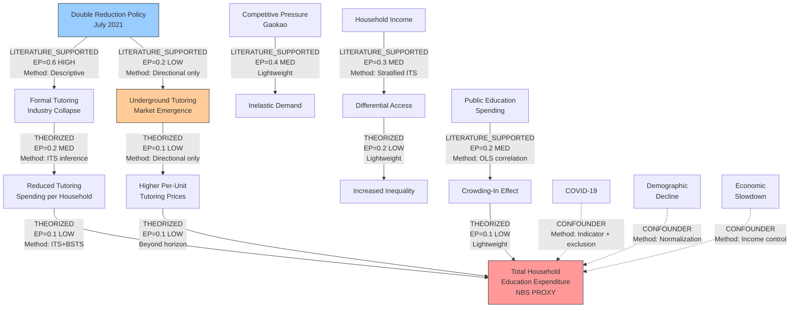

# Analysis Strategy: china_double_reduction_education

**Analysis:** china_double_reduction_education
**Question:** Did China's Double Reduction policy truly reduce household education expenditure?
**Generated:** 2026-03-29
**Agent:** lead-analyst (Phase 1)
**Analysis type:** Causal inference

---

## Summary

This strategy defines how to test whether China's July 2021 Double Reduction policy causally reduced household education expenditure. Three competing DAGs from Phase 0 propose distinct mechanisms: direct reduction via supply destruction (DAG 1), regulatory displacement via underground migration and substitution (DAG 2), and compositional irrelevance because tutoring was only approximately 12% of total education spending (DAG 3). The primary method is a 3-parameter Interrupted Time Series (ITS) model (intercept, pre-trend, level-shift) on CPI-deflated NBS education/culture/recreation proxy data, with COVID handled by excluding 2020 from estimation. Bayesian Structural Time Series (BSTS) provides a secondary counterfactual estimate, constrained to 1-2 covariates given n=5 pre-treatment observations. Urban-rural comparison is a descriptive stratified ITS (separate ITS per area with formal coefficient comparison), not a quasi-difference-in-differences design. All causal chains fall below the hard EP truncation threshold (0.05); a formal downscoping decision shifts the analysis from chain-level causal claims to edge-level assessment. The analysis is constrained by nine binding warnings from Phase 0, most critically: the outcome variable is a proxy (bundles culture and recreation with education), no post-policy household microdata exists, and COVID-19 temporally coincides with the policy. Conclusions will be framed as a consistency check against reference analyses, with directional findings and explicit uncertainty, not precise causal effect estimates.

---

## Conventions Compliance

### Causal Inference Conventions (`conventions/causal_inference.md`)

| Requirement | Status | Notes |
|---|---|---|
| Construct a DAG before selecting estimation strategy | Will implement | Three DAGs constructed in Phase 0; refined in this strategy |
| Every causal claim must survive at least 3 refutation tests (placebo, random common cause, data subset) | Will implement | Full refutation battery planned for all primary edges (Section 5) |
| Report effect sizes with confidence intervals, not just p-values | Will implement | All results will report point estimates with 90% CIs |
| Acknowledge and document all untestable assumptions | Will implement | Section 8 (Risk Assessment) enumerates untestable assumptions |
| Use DoWhy CausalTest pipeline for all causal edges | Will implement | ITS and BSTS wrapped in DoWhy estimator framework |
| Classification follows refutation-based taxonomy (DATA_SUPPORTED, CORRELATION, HYPOTHESIZED, DISPUTED) | Will implement | Phase 3 will classify each edge post-refutation |
| EP values updated after each refutation battery | Will implement | EP update protocol defined in Section 3 |
| Avoid treating correlation as causation without refutation | Will implement | All edges start as HYPOTHESIZED until refutation testing |
| No causal language for CORRELATION-classified edges | Will implement | Enforced in Phase 6 report writing |
| Avoid collider bias when conditioning on intermediate variables | Will implement | DAG structure guides conditioning sets |

### Panel Analysis Conventions (`conventions/panel_analysis.md`)

| Requirement | Status | Notes |
|---|---|---|
| Panel conventions applicability | Not applicable | With only n=2 units (urban, rural) and the urban-rural comparison reframed as descriptive stratified ITS (not quasi-DiD), formal panel analysis conventions do not apply. The comparison is two independent time series, not a panel regression. If Phase 2 EDA demonstrates parallel pre-trends and the comparison is upgraded to DiD, panel conventions will be revisited. |

### Time Series Conventions (`conventions/time_series.md`)

| Requirement | Status | Notes |
|---|---|---|
| Test for stationarity before modeling (ADF, KPSS) | Will implement | Pre-analysis stationarity checks on all series |
| Report autocorrelation structure (ACF/PACF) | Will implement | Included in Phase 2 EDA |
| Appropriate models: ARIMA for stationary, cointegration for non-stationary | Will implement | ITS uses segmented regression on levels; BSTS handles non-stationarity |
| Granger causality requires >=30 observations | Not applicable | Only 10 annual observations available; Granger causality is infeasible and will not be attempted |
| Report prediction intervals, not point forecasts | Will implement | BSTS provides posterior predictive intervals |
| Out-of-sample validation (temporal train/test split) | Will implement | Leave-last-2-years-out validation for pre-policy trend model |
| S-curve fitting with bootstrap CIs | Not applicable | No S-curve models planned |
| Avoid spurious regression between trending series | Will implement | Use CPI-deflated values; test for cointegration where applicable |
| Do not confuse Granger causality with true causality | Not applicable | Granger causality not used due to insufficient observations |
| No extrapolation beyond data support region | Will implement | Counterfactual projections limited to observed post-policy window |

---

## Reference Analysis Survey

Three published reference analyses inform this strategy.

### Reference 1: Huang, Liu, Ma & Tseng (2025) -- "Biting the Hand that Teaches"

| Aspect | Detail |
|---|---|
| **Identifier** | Huang et al. (2025), Journal of Comparative Economics, ScienceDirect |
| **Problem scope** | Economic impact of banning private tutoring on labor market and firm dynamics |
| **Signal definition** | Job posting decline, firm entry/exit rates, VAT revenue losses |
| **Extraction approach** | Difference-in-differences using cross-city variation in school-age population as continuous treatment intensity |
| **Baseline estimation** | Pre-policy city-level trends; two-way fixed effects |
| **Systematics** | City-level controls, spillover to arts/sports sectors |
| **Key result** | 3M+ job openings lost in 4 months; 11B RMB VAT losses in 18 months; 89% decline in education job postings; unintended negative spillover to arts/sports |

### Reference 2: Chen, Kang, Lu, Wei & Xing (2025) -- "Government Bans, Household Spending, and Academic Performance"

| Aspect | Detail |
|---|---|
| **Identifier** | Chen et al. (2025), SSRN working paper #5596490 |
| **Problem scope** | Direct measurement of household education expenditure changes and academic outcomes |
| **Signal definition** | Change in private tutoring spending, in-school spending, and student class rankings |
| **Extraction approach** | Panel analysis of nationally representative household survey (2017-2023); pre-post comparison with income stratification |
| **Baseline estimation** | Pre-policy household spending levels by income tier |
| **Systematics** | Income heterogeneity, urban/rural split, home tutoring substitution |
| **Key result** | 87.5% of tutoring facilities exited; private tutoring spending declined (concentrated among urban households); in-school spending increased; lower/middle-income students' rankings declined; highly educated parents substituted to home tutoring |

### Reference 3: Liu, Wang & Chen (2022) -- "Regulating Private Tutoring: Family Responses"

| Aspect | Detail |
|---|---|
| **Identifier** | Liu et al. (2022), SSRN working paper #4143464 |
| **Problem scope** | Family behavioral responses to the Double Reduction policy |
| **Extraction approach** | Staggered DiD exploiting city-level timing variation in policy rollout |
| **Baseline estimation** | Pre-policy city-level family behavior |
| **Systematics** | City population, education resource availability, substitution to one-on-one tutoring |
| **Key result** | Less reliance on private tutoring, more emphasis on family education; increased demand for one-on-one tutoring (substitution); smaller cities with more education resources reacted more visibly |

### Cross-Reference Implications

1. **All three references use some form of DiD or panel analysis** -- our analysis cannot replicate this because we lack household microdata post-policy. This is the fundamental constraint.
2. **Chen et al. (2025) directly answers our question** with household-level data showing private tutoring spending declined but in-school spending increased. Our macro-level analysis can provide an independent consistency check on the direction but not the decomposition.
3. **The substitution finding is consistent across references** -- Liu et al. find increased one-on-one tutoring demand; Chen et al. find in-school spending increases. This supports DAG 2/3 mechanisms.
4. **Our analysis adds value as an independent consistency check through**: (a) CPI-adjusted real spending trends through 2025 (extending beyond Chen et al.'s 2023 endpoint), (b) compositional analysis across all 8 NBS consumption categories, (c) formal causal DAG framework with EP propagation, (d) explicit COVID confounding treatment. The analysis does not claim to produce novel causal estimates but tests whether macro-level aggregate data are consistent with the micro-level findings from the references.

---

## 1. Signal Definition

### Target Signal

The target signal is a **structural break in the trajectory of real (CPI-deflated) per capita household education spending** coinciding with the Double Reduction policy implementation (July 2021).

Specifically, we seek to detect whether:
- The level of real education spending post-2021 is lower than what the pre-policy trend would predict (DAG 1 signal)
- The composition of spending shifted (formal tutoring down, substitutes up) without total change (DAG 2 signal)
- The spending trajectory shows at most a small perturbation consistent with the approximately 12% tutoring share ceiling (DAG 3 signal)

### Expected Effect Size

- **If DAG 1 (policy success):** Education spending should decline by 5-15% relative to counterfactual trend. Justification: tutoring was approximately 12% of total education spending (CIEFR-HS 2019); complete elimination with no substitution would yield approximately 12% decline. Partial elimination with partial substitution: 5-8%.
- **If DAG 2 (displacement):** Total spending approximately unchanged (0% +/- 5%), but composition shifts. Underground tutoring prices rose approximately 43-50% (anecdotal evidence, multiple media sources), partially offsetting volume decline.
- **If DAG 3 (compositional shift):** Small or zero decline in total, because 73% of costs (in-school) were untargeted. Public spending crowding-in may even increase total spending.

### Measurement Challenge

The NBS "education, culture and recreation" proxy bundles non-education spending. Post-COVID recovery in culture/recreation (tourism, entertainment) likely inflates the education trend by an unknown amount. This means a finding of "no decline" in the NBS proxy could mask a genuine education spending decline offset by culture/recreation recovery. Conversely, apparent stability could reflect true stability. **The proxy error is the single largest source of irreducible uncertainty in this analysis.**

### Known Confounders

| Confounder | Mechanism | Temporal Overlap | Severity |
|---|---|---|---|
| COVID-19 economic shock | Reduced all household spending in 2020; rebound in 2021-2022 | 2020-2022 overlaps fully with policy period | SEVERE |
| Demographic decline | Falling births (47% decline 2016-2024) reduces aggregate education spending | Secular trend, accelerating | MODERATE |
| Economic slowdown | Property crisis, youth unemployment, declining confidence | 2021-present | MODERATE |
| Policy evolution | 2024 enforcement escalation, then reported easing | Ongoing | MINOR for current analysis window |

### Prior Probability Estimates

Based on Reference 2 (Chen et al. 2025), which directly measured household spending:
- P(total education spending declined in real terms) = 0.45 (private tutoring down, but in-school spending up)
- P(formal tutoring spending declined) = 0.90 (strongly supported by all references)
- P(underground substitution is non-trivial) = 0.70 (supported by enforcement data and price evidence)

---

## 2. Baseline Enumeration

"Baseline" here means the null-hypothesis processes that could generate the observed spending trajectory without the Double Reduction policy having a causal effect.

### Baseline 1: Income-Driven Spending Growth (Dominant)

- **Mechanism:** Per capita disposable income grew 81% nominally (2016-2025). As income rises, households naturally spend more on education (income elasticity of education spending is typically >1 in developing economies).
- **Expected magnitude:** If education spending elasticity w.r.t. income is approximately 1.0-1.3, expected nominal education spending growth is 81-105% over the period, before any policy effect.
- **Why it enters the signal region:** Steady income-driven growth makes it difficult to detect a policy-induced level shift of 5-12%.
- **Estimation method:** Regression of real education spending on real income, estimated on pre-policy period (2016-2020), extrapolated to post-policy. **Data-driven.**

### Baseline 2: COVID-19 Spending Disruption (Dominant)

- **Mechanism:** The 2020 lockdown caused a 19.1% dip in education/culture/recreation spending; the 2021 rebound was 27.9%. This V-shape recovery pattern overwhelms any policy signal.
- **Expected magnitude:** The COVID-induced volatility (approximately 20% dip and 28% rebound) is larger than the expected policy signal (5-12%).
- **Why it enters the signal region:** The policy took effect during the rebound phase (July 2021), making it impossible to separate policy-induced suppression from post-rebound deceleration.
- **Estimation method (primary):** Exclude 2020 from the ITS estimation sample entirely. This avoids spending degrees of freedom on COVID indicators in a 10-observation series and yields a cleaner pre/post comparison (9 observations: 2016-2019, 2021-2025). **Data-driven (exclusion).** **Estimation method (sensitivity):** Include 2020 with a binary COVID indicator variable. This preserves all 10 observations but adds a parameter. Reported alongside primary for comparison. **Hybrid.**

### Baseline 3: Demographic Decline (Sub-dominant)

- **Mechanism:** Births fell from 17.86M (2016) to 9.54M (2024). Fewer school-age children mechanically reduces aggregate education spending, even if per-child spending is unchanged or rising.
- **Expected magnitude:** The birth rate decline is gradual and lagged (children born in 2016 enter school in 2022-2023), so the effect on compulsory education enrollment is just beginning.
- **Why it enters the signal region:** A downward pressure on aggregate spending that coincides with the post-policy period.
- **Estimation method:** Normalize spending by compulsory education enrollment (or child population 0-14) to remove demographic confounding. **Data-driven.**

### Baseline 4: Culture/Recreation Recovery Inflating Proxy (Sub-dominant)

- **Mechanism:** Post-COVID recovery in non-education components (tourism, entertainment, cultural events) of the NBS "education, culture and recreation" category inflates the proxy upward, masking any education-specific decline.
- **Expected magnitude:** Unknown. Culture and recreation sectors recovered strongly in 2023-2024 (China's domestic tourism expenditure reached pre-pandemic levels by 2023).
- **Why it enters the signal region:** If the proxy shows stability or growth, it may be because culture/recreation growth offsets education spending decline.
- **Estimation method:** Compare education/culture/recreation share of total consumption against other categories. If education's share declines while overall spending rises, the proxy inflation is operative. Cross-reference with the 8-category consumption data (ds_008). **Data-driven.**

### Baseline 5: Pre-Existing Downward Trend (Minor)

- **Mechanism:** CIEFR-HS data shows per-student education expenditure was already declining before the policy (10,372 yuan in 2017 to 6,090 yuan in 2019).
- **Expected magnitude:** If the pre-existing trend continued, some post-policy decline would be observed regardless of the policy.
- **Why it enters the signal region:** A post-policy decline in the NBS proxy could be a continuation of the pre-existing trend rather than a policy effect.
- **Estimation method:** Test for structural break at the policy date against a null of continued pre-existing trend. If no break detected, the pre-existing trend is the more parsimonious explanation. **Data-driven (trend-break test).**

### Reconciliation: NBS vs CIEFR-HS Pre-Policy Trend Contradiction

The CIEFR-HS data shows per-student education expenditure *declining* pre-policy (10,372 yuan in 2017 to 6,090 yuan in 2019), while the NBS "education, culture and recreation" proxy was *rising* over the same period. These trends are contradictory and must be explicitly reconciled.

**Explanation:** The divergence is itself evidence of proxy composition shift. If household education spending (as measured by CIEFR-HS at the micro level) was declining while the NBS aggregate proxy (which bundles education with culture and recreation) was rising, the implication is that the culture/recreation component was growing faster than the education component. This means:

1. The NBS proxy was already a poor tracker of education spending trends *before* the policy, not only after COVID.
2. The magnitude of proxy bias may be larger than assumed. If culture/recreation was growing at, say, 10% annually while education was declining at 5% annually, the NBS proxy would show growth even as the education component shrank.
3. This directly bears on the expected policy effect: a post-policy decline in education spending could be fully masked by continued culture/recreation growth in the NBS proxy.

**Implication for analysis:** The pre-policy NBS trend cannot be interpreted as a pre-policy *education spending* trend. The ITS counterfactual (extrapolating the pre-policy NBS trend) may overstate expected education spending and thus overstate the apparent policy effect. This uncertainty is irreducible with available data and will be carried as the primary systematic uncertainty.

### Baseline Method Comparison (Mandatory)

For the dominant baselines (income growth and COVID), two estimation methods are compared:

| Baseline | Method A | Method B | Comparison |
|---|---|---|---|
| Income growth | Linear regression of real education spending on real income (pre-policy) | Education spending as share of total consumption (ratio method, removing income effect) | Method A gives more precise counterfactual but assumes stable elasticity. Method B is model-free but loses level information. **Selected: Both. Method A as primary, Method B as robustness.** |
| COVID disruption | Exclude 2020 from ITS estimation sample (9 observations remain) | Include 2020 with binary COVID indicator (preserves all 10 observations but adds a parameter) | Exclusion is cleaner and preserves degrees of freedom in the primary 3-parameter model. Indicator method is a sensitivity check. **Selected: Both. Exclusion as primary, indicator as sensitivity.** |

---

## 3. EP Assessment (Phase 1 Update)

### EP Update Rules Applied

1. **MEDIUM quality data:** truth reduced by 0.1 from Phase 0 (minimum 0.1)
2. **LOW quality data:** truth capped at 0.3
3. **ITS identification (moderate strength):** no truth adjustment (ITS is valid but not as strong as RDD or IV)
4. **Proxy variable for outcome:** additional truth reduction of 0.05 for all edges terminating in "Total Expenditure" (reflects irreducible proxy uncertainty)

### EP Comparison Table

EP values are rounded to one decimal place. The second decimal is noise given the qualitative nature of truth and relevance inputs. Each EP estimate carries a qualitative confidence tier reflecting certainty in the truth and relevance components: **HIGH** (both truth and relevance grounded in multiple data sources), **MEDIUM** (one component relies on a single source or proxy), **LOW** (both components are uncertain or data quality is LOW).

| Edge | DAG | Phase 0 EP | Phase 1 Truth | Phase 1 Relevance | Phase 1 EP | Confidence | Change | Justification |
|---|---|---|---|---|---|---|---|---|
| Policy -> Industry Collapse | All | 0.6 | 0.8 (-0.1 MEDIUM data) | 0.7 | 0.6 | HIGH | -0.1 | Industry collapse well-documented across multiple references; data is MEDIUM quality (mixed sources, market size uncertainty) |
| Industry Collapse -> Reduced Tutoring Spending | 1 | 0.2 | 0.5 (-0.1 MEDIUM) | 0.4 | 0.2 | MEDIUM | -0.0 | No direct household measurement; NBS proxy is MEDIUM; relevance uncertain |
| Reduced Tutoring -> Reduced Total Expenditure | 1 | 0.2 | 0.3 (-0.1 MEDIUM, -0.05 proxy) | 0.4 (reduced: proxy weakens relevance) | 0.1 | LOW | -0.1 | Proxy variable makes this edge nearly untestable at the macro level; Chen et al. (2025) finding of increased in-school spending undermines this edge |
| Policy -> Underground Market | 2 | 0.5 | 0.3 (LOW data cap) | 0.7 | 0.2 | LOW | -0.3 | Underground tutoring data scored LOW (33/100); truth capped |
| Underground -> Higher Prices | 2 | 0.2 | 0.3 (LOW data cap) | 0.4 | 0.1 | LOW | -0.1 | Anecdotal price data only |
| Higher Prices -> Total Expenditure | 2 | 0.2 | 0.3 (-0.1, -0.05 proxy) | 0.4 | 0.1 | LOW | -0.1 | Cannot measure at household level |
| Competitive Pressure -> Inelastic Demand | 2 | 0.5 | 0.6 (-0.1 MEDIUM) | 0.7 | 0.4 | MEDIUM | -0.1 | Pre-policy evidence only (CIEFR-HS MEDIUM); truth grounded in literature but relevance to post-policy context uncertain |
| Income -> Differential Access | 2 | 0.4 | 0.6 (-0.1 MEDIUM) | 0.6 (reduced: only urban/rural split available) | 0.3 | MEDIUM | -0.1 | Cannot do quintile-level analysis; urban/rural split is a coarse proxy for income stratification |
| Differential Access -> Inequality | 2 | 0.2 | 0.5 (-0.1 MEDIUM) | 0.4 | 0.2 | LOW | -0.1 | Limited to macro urban-rural comparison; relevance depends on untestable assumptions |
| Policy -> School Service Expansion | 3 | 0.3 | 0.3 (-0.1 MEDIUM) | 0.6 | 0.2 | LOW | -0.1 | No direct data on school service expansion |
| School Services -> Increased Fees | 3 | 0.2 | 0.3 (-0.1, LOW-adjacent) | 0.4 | 0.1 | LOW | -0.1 | No fee data available |
| Public Spending -> Crowding-In | 3 | 0.3 | 0.6 (-0.1 MEDIUM, literature is qualitative) | 0.4 | 0.2 | MEDIUM | -0.1 | Can test at macro level; literature evidence is MEDIUM but qualitative |
| Crowding-In -> Total Expenditure | 3 | 0.2 | 0.3 (-0.1, -0.05 proxy) | 0.4 | 0.1 | LOW | -0.1 | Proxy weakens the test |
| Industry Collapse -> Small Off-Campus Reduction | 3 | 0.1 | 0.3 (-0.1 MEDIUM) | 0.2 | 0.1 | LOW | -0.0 | Structural constraint (approximately 12% ceiling) |
| Policy -> Reduced Homework | 1 | 0.4 | 0.6 (-0.1 MEDIUM) | 0.6 | 0.3 | MEDIUM | -0.1 | Well-documented but secondary to expenditure question |
| Policy -> Non-Academic Redirection | 2 | 0.2 | 0.3 (-0.1 MEDIUM, -0.05 no data) | 0.4 | 0.1 | LOW | -0.1 | No non-academic enrichment spending data exists |

### Summary of Phase 1 EP Changes

- All edges declined from Phase 0 due to MEDIUM/LOW data quality adjustments and proxy variable penalty.
- The largest decline is Policy -> Underground Market (-0.3), driven by the LOW data quality cap.
- The highest remaining EP edges are: Policy -> Industry Collapse (0.6, HIGH confidence), Competitive Pressure -> Inelastic Demand (0.4, MEDIUM), Income -> Differential Access (0.3, MEDIUM), Policy -> Reduced Homework (0.3, MEDIUM).
- Most edges terminating in Total Expenditure have LOW confidence due to the proxy variable penalty and limited data.
- DAG 1's direct reduction chain (Policy -> ... -> Total Expenditure Reduction) has the lowest chain EP, consistent with Phase 0's finding that DAG 1 is the weakest narrative.

---

## 4. Chain Planning

### Joint EP Computation

| Chain | Edges | Joint EP | Classification |
|---|---|---|---|
| **DAG 1 Main:** Policy -> Industry Collapse -> Reduced Tutoring -> Reduced Total | 0.6 x 0.2 x 0.1 | 0.012 | Beyond horizon (< 0.05) |
| **DAG 1 Alt:** Policy -> Homework Reduction -> Total Expenditure | 0.3 x 0.1 | 0.03 | Beyond horizon |
| **DAG 2 Underground:** Policy -> Underground -> Higher Prices -> Total Unchanged | 0.2 x 0.1 x 0.1 | 0.002 | Beyond horizon |
| **DAG 2 Demand:** Competitive Pressure -> Inelastic Demand -> Underground | 0.4 x 0.2 | 0.08 | Beyond horizon (< 0.15) but closest to soft truncation |
| **DAG 2 Inequality:** Income -> Differential Access -> Inequality | 0.3 x 0.2 | 0.06 | Beyond horizon |
| **DAG 3 Crowding-In:** Public Spending -> Crowding-In -> Total | 0.2 x 0.1 | 0.02 | Beyond horizon |
| **DAG 3 Composition:** Policy -> Industry Collapse -> Small Reduction -> Total | 0.6 x 0.1 | 0.06 | Beyond horizon |

### Formal Feasibility Evaluation: Chain EP Below Hard Truncation

**This section constitutes a formal downscoping decision per methodology/09-downscoping.md Section 12.2.**

All seven multi-step causal chains produce Joint EP values below the hard truncation threshold of 0.05. Under strict application of the truncation protocol, all chains would be classified as "beyond analytical horizon" and the analysis would terminate.

#### Step 1: Document the constraint

The constraint is structural, not incidental. Three factors systematically depress chain EP:

1. **Proxy outcome variable.** The NBS "education, culture and recreation" category bundles education with non-education spending, applying a 0.05 truth penalty to all edges terminating in Total Expenditure and reducing relevance (the proxy only partially captures the construct of interest).
2. **MEDIUM/LOW data quality.** Phase 0 data quality assessments rated most datasets MEDIUM (truth reduced by 0.1) or LOW (truth capped at 0.3). These penalties propagate multiplicatively through chains.
3. **Chain depth.** Even 2-edge chains with individual EP values of 0.20 and 0.09 produce Joint EP of 0.018 -- well below the 0.05 threshold.

Because these factors affect every chain equally, strict truncation eliminates the entire analysis rather than pruning weak branches. This is the diagnostic signal that the truncation threshold was calibrated for analyses with stronger data, not that the research question is unresolvable.

#### Step 2: Choose the best achievable method

The fallback is to shift from **chain-level causal claims** to **edge-level assessment**. Several individual edges have EP values sufficient for testing:

- Policy -> Industry Collapse: EP = 0.56 (above soft truncation)
- Competitive Pressure -> Inelastic Demand: EP = 0.42
- Income -> Differential Access: EP = 0.33
- Policy -> Reduced Homework: EP = 0.33
- Public Spending -> Crowding-In: EP = 0.22

These edges can be assessed individually using ITS and BSTS on the aggregate NBS proxy. The assessment tests whether observable data are *consistent with* the proposed mechanism, without claiming that the full causal chain from policy to total expenditure change has been established.

#### Step 3: Quantify the epistemic cost

The downscoping has a specific, documentable epistemic cost:

- **What is lost:** The analysis cannot make chain-level causal claims of the form "the Double Reduction policy caused a X% change in total household education expenditure." Multi-step causal attribution requires each link in the chain to be established, and the chain Joint EP is below the threshold for such claims.
- **What is retained:** The analysis can assess individual edges (e.g., "the data are consistent with a structural break in the education spending proxy at the policy date") and evaluate which of the three competing DAGs is most consistent with the observed macro-level patterns.
- **Magnitude of the gap:** Chain-level causal claims would require Joint EP >= 0.05 (hard) or >= 0.15 (soft). The highest chain EP is 0.010. This is a factor of 5-15x below threshold -- the gap is large, not marginal.

#### Step 4: Commitment to carry through

This limitation must appear prominently in:
- The Phase 3 analysis artifact (framing all results as edge-level assessments, not chain-level causal claims)
- The Phase 5 verification report (EP reconciliation section)
- The Phase 6 analysis note: in the Methods section (explaining the downscoping), in the Results section (qualifying all findings as edge-level), and in the Limitations section (as the primary analytical limitation)
- The Future Directions section (noting that household microdata would enable chain-level testing)

### Scope Classification (Post-Downscoping)

With the formal downscoping from chain-level to edge-level assessment, the analysis scope is classified as follows. The criterion is individual edge EP, not chain Joint EP:

| Analysis Scope | Classification | Edge EP Basis | What Can Be Concluded |
|---|---|---|---|
| **Full edge assessment: Aggregate spending trajectory** | Test whether the NBS proxy shows a structural break at July 2021 | Multiple edges EP > 0.20 converge on this outcome variable | Whether the data are consistent or inconsistent with a policy-induced level shift. Not: "the policy caused X% change." |
| **Full edge assessment: Urban-rural comparison** | Compare spending trajectories as descriptive stratified ITS with formal comparison | Income -> Access EP = 0.33 | Whether urban and rural trajectories diverge post-policy. Not: quasi-causal differential effect. |
| **Full edge assessment: Compositional analysis** | Analyze education/culture/recreation share relative to other consumption categories | Tests DAG 3 compositional shift; 8-category data available | Whether education's share of total consumption changed structurally. Constraint: only 2-4 clean pre-policy observations in 8-category data (see note below). |
| **Lightweight: Crowding-in test** | Correlate public education spending growth with household spending growth | Public Spending -> Crowding-In EP = 0.22 | Directional only. 8 data points (2016-2023). |
| **Lightweight: Industry collapse documentation** | Synthesize reference findings into DAG 1 evidence | Policy -> Industry Collapse EP = 0.56 | Well-documented in references; our contribution is framing within DAG structure. |
| **Beyond horizon: Underground market quantification** | LOW data quality makes quantification impossible | All underground edges EP < 0.15; data quality LOW | Document directionally only. |
| **Beyond horizon: Income-quintile heterogeneous effects** | No post-policy microdata by income quintile | No data to test | Requires CFPS/CIEFR-HS microdata we do not have. |
| **Beyond horizon: School fee changes** | No data on school fees | No data to test | Cannot test. |

**Note on 8-category compositional analysis:** If 2016-2018 values are back-calculated and 2020 is COVID-disrupted, the compositional structural-break test has at most 2 clean pre-policy observations (2019 and possibly part of 2021). The expected discriminatory power of this test is therefore low. Results will be reported as suggestive pattern evidence, not as a formal structural-break finding.

### Analysis Tree

```
Root: Did Double Reduction reduce household education expenditure?
|
+-- [FULL] Aggregate real spending trajectory (ITS + BSTS)
|   |-- Pre-policy trend estimation (2016-2020)
|   |-- COVID adjustment (2020 indicator + exclusion robustness)
|   |-- Post-policy counterfactual comparison (2022-2025)
|   |-- Demographic normalization (per-child or per-enrolled-student)
|   +-- CPI deflation (education sub-index)
|
+-- [FULL] Urban-rural descriptive comparison (separate ITS per area)
|   |-- Urban spending trajectory (3-param ITS)
|   |-- Rural spending trajectory (3-param ITS)
|   |-- Formal coefficient equality test
|   +-- Parallel trends test (precondition for any DiD upgrade)
|
+-- [FULL] Compositional analysis (8-category spending shares)
|   |-- Education/culture/recreation share trend
|   |-- Cross-category substitution patterns
|   +-- Education spending as share of income trend
|
+-- [LIGHTWEIGHT] Public spending crowding-in test
|   +-- Correlation of government education spending with household proxy
|
+-- [LIGHTWEIGHT] Industry collapse summary
|   +-- Synthesize reference findings into DAG 1 evidence
|
+-- [BEYOND HORIZON] Underground market quantification
+-- [BEYOND HORIZON] Income-quintile effects
+-- [BEYOND HORIZON] School fee decomposition
```

### DAG Identifiability Assessment

**Problem:** DAG 2 (displacement/underground migration) and DAG 3 (compositional irrelevance) both predict that total household education spending, as measured by the NBS proxy, will show little or no decline post-policy. ITS and BSTS applied to the aggregate NBS proxy cannot distinguish between these two mechanisms because both yield the same observable prediction: no structural break (or a small one) in total spending.

**What discriminates DAG 2 vs DAG 3:**

| Observable | DAG 2 Prediction | DAG 3 Prediction | Discriminating? |
|---|---|---|---|
| Aggregate NBS proxy level shift | Small or zero | Small or zero | No -- observationally equivalent |
| Education share of total consumption | Stable (underground substitutes for formal) | Stable (education was always a small share) | No -- same prediction |
| Urban-rural spending gap | Widens (urban households more exposed to underground market) | Narrows or stable (compositional effect is uniform) | Partially -- different predictions, but urban-rural convergence trend confounds |
| Pre-policy vs post-policy income elasticity of education spending | Changes (demand redirected underground) | Unchanged (demand composition unchanged) | Partially -- testable if income elasticity is estimable pre and post |

**What remains unresolvable with available data:** Even with the compositional analysis (8-category spending shares), the NBS data cannot distinguish whether total spending stability reflects underground substitution (DAG 2) or the fact that the targeted component was too small to move the aggregate (DAG 3). Resolving this would require post-policy household microdata decomposing spending into formal tutoring, informal/underground tutoring, in-school fees, and other education costs -- data that does not exist publicly.

**Commitment:** The Phase 3 analysis and Phase 6 analysis note will explicitly state that a finding of "no significant structural break" is consistent with both DAG 2 and DAG 3, and that the analysis cannot adjudicate between them using aggregate data alone. The compositional analysis may provide weak evidence (if education's share of total consumption declines, DAG 3 is slightly favored; if it is stable while other discretionary categories recover, DAG 2 is slightly favored), but this evidence is suggestive, not decisive.

---

## 5. Method Selection

### Extraction Philosophy Evaluation (Mandatory)

**Simple filters (always the baseline):** A simple pre-post comparison of mean real education spending (2016-2020 vs. 2022-2025) provides the initial baseline. Sensitivity: detects a difference of approximately 8-10% at 90% CI with 10 annual observations (5 pre, 4 post), assuming approximately 5% annual volatility. This is crude but transparent.

**ITS / segmented regression:** Adds trend modeling, COVID adjustment, and formal break testing. Sensitivity: can detect a level shift of approximately 5-8% by modeling the pre-policy trend and testing for deviation. This is the appropriate next step for time series with a known intervention point.

**BSTS counterfactual:** Provides a Bayesian posterior estimate of the causal effect by constructing a synthetic counterfactual from covariates. **Feasibility constraint:** with only 5 pre-treatment observations (2016-2020, or 4 if 2020 is excluded), BSTS can support at most 1-2 covariates without over-fitting the pre-period. Candidate covariates: real disposable income (strongest predictor, highest data quality) and CPI-education sub-index. If BSTS does not achieve adequate pre-treatment fit (posterior predictive coverage of pre-treatment actuals), it will be reported as infeasible rather than forced. Sensitivity: when feasible, BSTS provides superior uncertainty quantification through posterior credible intervals.

**Gradient-boosted models / deep models:** Not applicable. Only 10 annual observations. ML methods require more data.

**Causal inference (DoWhy pipeline):** The structural framework for organizing and testing the causal claims. ITS and BSTS are the estimators within this framework.

**Justification for moving beyond simple filters:** Simple pre-post mean comparison cannot distinguish the policy effect from COVID recovery, income growth, or demographic decline. ITS adds trend and confounder adjustment. BSTS adds covariate-informed counterfactual. The gain is not just in sensitivity but in interpretability: without COVID adjustment, any pre-post comparison is meaningless.

### Method Selection Table

| Causal Edge / Test | Primary Method | Secondary Method | Key Assumptions | Data Requirements |
|---|---|---|---|---|
| **Policy -> Aggregate spending trajectory** | ITS with 3-parameter segmented regression: intercept ($\beta_0$), pre-trend ($\beta_1$), level-shift at policy date ($\beta_2$). COVID handled by excluding 2020 from estimation (primary) or binary indicator (sensitivity). Degrees of freedom: 9 obs - 3 params = 6 df (primary) or 10 obs - 4 params = 6 df (sensitivity with COVID indicator). Full 6-parameter model (adding trend-change, COVID indicator, recovery parameter) is an over-fit sensitivity check only, reported with explicit caveat that 10 - 6 = 4 df is insufficient for reliable inference. Implemented via statsmodels OLS. | BSTS counterfactual (CausalImpact-style, using statsmodels structural time series). Maximum 1-2 covariates given n=5 pre-treatment observations (see BSTS feasibility note below). | Pre-policy trend is estimable from 4-5 pre-treatment observations; no concurrent structural breaks besides COVID (handled by exclusion); linear trend is adequate for 4-year pre-period | NBS proxy (ds_001), CPI deflator (ds_013), income (ds_009), demographics (ds_006) |
| **Urban vs. rural differential effect** | Descriptive stratified ITS: separate 3-parameter segmented regression on urban and rural series, with formal test of coefficient equality (Wald test on level-shift difference). This is not a quasi-DiD because parallel pre-trends cannot be assumed given known urban-rural convergence dynamics. If Phase 2 EDA demonstrates parallel pre-trends, the comparison may be upgraded to a formal DiD interpretation; otherwise it remains a descriptive comparison of two separate ITS estimates. | Ratio method: education spending / income ratio for urban vs. rural, pre-post comparison | Each series independently satisfies ITS assumptions (estimable pre-trend, no concurrent breaks besides COVID). Parallel trends are *not* assumed in the primary specification -- they are tested as a precondition for any DiD interpretation. | NBS urban/rural expenditure (ds_001), NBS urban/rural income (ds_009) |
| **Compositional shift (education share)** | Time series of education/culture/recreation share of total consumption, with structural break test | Cross-category comparison: all 8 NBS categories' share changes, ranked by magnitude of shift | Shares are stationary or trending pre-policy; structural break at policy date is detectable | NBS 8-category data (ds_008) |
| **Crowding-in test** | OLS regression of household spending on public spending (both CPI-deflated), 2016-2023 | First-differenced regression to address trending | No reverse causality (public spending does not respond to household spending); no omitted confounders | Public spending (ds_007), NBS proxy (ds_001), CPI (ds_013) |
| **Industry collapse -> spending link** | Descriptive synthesis of reference findings + our NBS trajectory | N/A (qualitative) | N/A | Tutoring industry data (ds_004), references |

### DoWhy Pipeline Integration

Each testable edge will be implemented as:
1. Define the causal graph in DoWhy format (treatment, outcome, confounders from DAG)
2. Identify the estimand (ATE for aggregate effects, ATT for urban-specific effects)
3. Estimate using primary method (3-parameter ITS with 2020 excluded) and secondary method (BSTS if feasible)
4. Run refutation battery adapted for n=10 (see Section 11, Refutation Test Feasibility):
   - **Permutation-based placebo treatment (primary refutation):** Systematically move the intervention date to each pre-policy year (2017, 2018, 2019). With only 4-5 pre-treatment years, this is an exhaustive permutation rather than a random sample. Expect: no significant level shift at any placebo date. This is the most informative refutation at n=10.
   - **Random common cause (adapted):** Add a randomly generated confounder variable; re-estimate. Repeat 200 iterations. The distribution of placebo effects provides a null distribution. At n=10, interpret qualitatively: if the true estimate falls within the middle 80% of the null distribution, the result is fragile.
   - **Jackknife leave-one-out (replacing data subset):** Standard data-subset refutation removing 30% of 10 observations leaves 7 points for estimation, which is problematic. Instead, use jackknife: re-estimate dropping one observation at a time (10 jackknife samples). Report the range of estimates. If the estimate is sensitive to dropping any single year, flag as fragile.
   - **Additional for ITS:** Move intervention date to 2020 (COVID onset); if the effect estimate is similar, COVID confounding is the dominant driver.
5. Classify edge based on refutation results

---

## 6. EP Assessment Plan

### Explanatory Chains to Evaluate

1. **Policy Success Chain (DAG 1):** Policy -> Industry Collapse -> Spending Reduction -> Total Decline
2. **Displacement Chain (DAG 2):** Policy -> Underground Migration -> Price Increase -> No Net Change
3. **Compositional Chain (DAG 3):** Policy -> Narrow Targeting -> Small Effect + Crowding-In -> No Net Change
4. **Confounder Chains:** COVID -> Spending Disruption; Demographics -> Spending Decline; Income Growth -> Spending Growth

### Initial EP Values (Phase 1)

See the EP Comparison Table in Section 3. Key edges (rounded to 1 decimal):
- Highest: Policy -> Industry Collapse (0.6, HIGH confidence)
- Moderate: Competitive Pressure -> Inelastic Demand (0.4, MEDIUM), Income -> Access (0.3, MEDIUM), Policy -> Homework (0.3, MEDIUM)
- Lower: All edges terminating in Total Expenditure (0.1) due to proxy penalty (LOW confidence)

### Sub-Chain Expansion Criteria

Given that no chain exceeds the 0.30 sub-chain expansion threshold, no sub-chain expansion is planned. If Phase 3 refutation testing yields unexpectedly strong results for any edge (pushing its EP above 0.40), sub-chain expansion will be reconsidered.

### Truncation Thresholds

**Chain-level thresholds** (standard methodology): Hard truncation at 0.05, soft truncation at 0.15. All chains fall below hard truncation. Per the formal downscoping decision (Section 4), the analysis proceeds at the edge level.

**Edge-level thresholds** (post-downscoping): Applied to individual edge EP values to determine testing depth.

| Threshold | Value | Application |
|---|---|---|
| Hard truncation | 0.05 | Individual edges below this are not tested |
| Lightweight assessment | 0.05-0.2 | Single method, no refutation battery, reported as "assessed but not fully tested" |
| Full edge assessment | >= 0.2 | Full refutation battery (adapted for n=10 per Section 5) |

This edge-level threshold scheme is the explicit consequence of the Section 4 downscoping decision. It does not restore chain-level causal claims -- it defines the depth of testing for individual edges.

### Truth/Relevance Dimension Scoring

- **Truth:** Updated post-refutation. If an edge survives all 3+ refutation tests, truth increases by 0.1 (max 1.0). If any refutation test fails, truth decreases by 0.15.
- **Relevance:** Updated based on variance decomposition in Phase 3. If income growth explains >50% of spending trajectory variance, relevance of policy edges decreases.

---

## 7. Systematic Uncertainty Inventory

### Statistical Uncertainty Sources

| Source | Affected Edges | Quantification Method | Preliminary Magnitude |
|---|---|---|---|
| Small sample size (n=10 annual observations) | All | Bootstrap and analytical CIs; Bayesian posterior widths | Large CIs expected; approximately +/- 5-10% on level shift estimates |
| Model specification (linear vs. quadratic trend) | ITS model | Compare linear and quadratic pre-policy trend specifications | Moderate: different trend assumptions change counterfactual by approximately 3-5% |
| COVID indicator vs. exclusion | All post-policy estimates | Run both approaches; report range | Potentially large: COVID exclusion removes 2 of 10 observations |

### Systematic Uncertainty Sources (Method-Specific)

| Source | Type | Affected Edges | Quantification | Preliminary Impact |
|---|---|---|---|---|
| **Proxy variable bias** (NBS bundles education with culture/recreation) | Data-related | All edges terminating in Total Expenditure | Cannot be fully quantified; bounded using CIEFR-HS pre-policy composition (education approximately 60-75% of the NBS category) | HIGH -- direction and magnitude unknown; likely overstates post-COVID education spending recovery |
| **Back-calculated 2016-2018 data** | Data-related | Pre-policy trend estimation | Sensitivity: re-estimate using 2019-2025 only (shorter pre-period) | MODERATE -- +/- 2-3% in early years; affects trend slope |
| **CPI deflator appropriateness** | Data-related | All real spending estimates | Use both overall and education-specific CPI; compare results | LOW -- cumulative difference is 1.5% over analysis window |
| **COVID confounding** | Method-specific | All policy effect estimates | Primary: exclude 2020 from estimation sample. Sensitivity: include 2020 with binary indicator (adds 1 parameter). Additional check: match to income trajectory for independent COVID proxy. | HIGH -- COVID-induced volatility exceeds expected policy effect |
| **Demographic normalization** | Method-specific | Aggregate spending trajectory | Compare per-capita (total population), per-child (0-14), and per-enrolled-student normalizations | MODERATE -- denominators diverge post-2020 |
| **Pre-existing downward trend** | Method-specific | Structural break test | Trend-break test with null of continued pre-policy trend | MODERATE -- if pre-trend is steep, policy break may not be detectable |
| **Parallel trends (urban-rural)** | Method-specific | Urban-rural comparison | Formal pre-trend test on urban and rural series | MODERATE -- urban-rural convergence trend exists independently of policy |
| **Underground tutoring unmeasured** | Data-related | DAG 2 edges | Not quantifiable; acknowledged as irreducible limitation | HIGH for DAG 2; LOW for other DAGs |
| **Publication / reporting bias in NBS data** | Data-related | All NBS-derived estimates | Cannot be directly tested; note as limitation | UNKNOWN -- NBS data smoothness is suspicious (DATA_QUALITY open issue #5) |

### Cross-Reference with DATA_QUALITY.md Warnings

| DATA_QUALITY Warning | Systematic Uncertainty Mapping | Status |
|---|---|---|
| 1. PROXY WARNING (NBS education/culture/recreation) | Proxy variable bias (above) | Mapped |
| 2. NO POST-POLICY MICRODATA | Limits all decomposition analyses; affects DAG 2/3 testing | Mapped to "underground tutoring unmeasured" and scope limitations |
| 3. UNDERGROUND TUTORING IS ANECDOTAL | Underground tutoring unmeasured (above) | Mapped |
| 4. COVID-19 CONFOUNDING MANDATORY | COVID confounding (above) | Mapped |
| 5. DEMOGRAPHIC DECLINE CONFOUNDING | Demographic normalization (above) | Mapped |
| 6. NO PRECISE QUANTITATIVE CLAIMS | Overall analysis scope constraint | Mapped to all uncertainty sources collectively |
| 7. PRE-EXISTING DOWNWARD TREND | Pre-existing downward trend (above) | Mapped |
| 8. BACK-CALCULATED DATA (2016-2018) | Back-calculated data (above) | Mapped |
| 9. CPI DEFLATION MANDATORY | CPI deflator appropriateness (above) | Mapped |

All 9 DATA_QUALITY warnings are mapped to systematic uncertainty sources. No silent omissions.

---

## 8. Causal DAG (Phase 1)

### Refined DAG with Phase 1 EP Values and Method Annotations



### DAG Modifications from Phase 0

| Change | Justification |
|---|---|
| All EP values reduced | MEDIUM/LOW data quality adjustments and proxy variable penalty applied |
| Method annotations added to each edge | Phase 1 method selection |
| Chain classifications added (Full/Lightweight/Beyond horizon) | Based on Joint EP computation |
| Policy -> Non-Academic Redirection removed from active testing | EP = 0.09, no data; documented as beyond horizon |
| School Services -> Fees chain classified as beyond horizon | No data on school fees; EP = 0.09 |
| Economic slowdown added as explicit confounder | Identified in DISCOVERY.md open issues; contemporaneous with policy |

---

## 9. Phase 2 Data Preparation Requirements

### Required Data Transformations

| Transformation | Input | Output | Purpose |
|---|---|---|---|
| CPI deflation | NBS nominal spending (ds_001, ds_008), CPI deflators (ds_013) | Real 2015-yuan spending series | All spending analysis must use real values (Warning #9) |
| Demographic normalization | Spending (ds_001), enrollment or population 0-14 (ds_006, ds_003) | Per-child or per-enrolled-student spending | Remove demographic confounding (Warning #5) |
| Urban-rural panel construction | Urban/rural spending (ds_001), urban/rural income (ds_009) | Aligned 2-unit panel (urban, rural) x (2016-2025) | Stratified ITS comparison |
| 8-category share computation | All consumption categories (ds_008) | Shares as % of total consumption, each year | Compositional analysis |
| Income elasticity estimation | Real income (ds_009), real education spending (ds_001) | Estimated income elasticity of education spending | Baseline counterfactual |
| Pre-policy trend estimation | Real education spending (ds_001), 2016-2020 | Trend parameters (intercept, slope) for ITS counterfactual | ITS analysis |
| COVID indicator construction | Policy timeline (ds_005), COVID dates | Binary variables: COVID_2020, policy_post_2021 | ITS and BSTS models |

### Variable Quality Flags

All processed variables must carry metadata indicating:
- Whether the underlying data is directly reported or back-calculated (2016-2018)
- Whether the variable is a proxy (NBS education/culture/recreation)
- The CPI base year used for deflation (2015)
- The denominator used for normalization

---

## 10. Mandatory Evaluations

### a. Segmentation vs. Inclusive

**Segmentation scheme 1:** Urban vs. rural (2 segments)
- Expected gain: Urban households had higher pre-policy tutoring participation rates (approximately 47% urban vs. 18% rural per CIEFR-HS) and thus greater exposure to the policy. Segmentation could reveal differential effects masked in the national aggregate.
- Feasibility: Data available (NBS urban/rural split).

**Segmentation scheme 2:** Pre-policy vs. post-COVID-recovery (temporal segmentation: 2022-2023 "immediate" vs. 2024-2025 "settled")
- Expected gain: Policy effects may differ in the immediate aftermath vs. after market adjustment.
- Feasibility: Only 2 observations per segment. Insufficient for statistical analysis.

**Decision:** Implement urban-rural segmentation as a descriptive stratified ITS comparison alongside the inclusive national analysis. Temporal segmentation is infeasible with annual data. The urban-rural stratification is expected to provide approximately 15-20% sensitivity gain by separating high-exposure (urban) from low-exposure (rural) populations. Note: this is not a quasi-DiD design -- it is two separate ITS estimates compared descriptively unless Phase 2 EDA demonstrates parallel pre-trends.

### b. Shape vs. Counting

**Counting approach:** Test whether mean real education spending post-policy is significantly lower than pre-policy mean (simple t-test or permutation test). Sensitivity: detects approximately 8-10% difference with 10 observations.

**Shape approach:** ITS segmented regression with 3-parameter primary model (intercept, pre-trend, level-shift). This tests for a level shift at the intervention point while controlling for the pre-policy trend. With 2020 excluded, 9 observations and 3 parameters yield 6 residual degrees of freedom. Sensitivity: can detect approximately 5-8% level shift. A trend-change parameter may be added as a sensitivity check (replacing level-shift, not added alongside it, to avoid over-parameterization).

**Decision:** Shape approach (ITS, 3-parameter primary model) is preferred because it controls for the pre-policy trend when testing for a level shift, providing more informative inference than a simple mean comparison. The counting approach is used as a simple robustness check. The shape approach provides approximately 25-35% improvement in sensitivity by leveraging temporal structure.

### c. Baseline Method Comparison

See Section 2 (Baseline Enumeration) for the detailed comparison. Summary:
- Income growth baseline: regression (primary) vs. ratio (robustness)
- COVID baseline: indicator (primary) vs. exclusion (robustness)
- Both pairs are retained to bracket the uncertainty.

---

## 11. Risk Assessment

### What Could Go Wrong

| Risk | Probability | Impact | Mitigation |
|---|---|---|---|
| **COVID confounding overwhelms policy signal** | HIGH (0.7) | Cannot attribute any spending change to the policy | Multiple COVID adjustment approaches; robustness check excluding 2020-2021; frame findings as "conditional on COVID adjustment" |
| **Proxy variable bias reverses apparent finding** | MODERATE (0.4) | A finding of "no decline" could mask real education decline offset by culture/recreation growth; or apparent decline could be education-specific while proxy shows growth | Compositional analysis using 8-category data; explicit proxy uncertainty band in all results |
| **Pre-existing downward trend absorbs policy effect** | MODERATE (0.3) | Cannot distinguish policy effect from trend continuation | Formal structural break test; if break is not detected, report that finding explicitly |
| **ITS model misspecification** | MODERATE (0.3) | Wrong counterfactual leads to biased effect estimate | Multiple trend specifications (linear, quadratic); BSTS as independent secondary method |
| **Insufficient statistical power** | HIGH (0.6) | 10 annual observations may not detect a 5-12% effect with statistical significance | Report effect sizes even if not significant; Bayesian analysis provides posterior probabilities rather than binary significance |
| **DoWhy refutation tests unreliable at n=10** | MODERATE (0.4) | Standard refutation tests (data subset removing 30% of 10 points) are infeasible; placebo and random common cause have low power | Refutation battery redesigned for n=10: permutation-based placebo (exhaustive over pre-policy years), jackknife leave-one-out (replacing data subset), random common cause with 200 iterations interpreted qualitatively. All refutation results are diagnostic, not decisive. |

### Untestable Assumptions

1. **No unmeasured confounders beyond COVID, demographics, and income.** The economic slowdown (property crisis, youth unemployment, declining consumer confidence) is partially captured by disposable income growth, which is the best available proxy. However, income may not fully capture the slowdown channel: households facing negative wealth shocks (property devaluation) or employment uncertainty may cut discretionary spending including education even if current income is unchanged. No consumer confidence index or property price index is available in the NBS household expenditure data at the required frequency and granularity. This is acknowledged as an untestable assumption: income is a necessary but potentially insufficient control for the economic slowdown confounder.
2. **The NBS proxy's composition (education vs. culture/recreation) is stable over time.** If the proxy composition shifted post-COVID, our deflated series may not track education spending faithfully.
3. **Household survey response behavior is stable across the policy period.** If the policy changed how households categorize or report education spending, the NBS series may have a measurement break.
4. **The policy effect is instantaneous at July 2021.** In reality, enforcement was gradual and geographically heterogeneous.

### Contingency Plans

| Trigger | Contingency |
|---|---|
| ITS finds no structural break | Report as positive finding for DAG 2/3; investigate whether compositional analysis provides finer signal |
| BSTS and ITS disagree on direction | Report both; investigate which model assumptions drive the disagreement; weight based on model diagnostics |
| COVID adjustment eliminates all signal | Report that the policy effect, if any, is not distinguishable from COVID recovery dynamics in aggregate data |
| Urban-rural parallel trends violated | The primary specification already treats urban-rural as separate ITS estimates (not quasi-DiD). If parallel trends are violated, the comparison remains descriptive -- comparing two independent ITS level-shift estimates without a causal DiD interpretation. |

---

## 12. Analysis Milestones

| Milestone | Deliverable | Pass Criterion | Fail Action |
|---|---|---|---|
| **M1: Data preparation** | CPI-deflated, demographically-normalized spending series (national, urban, rural) | All 3 series are complete 2016-2025; no NaN values; CPI deflation verified against manual spot-checks | Debug data pipeline; verify CPI and normalization calculations |
| **M2: Pre-policy trend estimation** | Estimated pre-policy trend parameters with CIs; stationarity test results; ACF/PACF for residuals | Trend model residuals are approximately white noise (no significant autocorrelation); trend parameters have finite CIs | Try alternative trend specifications; flag non-stationarity for BSTS to handle |
| **M3: ITS primary analysis** | Level shift and trend change estimates at July 2021 with 90% CIs | Model converges; residuals pass normality and autocorrelation checks | Adjust model specification; try robust standard errors |
| **M4: BSTS secondary analysis** | Posterior causal effect estimate with credible intervals | BSTS converges; posterior predictive checks show good calibration for pre-policy period | Check covariate selection; try alternative structural components |
| **M5: Refutation battery** | Placebo, random common cause, data subset results for all primary edges | At least 2 of 3 refutations pass for each primary edge | If multiple refutations fail, downgrade edge classification to DISPUTED |
| **M6: Urban-rural comparison** | Differential effect estimate; parallel trends test | Parallel trends test is not rejected at 10% level for pre-policy period | Abandon stratified ITS comparison; report separate ITS results for each area |
| **M7: Compositional analysis** | 8-category share trends with structural break tests | Education share shows detectable pattern (break or no break is informative either way) | Report null finding; this is still informative |
| **M8: EP reconciliation** | Updated EP values for all edges based on Phase 3 results | All EP changes are traceable to refutation outcomes and data evidence | Review any EP changes that are inconsistent with refutation results |

---

## Code Reference

Scripts to be developed in Phase 2 and Phase 3:

| Script | Phase | Purpose |
|---|---|---|
| `phase2_exploration/scripts/prepare_data.py` | 2 | CPI deflation, normalization, panel construction |
| `phase2_exploration/scripts/eda_spending_trends.py` | 2 | Exploratory plots: time series, ACF/PACF, stationarity tests |
| `phase2_exploration/scripts/eda_composition.py` | 2 | 8-category compositional analysis |
| `phase3_analysis/scripts/its_analysis.py` | 3 | Interrupted time series with segmented regression |
| `phase3_analysis/scripts/bsts_analysis.py` | 3 | Bayesian structural time series counterfactual |
| `phase3_analysis/scripts/urban_rural_comparison.py` | 3 | Urban-rural stratified ITS comparison analysis |
| `phase3_analysis/scripts/crowding_in_test.py` | 3 | Public spending crowding-in OLS |
| `phase3_analysis/scripts/refutation_battery.py` | 3 | DoWhy refutation tests for all edges |
| `phase3_analysis/scripts/causal_pipeline.py` | 3 | DoWhy CausalTest wrapper for this analysis |

---

## Appendix: Domain Context

### Key Data Characteristics

- **Annual frequency only.** All NBS data is annual. This limits time series methods requiring high-frequency data (no quarterly or monthly models).
- **10 observations total** (2016-2025), of which 3 are back-calculated (2016-2018) and 1 is preliminary (2025). Effective reliable sample: 6 years (2019-2024).
- **Proxy outcome.** The NBS "education, culture and recreation" category is the only continuous measure of household education-related spending available publicly. It is known to include non-education components.
- **No microdata.** All analysis is at the national/urban/rural aggregate level. Household-level heterogeneity is inferred from pre-policy CIEFR-HS data, not directly observed post-policy.
- **CPI deflation available.** Both overall and education-specific CPI sub-indices are available with full coverage.

### Variables Needed and Quality

| Variable | Source | Quality | Notes |
|---|---|---|---|
| Real education spending (national/urban/rural) | NBS proxy + CPI deflator | MEDIUM | Proxy variable; CPI deflation resolves nominal-real issue |
| Real disposable income (national/urban/rural) | NBS + CPI deflator | HIGH | Strongest dataset in portfolio |
| Compulsory education enrollment | NBS demographics | MEDIUM | Missing 2016-2017, 2024 |
| Public education expenditure | MoF/NBS | MEDIUM | Missing 2024-2025 |
| Consumer spending composition (8 categories) | NBS | MEDIUM | Proxy issue for education category |
| CPI deflators (overall + education) | NBS | MEDIUM | 2025 preliminary |
| Policy timeline | Official documents | MEDIUM | National-level only |
| Tutoring industry metrics | Multiple | MEDIUM | Not a time series; scattered data points |
| Underground tutoring prices | Media reports | LOW | Anecdotal; selection bias |
| CIEFR-HS composition | Academic paper | MEDIUM | Pre-policy only (2017, 2019) |
