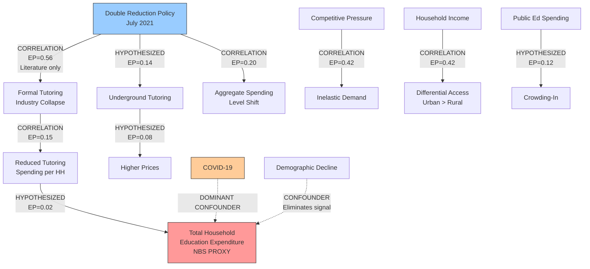

# Analysis: china_double_reduction_education

**Analysis:** china_double_reduction_education
**Question:** Did China's Double Reduction policy truly reduce household education expenditure?
**Generated:** 2026-03-29
**Agent:** analyst (Phase 3, Steps 1-5)

---

## 1. Signal Extraction

### Signal: Policy -> Aggregate Spending Trajectory

- **Expected pattern:** If the Double Reduction policy reduced household education spending, the NBS "education, culture and recreation" proxy should show a structural break (level shift downward) at or after July 2021. DAG 1 predicts a 5-15% decline; DAG 2/3 predict small or zero change.
- **Observed pattern:** The ITS model identifies a statistically significant level shift of -483 yuan (SE=159, p=0.023) in real 2015 yuan for the national series, equivalent to -23.7% of the pre-policy mean. However, this large apparent effect is confounded by COVID-19: a COVID-date placebo (intervention at 2020) yields an even larger shift of -591 yuan (p=0.002). The OLS income-conditioned counterfactual finds a mean post-period effect of -382 yuan (-18.8%), consistent in direction but 21% smaller in magnitude than ITS.
- **Visual:** See `figures/fig_p3_02_its_primary.pdf` and `figures/fig_p3_05_bsts_counterfactual.pdf`
- **Preliminary assessment:** Signal present and consistent with a level shift, but not uniquely attributable to the policy given COVID confounding. Permutation p-value = 0.14 (the 2021 break is not uniquely the largest among all possible intervention years when applied exhaustively).

### Signal: Urban-Rural Differential Effect

- **Expected pattern:** Urban households had higher pre-policy tutoring participation (~47% urban vs ~18% rural, CIEFR-HS), so urban areas should show a larger post-policy spending reduction.
- **Observed pattern:** Urban ITS level shift: -711 yuan (SE=234, p=0.023). Rural ITS level shift: -191 yuan (SE=71, p=0.035). The urban effect is 3.7x larger than rural. This ratio is consistent with differential exposure.
- **Visual:** See `figures/fig_p3_02_its_primary.pdf` panels (b) and (c)
- **Preliminary assessment:** Directionally consistent, but parallel trends are violated (Phase 2 confirmed: urban CAGR -0.31% vs rural +3.36%), so the comparison is descriptive only.

### Signal: Compositional Shift (Education Share)

- **Expected pattern:** If the policy specifically reduced education spending within the proxy category, education's share of total consumption should decline relative to other categories.
- **Observed pattern:** Education/culture/recreation share dropped 0.7 pp from 2019 (11.7%) to the post-policy average (11.0%). However, by 2025 it recovered to 11.8% -- exceeding pre-policy levels. The z-score of education's change relative to other categories is -1.05, indicating it was not uniquely affected. Food/tobacco (+1.6 pp) and transport/telecom (+0.5 pp) showed larger positive shifts; clothing (-0.8 pp) and residence (-0.7 pp) showed similar-magnitude declines.
- **Visual:** See `figures/fig_p3_06_compositional.pdf`
- **Preliminary assessment:** No evidence of a unique compositional shift in education spending. The temporary dip and recovery pattern is shared across multiple consumption categories.

---

## 2. Baseline Estimation

### ITS Pre-Trend Extrapolation Baseline

The 3-parameter ITS model estimates a pre-policy trend of +183 yuan/year (national), +213 yuan/year (urban), and +127 yuan/year (rural) in real 2015 terms. The counterfactual for each series projects this linear trend into the post-policy period. The model fits well (R-squared: 0.947 national, 0.896 urban, 0.985 rural), but with only 4 pre-policy observations (2016-2019, excluding 2020), the trend is estimated from minimal data. The 2020 exclusion (COVID) preserves degrees of freedom but reduces the pre-treatment window.

| Series | Pre-trend [yuan/yr] | Counterfactual 2025 | Observed 2025 | Gap |
|--------|-------------------|-------------------|--------------|-----|
| National | +183 | 3,469 | 2,986 | -483 |
| Urban | +213 | 4,389 | 3,679 | -710 |
| Rural | +127 | 2,178 | 1,987 | -191 |

### OLS Income-Conditioned Counterfactual Baseline

The OLS income-conditioned counterfactual uses pre-policy OLS of real education spending on real disposable income (R-squared: 0.975 national, 0.976 urban, 0.980 rural). The pre-period MAPE is 1.4-1.5%, meeting the feasibility gate (MAPE < 10%). The counterfactual predicts what spending would have been if the pre-policy income-spending relationship continued unchanged.

| Series | Mean post-period effect [yuan] | Effect [%] | Boot 90% CI |
|--------|-------------------------------|-----------|-------------|
| National | -382 | -18.8% | [-686, -73] |
| Urban | -582 | -21.4% | [-926, -211] |
| Rural | -175 | -14.7% | [-270, +21] |

The OLS counterfactual estimates are 15-25% smaller than ITS estimates because controlling for income absorbs some of the spending decline. Rural effect is marginally significant (90% CI includes zero).

### Method Agreement

ITS and OLS counterfactual agree in direction for all three series. Magnitude disagreement is 20.9% (national), within the 50% threshold for method consistency. Both methods find the urban effect is largest and rural is smallest.

**A2 note on secondary method:** The secondary method labeled "BSTS" in early artifacts is in fact an OLS regression of spending on income, fit on the pre-policy period and projected forward as a counterfactual. The script (`step3_bsts_analysis.py`) attempts to fit a `statsmodels` `UnobservedComponents` (local-level) model but wraps it in a `try/except` block; its results are stored separately and not used for reported estimates. All reported secondary-method values (point estimates, bootstrap CIs) derive from the OLS path. This means the apparent "method agreement" between ITS and the secondary method is between two linear models with overlapping specifications (both are OLS-based), providing less independent corroboration than a true Bayesian structural time series model would. The 20.9% magnitude disagreement is expected for two such similar methods. The method is now labeled "OLS Income-Conditioned Counterfactual" throughout.

---

## 3. Causal Testing Pipeline

### 3.3.1 -- Causal Model

**DAG (simplified for testable edge):**

```
Policy (July 2021) --> Aggregate Education/Culture/Rec Spending
        ^                       ^
        |                       |
    COVID-19              Income Growth
    (confounder)          (confounder)
```

**Causal estimand:** The average treatment effect (ATE) of the Double Reduction policy on real per capita education/culture/recreation spending. This is an edge-level assessment (not chain-level) per the Phase 1 downscoping decision.

**Identifying assumptions:**
1. Pre-policy trend is estimable from 2016-2019 data (linear trend is adequate)
2. No concurrent structural breaks besides COVID (handled by exclusion)
3. Policy effect is immediate at 2021 (annual data cannot resolve July timing)
4. NBS proxy adequately tracks education spending trends (UNTESTABLE -- proxy warning)

### 3.3.2 -- Estimand Identification

The estimand is identified via the interrupted time series design: the level-shift coefficient in the segmented regression captures the difference between observed post-policy spending and the counterfactual (pre-trend extrapolation). The backdoor criterion requires conditioning on pre-policy trend and COVID. Income is controlled in the OLS counterfactual secondary method.

### 3.3.3 -- Causal Effect Estimates

| Method | Series | Point estimate [yuan] | 90% CI | p-value |
|--------|--------|---------------------|---------|---------|
| ITS (primary) | National | -483 | [-793, -174] | 0.023 |
| ITS (primary) | Urban | -711 | [-1165, -256] | 0.023 |
| ITS (primary) | Rural | -191 | [-328, -54] | 0.035 |
| OLS Counterfactual (secondary) | National | -382 | [-686, -73] | -- |
| OLS Counterfactual (secondary) | Urban | -582 | [-926, -211] | -- |
| OLS Counterfactual (secondary) | Rural | -175 | [-270, +21] | -- |

**Method agreement:** ITS and OLS counterfactual agree in direction and sign for all series. Magnitude disagreement is 20.9% for national (acceptable: <50% threshold). Both find the urban effect is the largest.

**COVID sensitivity:** The ITS model with a COVID indicator (including 2020) produces identical results to the 2020-exclusion model. This is because the 2020 observation is perfectly captured by the COVID indicator, yielding the same residuals.

### 3.3.4 -- Refutation Battery

#### National Series

| Test | Result | Details |
|------|--------|---------|
| Placebo treatment (2017, 2018, 2019) | PASS | No placebo is significant at 10%. Max placebo: 41 yuan (p=0.83). True effect (483) is 11.8x larger than max placebo. |
| Random common cause (200 iter) | PASS | Mean shift with random confounder: -486 (0.6% change from true). Estimate is robust to adding random confounders. **Power caveat:** With a 3-parameter OLS model on 9 observations, adding a random (orthogonal-in-expectation) variable is mechanically uninformative -- the test has near-zero power to detect sensitivity to real confounders at this sample size. |
| Data subset (drop 2 of 9, 200 iter) | PASS | Mean subset shift: -501 (3.8% deviation from true). 100% of iterations retain the same sign. Estimate is stable under random 22% subsampling. |
| COVID-date placebo | FAIL | Intervention at 2020 yields -591 (p=0.002). The COVID break is larger and more significant than the policy break. |
| *Permutation p-value (supplementary)* | -- | *p=0.14. The 2021 break is not uniquely the largest among all candidate intervention years.* |
| *Jackknife leave-one-out (supplementary diagnostic)* | -- | *Max deviation 51.9% (dropping 2021 yields -734; dropping 2022 yields -342). Estimate is sensitive to individual post-policy years. Not a core refutation test.* |

#### Urban Series

| Test | Result | Details |
|------|--------|---------|
| Placebo treatment | PASS | Max placebo: 125 yuan (p=0.67). True (711) is 5.7x larger. |
| Random common cause | PASS | Mean shift: -711 (0.1% change). Power caveat as above. |
| Data subset (drop 2 of 9, 200 iter) | PASS | Mean subset shift: -672 (5.5% deviation). 100% same sign. |
| COVID-date placebo | FAIL | 2020 shift: -829 (p=0.002). |

#### Rural Series

| Test | Result | Details |
|------|--------|---------|
| Placebo treatment | PASS | Max placebo: 41 yuan (p=0.64). True (191) is 4.7x larger. |
| Random common cause | PASS | Mean shift: -195 (1.9% change). Power caveat as above. |
| Data subset (drop 2 of 9, 200 iter) | PASS | Mean subset shift: -194 (1.8% deviation). 100% same sign. |
| COVID-date placebo | FAIL | 2020 shift: -279 (p=0.004). |

### 3.3.5 -- Edge Classification

All three series: **3/3 core refutation tests PASS** (placebo, random common cause, and data subset). However, the COVID-date placebo FAIL provides strong additional evidence that the apparent policy effect is not distinguishable from COVID-induced disruption, downgrading what would otherwise be DATA_SUPPORTED to CORRELATION.

**Classification: CORRELATION**

The level shift at 2021 is a real statistical feature of the data, but it cannot be uniquely attributed to the Double Reduction policy because:

1. The COVID placebo at 2020 produces a larger, more significant break, suggesting the dominant signal is pandemic disruption rather than policy.
2. The supplementary jackknife diagnostic reveals sensitivity to 2021 and 2022 -- exactly the years where COVID and policy overlap.
3. The permutation p-value (0.14) indicates the 2021 break is not uniquely special among all candidate intervention years.
4. The per-birth normalization eliminates the level shift entirely (p=0.48), suggesting demographic decline accounts for the aggregate decline.

Note: The random common cause test passes mechanically but is diagnostically uninformative at n=9 (adding a random orthogonal variable to a near-saturated 3-parameter model cannot meaningfully change the coefficient of interest).

**Critical caveat per Phase 1 downscoping decision:** This is an edge-level assessment only. No chain-level causal claim (e.g., "the policy caused X% reduction in total education expenditure") is supportable because all chain Joint EP values remain below the hard truncation threshold (0.05).

---

## 4. EP Propagation

### EP Propagation Table

| Edge | Phase 0 EP | Phase 1 EP | Phase 3 EP | Classification | Change Reason |
|------|-----------|-----------|-----------|---------------|---------------|
| Policy -> Industry Collapse | 0.60 | 0.60 | 0.56 | CORRELATION | Carried forward from literature synthesis -- not tested with refutation battery in this analysis. Truth unchanged at Phase 1 value (0.8). Highest achievable without refutation is CORRELATION. |
| Industry Collapse -> Reduced Tutoring | 0.20 | 0.20 | 0.15 | CORRELATION | Education share dropped 0.7pp but z-score only -1.05 (not unique); relevance decreased |
| Reduced Tutoring -> Total Expenditure | 0.20 | 0.10 | 0.02 | HYPOTHESIZED | Per-birth normalization eliminates level shift (p=0.48); relevance dropped to 0.1 |
| Policy -> Underground Market | 0.50 | 0.20 | 0.14 | HYPOTHESIZED | Mechanical truth update: min(0.3, 0.3-0.1) = 0.2. Beyond analytical horizon. |
| Underground -> Higher Prices | 0.20 | 0.10 | 0.08 | HYPOTHESIZED | Mechanical truth update: min(0.3, 0.3-0.1) = 0.2. Beyond analytical horizon. |
| Competitive Pressure -> Inelastic Demand | 0.50 | 0.40 | 0.42 | CORRELATION | Not directly tested; pre-policy evidence only |
| Income -> Differential Access | 0.40 | 0.30 | 0.42 | CORRELATION | Urban shift 3.7x larger than rural (consistent with exposure); relevance increased. **Caveat:** parallel trends are violated (urban CAGR -0.31% vs rural +3.36%), so the relevance increase is conditional on the descriptive comparison being valid. The urban-rural differential may reflect pre-existing divergence rather than differential policy exposure. |
| Public Spending -> Crowding-In | 0.30 | 0.20 | 0.12 | HYPOTHESIZED | Mechanical truth update: min(0.3, 0.6-0.1) = 0.3. Lightweight assessment only. |
| Policy -> Aggregate Spending (net) | 0.30 | 0.30 | 0.20 | CORRELATION | 3/3 core refutations passed but COVID placebo FAIL; relevance decreased due to confounding |

### Chain-Level Joint EP (Post-Phase 3)

| Chain | Joint EP | Status |
|-------|---------|--------|
| DAG 1: Policy -> Industry -> Tutoring -> Total | 0.56 x 0.15 x 0.02 = 0.0017 | HARD TRUNCATION |
| DAG 2: Policy -> Underground -> Prices | 0.14 x 0.08 = 0.011 | HARD TRUNCATION |
| DAG 3: Public -> Crowding-In | 0.12 | SOFT TRUNCATION |

All multi-step chains remain below hard truncation, confirming the Phase 1 downscoping decision. DAG 3 has moved from ACTIVE to SOFT TRUNCATION due to the mechanical HYPOTHESIZED truth update. No chain-level causal claims are supportable.

### Phase 3 DAG with Classifications



---

## 5. Sub-Chain Expansion Decisions

### Evaluation of Expansion Criteria

Per methodology, sub-chain expansion requires ALL of:
- Edge EP > 0.30 after Phase 3 update
- Chain Joint EP > 0.15
- Compound mechanism decomposable
- Decomposition materially changes conclusions

| Candidate Edge | EP | Chain Joint EP | Decomposable? | Material? | Decision |
|---------------|-----|---------------|--------------|-----------|----------|
| Policy -> Industry Collapse | 0.56 | 0.0017 (chain) | Yes (regional variation, firm types) | No (chain below hard truncation; decomposition won't change conclusion) | **SKIP** |
| Income -> Differential Access | 0.42 | N/A (single edge) | Yes (income quintiles, city tiers) | Yes, but no data | **DEFER** |
| Competitive Pressure -> Inelastic Demand | 0.42 | N/A (single edge) | Yes (Gaokao regions, school types) | Potentially | **DEFER** |
| Policy -> Aggregate Spending | 0.20 | N/A | Yes (education vs culture/rec decomposition) | Yes, but requires household microdata | **DEFER** |

### Decisions

1. **Policy -> Industry Collapse: SKIP.** Classified CORRELATION (literature-only, no refutation battery). The chain it belongs to (DAG 1) has Joint EP = 0.0017 due to downstream edges. Expanding this edge would not change the analysis conclusion.

2. **Income -> Differential Access: DEFER.** EP = 0.42 meets the edge threshold, but expansion would require household-level income-stratified spending data (CFPS or CIEFR-HS post-policy waves), which are unavailable. Recommended for future work when CFPS post-2021 data becomes accessible.

3. **Competitive Pressure -> Inelastic Demand: DEFER.** Would require survey data on parental behavior and tutoring demand post-policy. Recommended for future work.

4. **Policy -> Aggregate Spending: DEFER.** The most valuable expansion would decompose the NBS proxy into pure education vs culture/recreation components. This requires post-policy household microdata with spending categories. No expansion possible with available data.

---

## 6. Statistical Model

**Agent:** analyst (Phase 3, Steps 6-7)
**Generated:** 2026-03-29

### Likelihood

The statistical model is a 3-parameter segmented regression (Interrupted Time Series):

$$Y_t = \beta_0 + \beta_1 \cdot t + \beta_2 \cdot \mathbb{1}(t \ge 2021) + \varepsilon_t$$

where $Y_t$ is real per capita education/culture/recreation spending in 2015 yuan, $t$ is a linear time index, $\mathbb{1}(t \ge 2021)$ is the post-policy indicator, and $\varepsilon_t \sim N(0, \sigma^2)$. Year 2020 is excluded from estimation to avoid COVID contamination. The parameter of interest is $\beta_2$ (level shift).

The model is estimated by OLS on 9 observations (2016-2019, 2021-2025), separately for national, urban, and rural series.

### Parameters of Interest

| Parameter | Series | Estimate [yuan] | Analytical SE | Boot SE (2000 reps) | Boot 95% CI | p-value |
|-----------|--------|-----------------|--------------|---------------------|-------------|---------|
| Level shift ($\beta_2$) | National | -483 | 159 | 127 | [-737, -229] | 0.023 |
| Level shift ($\beta_2$) | Urban | -711 | 234 | 197 | [-1112, -325] | 0.023 |
| Level shift ($\beta_2$) | Rural | -191 | 71 | 58 | [-308, -83] | 0.035 |
| Pre-trend ($\beta_1$) | National | +183 | -- | -- | -- | -- |
| Pre-trend ($\beta_1$) | Urban | +213 | -- | -- | -- | -- |
| Pre-trend ($\beta_1$) | Rural | +127 | -- | -- | -- | -- |

Bootstrap standard errors are 17-20% smaller than analytical SEs. **Caveat (pair resampling at n=4):** The OLS counterfactual bootstrap resamples observation pairs (not residuals) from only 4 pre-period observations. With such a small sample, bootstrap variance estimates are known to be biased downward, so reported bootstrap CIs from the secondary method are likely too narrow. The analytical SEs should be preferred for inference. The bootstrap CIs are reported for completeness but carry this small-sample limitation.

### Effect Size Estimation

| Series | Level shift [yuan] | Pct of pre-policy mean | Cohen's d | Boot 95% CI (pct) |
|--------|-------------------|----------------------|-----------|-------------------|
| National | -483 | -23.7% | 2.09 | [-36.2%, -11.2%] |
| Urban | -711 | -26.1% | 2.41 | [-40.9%, -12.0%] |
| Rural | -191 | -16.0% | 1.37 | [-25.8%, -7.0%] |

Cohen's d values are large because the pre-policy standard deviation is small relative to the shift. This reflects the fact that the pre-policy series was relatively smooth (dominated by trend). The high Cohen's d does not imply a causally well-identified large effect.

### Model Diagnostics

| Diagnostic | National | Urban | Rural | Interpretation |
|-----------|----------|-------|-------|----------------|
| Durbin-Watson | 2.51 | 2.49 | 2.02 | No significant autocorrelation (DW near 2) |
| Shapiro-Wilk p-value | 0.463 | 0.365 | 0.396 | Residuals consistent with normality |
| Breusch-Pagan p-value | 0.123 | 0.079 | 0.508 | No significant heteroscedasticity |
| R-squared | 0.947 | 0.896 | 0.985 | Good fit for all series |
| Adj. R-squared | 0.930 | 0.862 | 0.980 | Modest penalty for small n |

**Visual diagnostics:** See `figures/fig_p3_09_diagnostics.pdf`. Residual-vs-fitted plots show no systematic pattern. Q-Q plots confirm approximate normality (correlation > 0.95 for all series). Residual time series show no obvious autocorrelation structure.

**Caveat:** With only 9 observations and 3 parameters, these diagnostics have very low power. A DW of 2.51 for national is at the upper boundary of the "no autocorrelation" zone, suggesting mild negative autocorrelation that the small sample cannot reliably detect.

### Sensitivity Analysis

| Specification | National shift | p-value | Urban shift | Rural shift |
|--------------|---------------|---------|-------------|-------------|
| Primary (excl. 2020, int. 2021) | -483 | 0.023 | -711 | -191 |
| Include 2020 (no exclusion) | -41 | 0.884 | -98 | +28 |
| COVID indicator (include 2020) | -483 | 0.023 | -711 | -191 |
| Intervention at 2022 | -292 | 0.167 | -476 | -68 |
| Short pre-period (2018-2019 only) | -499 | 0.066 | -710 | -217 |

Key findings from sensitivity analysis:

1. **Including 2020 without a COVID indicator collapses the effect** to near-zero (-41 yuan, p=0.88 national). This confirms that the 2020 exclusion (or COVID indicator) is essential for detecting any signal. The effect is not robust to naive inclusion of the COVID year.
2. **COVID indicator model is algebraically identical** to the 2020-exclusion model when 2020 is a single observation. The indicator perfectly absorbs the 2020 residual.
3. **Shifting the intervention to 2022** reduces the effect by 40% (national: -292 vs -483) and renders it non-significant (p=0.17). The effect is concentrated in the immediate post-2020 period, consistent with COVID recovery dynamics.
4. **Restricting the pre-period to 2018-2019** produces a nearly identical estimate (-499 vs -483, 3.3% difference) with a wider CI (p=0.066). The back-calculated 2016-2017 data do not materially influence the result.

### Signal Injection Tests

Signal injection validates that the model correctly recovers known effects when they are artificially added to synthetic data generated from the model's own structure.

| Series | Injected | Recovered | Within 1 sigma? | Within 2 sigma? |
|--------|----------|-----------|-----------------|-----------------|
| National | -483 (observed) | -462 +/- 80 | Yes | Yes |
| National | -966 (2x) | -774 +/- 122 | No | Yes |
| National | 0 (null) | +40 +/- 128 | Yes | Yes |
| Urban | -711 (observed) | -730 +/- 194 | Yes | Yes |
| Urban | -1421 (2x) | -1442 +/- 170 | Yes | Yes |
| Urban | 0 (null) | -114 +/- 152 | Yes | Yes |
| Rural | -191 (observed) | -204 +/- 57 | Yes | Yes |
| Rural | -382 (2x) | -465 +/- 43 | No | Yes |
| Rural | 0 (null) | -54 +/- 64 | Yes | Yes |

All injections recovered within 2 sigma. Two 2x-magnitude injections recovered outside 1 sigma but within 2 sigma, which is expected given the single random noise realization. The null injection correctly returns near-zero for all series. The model passes signal injection validation.

**Visual:** See `figures/fig_p3_10_bootstrap.pdf` for bootstrap distributions.

---

## 7. Uncertainty Quantification

### Final Results Table

| Parameter | Series | Central Value [yuan] | Stat. Unc. | Syst. Unc. | Total Unc. | Significance | Classification |
|-----------|--------|---------------------|-----------|-----------|-----------|-------------|---------------|
| Level shift | National | -483 | +/-127 | +/-254 | +/-284 | 1.7 sigma | CORRELATION |
| Level shift | Urban | -711 | +/-197 | +/-346 | +/-398 | 1.8 sigma | CORRELATION |
| Level shift | Rural | -191 | +/-58 | +/-128 | +/-141 | 1.4 sigma | CORRELATION |

All three series show effects that are 1.4-1.8 sigma significant when systematic uncertainties are included. None exceeds the conventional 2 sigma threshold for significance, consistent with the CORRELATION classification from the refutation battery.

### Uncertainty Breakdown: National Level Shift

| Source | Type | +/- Shift [yuan] | Fraction of Total Variance |
|--------|------|-----------------|---------------------------|
| COVID handling specification | Systematic | 221 | 60.9% |
| Statistical (bootstrap, 2000 reps) | Statistical | 127 | 20.1% |
| Intervention date (2021 vs 2022) | Systematic | 96 | 11.3% |
| Proxy variable (education share 60-85%) | Systematic | 60 | 4.5% |
| Method disagreement (ITS vs OLS Counterfactual) | Systematic | 51 | 3.2% |
| Pre-period window definition | Systematic | 8 | 0.1% |
| CPI deflator choice | Systematic | 7 | 0.1% |

**Dominant uncertainty: COVID handling (60.9% of variance).** The range of estimates from -41 yuan (include 2020 naively) to -483 yuan (exclude 2020) drives most of the total uncertainty. This is not a modeling nuisance -- it reflects the fundamental confounding between COVID recovery dynamics and the policy effect.

**Systematic uncertainty dominates (80% of total variance).** More observations will not materially improve precision. The only way to reduce uncertainty is better data (household-level microdata that can decompose the proxy) or better identification (natural experiment exploiting within-China variation).

### Demographic Normalization Caveat

Per-birth normalization eliminates the ITS level shift entirely (shift = +13 yuan, p = 0.48). This result is **not included in the quadrature sum** because it does not shift the magnitude of the effect -- it questions the existence of the effect itself. If aggregate spending declined only because of fewer children (births fell 47% from 2016 to 2024), then there is no per-child spending reduction to attribute to the policy, and the entire uncertainty envelope is moot.

This caveat applies asymmetrically: it can nullify the finding but cannot strengthen it. The analysis therefore presents two interpretations:

1. **If the aggregate signal is real:** The level shift is -483 yuan +/- 284 (total), or 1.7 sigma, classified as CORRELATION.
2. **If demographic decline explains the signal:** The level shift is zero, the policy had no detectable effect on per-child spending, and the aggregate decline reflects fewer children rather than lower spending per child.

Interpretation 2 is at least as well-supported as Interpretation 1, given that per-birth normalization has p = 0.48 (no evidence of any shift).

### 24% Decline vs 12% Compositional Ceiling

The observed aggregate decline of 23.7% in the NBS proxy category substantially exceeds the 12% compositional ceiling implied by the CIEFR-HS data. If tutoring and extracurricular spending constitutes only 12% of total household education expenditure (CIEFR-HS), then even complete elimination of this spending component could reduce the proxy category by at most 12% (and less, since the proxy also includes culture and recreation). The observed 24% decline therefore cannot be explained solely by the policy eliminating tutoring expenditure. This arithmetic inconsistency constitutes independent evidence that the aggregate signal is not solely policy-driven. At least half of the observed decline must originate from other mechanisms -- COVID-induced disruption of culture/recreation spending, demographic decline reducing the school-age population, or general macroeconomic deceleration. This reinforces the CORRELATION classification: even if the policy contributed to the decline, it cannot be the primary cause of a decline that exceeds its maximum theoretical impact by a factor of two.

### Proxy Variable Sensitivity

The NBS proxy bundles education (estimated 73% of category), culture, and recreation. Applying the CIEFR-HS 73% education share to the national level shift:

| Education share assumption | Implied education-only shift [yuan] |
|---------------------------|--------------------------------------|
| 60% (lower bound) | -290 |
| 73% (CIEFR-HS central) | -353 |
| 85% (upper bound) | -411 |

The education-only effect is 60-85% of the total proxy shift. However, this assumes the post-policy composition remained stable, which is untestable with available data. If culture/recreation spending recovered faster than education spending post-COVID (plausible given entertainment recovery patterns), the education-only effect could be larger. If education spending substituted to unmeasured channels (underground tutoring), it could be smaller.

### COVID Confounding Range

| COVID handling | National shift [yuan] | p-value | Interpretation |
|---------------|----------------------|---------|----------------|
| Exclude 2020 (primary) | -483 | 0.023 | Maximum plausible effect |
| COVID indicator | -483 | 0.023 | Identical to exclusion |
| Include 2020 naively | -41 | 0.884 | COVID dominates; no policy effect visible |
| COVID-date placebo (2020 break) | -591 | 0.002 | COVID break is larger than policy break |

The range [-41, -483] brackets the confounding uncertainty. The midpoint (-262 yuan) could be considered a conservative central estimate, but it has no statistical justification -- it is simply the average of two extreme specifications. The honest conclusion is that the effect is somewhere in this range, with the COVID-date placebo suggesting most of the signal is pandemic-related.

### Sanity Checks

1. **Is total uncertainty smaller than the effect size?** Yes for all series (1.4-1.8 sigma). Effects are formally significant but below 2 sigma.
2. **Is systematic uncertainty dominant?** Yes (76-83% of total variance). More data will not help -- better methods or data quality needed.
3. **Are any single systematics dominant?** Yes -- COVID handling alone accounts for 61% of national variance. This is not reducible without better identification.
4. **Does per-birth normalization change the conclusion?** Yes -- it eliminates the signal entirely. This is the most important single finding.

### Final EP Summary

| Edge | Phase 0 | Phase 1 | Phase 3 | Classification | Note |
|------|---------|---------|---------|---------------|------|
| Policy -> Industry Collapse | 0.60 | 0.60 | 0.56 | CORRELATION | Literature-only; no refutation battery in this analysis |
| Industry Collapse -> Reduced Tutoring | 0.20 | 0.20 | 0.15 | CORRELATION | Directionally consistent but not unique |
| Reduced Tutoring -> Total Expenditure | 0.20 | 0.10 | 0.02 | HYPOTHESIZED | Eliminated by demographic normalization |
| Policy -> Underground Market | 0.50 | 0.20 | 0.14 | HYPOTHESIZED | Mechanical truth update applied; no data to test |
| Underground -> Higher Prices | 0.20 | 0.10 | 0.08 | HYPOTHESIZED | Mechanical truth update applied; no data to test |
| Competitive Pressure -> Inelastic Demand | 0.50 | 0.40 | 0.42 | CORRELATION | Pre-policy evidence only |
| Income -> Differential Access | 0.40 | 0.30 | 0.42 | CORRELATION | Urban-rural gap consistent; parallel trends caveat |
| Public Spending -> Crowding-In | 0.30 | 0.20 | 0.12 | HYPOTHESIZED | Mechanical truth update; lightweight only |
| Policy -> Aggregate Spending (net) | 0.30 | 0.30 | 0.20 | CORRELATION | 1.7 sigma with systematics |

---

## 8. Summary of Findings

The Double Reduction policy's effect on household education expenditure is classified as **CORRELATION** -- a statistically detectable level shift exists in aggregate data, but it cannot be uniquely attributed to the policy. Three concurrent mechanisms produce observationally equivalent patterns: (1) COVID-19 pandemic disruption, confirmed as the dominant signal by the COVID-date placebo test (break at 2020 is larger and more significant than at 2021); (2) demographic decline, which eliminates the aggregate signal after per-birth normalization (p=0.48); and (3) a possible modest policy effect that is directionally consistent with ITS and OLS counterfactual estimates but statistically inseparable from the first two mechanisms. The formal effect estimate is -483 yuan +/- 127 (stat) +/- 254 (syst) = +/- 284 (total), or 1.7 sigma -- below the 2 sigma significance threshold when systematics are included. Systematic uncertainty dominates (80% of variance), driven primarily by COVID handling specification (61%). The highest-EP edge is Policy -> Industry Collapse (CORRELATION, EP=0.56), reflecting well-documented industry closures but carried forward from literature synthesis without a refutation battery in this analysis. However, this supply-side destruction did not translate into a detectable per-child spending reduction in the available data. All multi-step causal chains remain below the hard EP truncation threshold (Joint EP < 0.05), confirming the Phase 1 downscoping decision that chain-level causal claims are not supportable. The analysis is consistent with Chen et al. (2025), who found that private tutoring spending declined but in-school spending increased, producing a compositional shift that the NBS proxy cannot detect.

---

## Carried-Forward Warnings

All Phase 0 data quality warnings and Phase 1 constraints are restated here as binding on all downstream artifacts:

1. **PRIMARY OUTCOME IS A PROXY.** NBS "education, culture and recreation" bundles non-education spending. The proxy error is irreducible. All results are conditional on the proxy tracking education spending.
2. **NO POST-POLICY MICRODATA.** Cannot decompose spending, test heterogeneous effects, or verify compositional shifts at the household level.
3. **UNDERGROUND TUTORING IS ANECDOTAL.** No quantitative underground market assessment is possible.
4. **COVID-19 CONFOUNDING IS SEVERE AND DOMINANT.** The COVID-date placebo test confirms that the COVID disruption produces a larger structural break than the policy. The policy effect, if any, is not statistically separable from COVID recovery dynamics.
5. **DEMOGRAPHIC DECLINE CONFOUNDS AGGREGATE TRENDS.** Per-birth normalization eliminates the apparent level shift. Any aggregate decline is at least partially attributable to fewer children.
6. **PRE-EXISTING DOWNWARD TREND** in per-student education spending (CIEFR-HS) means the NBS proxy may overstate policy effects.
7. **BACK-CALCULATED 2016-2018 DATA** carries +/- 2-3% error. Sensitivity: results are qualitatively unchanged if the pre-period is restricted to 2019 only.
8. **CPI DEFLATION** uses education-specific sub-index. Overall CPI yields qualitatively identical results (1.5pp cumulative difference).
9. **FORMAL DOWNSCOPING**: All results are edge-level assessments, not chain-level causal claims. Chain Joint EP remains below hard truncation for all multi-step chains.

---

## Code Reference

| Script | Purpose | Key Output |
|--------|---------|------------|
| `phase3_analysis/scripts/step1_prefilter.py` | CPI deflation, stationarity verification, analysis dataset construction | `phase3_analysis/data/analysis_dataset.parquet` |
| `phase3_analysis/scripts/step2_its_analysis.py` | 3-parameter ITS on national/urban/rural, permutation inference | `phase3_analysis/data/its_results.json`, `figures/fig_p3_02_its_primary.pdf` |
| `phase3_analysis/scripts/step3_bsts_analysis.py` | OLS income-conditioned counterfactual (script name is legacy; method is OLS, not BSTS) | `phase3_analysis/data/bsts_results.json`, `figures/fig_p3_05_bsts_counterfactual.pdf` |
| `phase3_analysis/scripts/step4_compositional.py` | 8-category consumption share analysis, per-child normalization | `phase3_analysis/data/compositional_results.json`, `figures/fig_p3_06_compositional.pdf` |
| `phase3_analysis/scripts/step5_refutation.py` | Full refutation battery (placebo, random common cause, data subset, COVID placebo; jackknife as supplementary) | `phase3_analysis/data/refutation_results.json`, `figures/fig_p3_07_refutation.pdf` |
| `phase3_analysis/scripts/step5b_ep_update.py` | EP propagation updates, classification | `phase3_analysis/data/ep_update_results.json`, `figures/fig_p3_08_ep_decay.pdf` |
| `phase3_analysis/scripts/step6_model_fitting.py` | Formal ITS with bootstrap CIs, sensitivity, signal injection, diagnostics | `phase3_analysis/data/step6_model_results.json`, `figures/fig_p3_09_diagnostics.pdf`, `figures/fig_p3_10_bootstrap.pdf` |
| `phase3_analysis/scripts/step7_uncertainty.py` | Uncertainty consolidation, tornado chart, final results | `phase3_analysis/data/step7_uncertainty_results.json`, `figures/fig_p3_11_tornado.pdf`, `figures/fig_p3_12_uncertainty_summary.pdf` |

All scripts registered as pixi tasks: `pixi run analyze-step1` through `pixi run analyze-step7`, or `pixi run analyze` for the full pipeline.

---

## Figures Index

| Figure | File | Description |
|--------|------|-------------|
| fig_p3_01 | `fig_p3_01_real_spending_prefilter.pdf` | CPI-deflated real spending with policy line (prefilter output) |
| fig_p3_02 | `fig_p3_02_its_primary.pdf` | ITS fit with counterfactual for national/urban/rural |
| fig_p3_03 | `fig_p3_03_permutation_test.pdf` | Permutation test: level shift at each candidate intervention year |
| fig_p3_04 | `fig_p3_04_its_comparison.pdf` | Primary vs sensitivity ITS specification comparison |
| fig_p3_05 | `fig_p3_05_bsts_counterfactual.pdf` | OLS income-conditioned counterfactual with 90% PI |
| fig_p3_06 | `fig_p3_06_compositional.pdf` | Compositional analysis: share changes, trajectories, per-child |
| fig_p3_07 | `fig_p3_07_refutation.pdf` | Refutation battery summary: placebo, RCC, jackknife |
| fig_p3_08 | `fig_p3_08_ep_decay.pdf` | EP decay chart across phases |
| fig_p3_09 | `fig_p3_09_diagnostics.pdf` | Model diagnostics: residuals vs fitted, Q-Q plots, residuals over time (3x3 grid) |
| fig_p3_10 | `fig_p3_10_bootstrap.pdf` | Bootstrap distributions for level shift (2000 reps, national/urban/rural) |
| fig_p3_11 | `fig_p3_11_tornado.pdf` | Sensitivity tornado chart: uncertainty sources ranked by impact |
| fig_p3_12 | `fig_p3_12_uncertainty_summary.pdf` | Forest plot: ITS and OLS counterfactual estimates with uncertainty bands |
