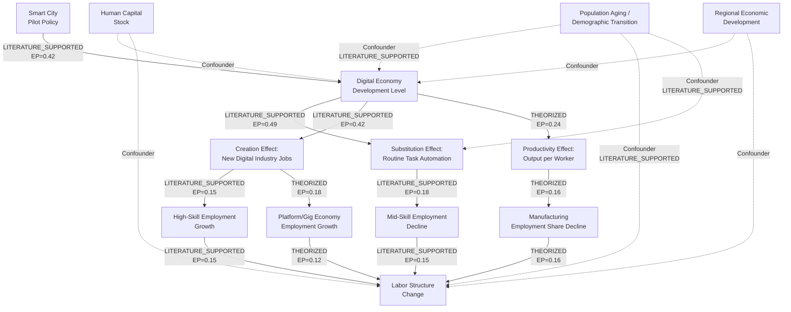
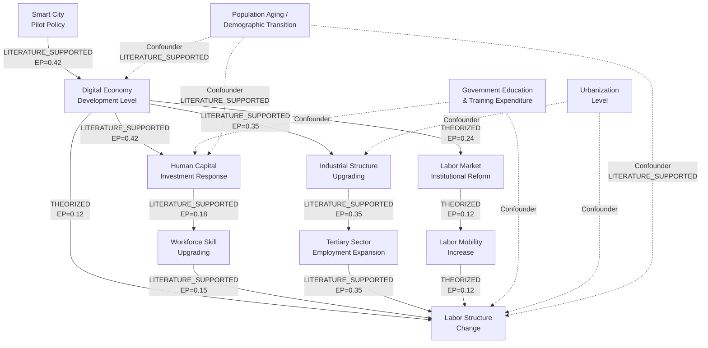
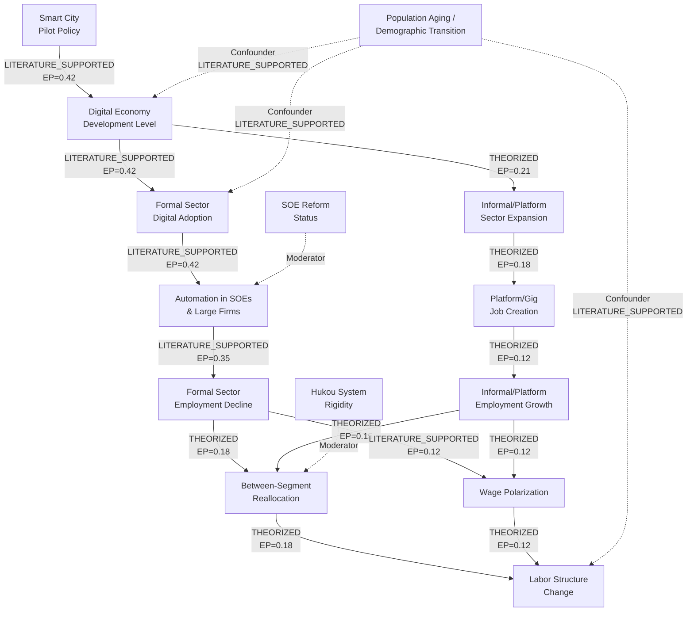

# DISCOVERY: Digital Economy and Labor Force Structural Change in China

## Summary

This analysis investigates whether China's digital economy drives labor force structural change through three theoretically grounded mechanism channels: the creation effect (new job categories and industries), the substitution effect (automation-driven displacement), and the mediation effect (indirect transmission via human capital, industrial upgrading, and institutional channels). The question requires macro-micro integration using EPS provincial panel data and CFPS household survey data, with a DID framework leveraging smart city pilot policies as a quasi-natural experiment. We construct three competing causal DAGs representing a technology-push model, an institutional-mediation model, and a labor market segmentation model, each generating distinct testable predictions about how digital economy development reshapes employment composition across skill levels, sectors, and employment forms.

---

## Question Decomposition

| Component | Value |
|-----------|-------|
| Raw question | 数字经济是否推动劳动力结构变化？分析应包含基于创造效应、替代效应和中介效应的机制分析，优先使用EPS（中国经济政策模拟系统）和CFPS（中国家庭追踪调查）数据，包含以DID（双重差分）模型作为baseline对比的图表。 |
| Domain(s) | **Primary:** Digital economics, Labor economics. **Secondary:** Industrial organization, Human capital theory, Regional economics, Public policy evaluation |
| Entities | See detailed list below |
| Relationships | See detailed mapping below |
| Timeframe | 2011--2024 (mixed: historical analysis of China's digital economy acceleration era); key inflection dates: 2012 (first smart city pilot batch), 2014 (second batch), 2015 (third batch), 2015 ("Internet Plus" national strategy), 2020 (COVID-19 digital acceleration) |
| Implied concerns | See detailed list below |

### Domain

- **Primary domain:** Digital economics -- the study of economic activity mediated by digital platforms, e-commerce, fintech, and information technology infrastructure.
- **Primary domain:** Labor economics -- the study of labor supply, demand, wage determination, employment structure, and human capital formation.
- **Secondary domains:**
  - Industrial organization (sectoral reallocation driven by digital transformation)
  - Human capital theory (skill upgrading/downgrading as mediation channel)
  - Regional economics (spatial heterogeneity in digital economy penetration)
  - Public policy evaluation (DID requires identifiable policy shocks)

### Entities

**Core treatment variable:**
- Digital economy development level (measured as composite index: internet penetration, e-commerce transaction volume, digital finance index, ICT industry value-added, software/IT service revenue)

**Core outcome variables:**
- Labor force sectoral composition (primary / secondary / tertiary sector shares)
- Labor force skill composition (high-skilled / medium-skilled / low-skilled shares)
- Employment form composition (formal / informal / platform / self-employed shares)
- Employment quality indicators (wage levels, job stability, skill-job match)

**Mechanism/mediator variables:**
- Creation effect channel: new digital industry employment, platform economy jobs, ICT sector job growth
- Substitution effect channel: routine task intensity, automation exposure index, manufacturing employment decline
- Mediation effect channel: human capital accumulation (education years, training participation), industrial structure upgrading (tertiary sector share), technology adoption rate

**Policy/treatment variables (for DID):**
- National smart city pilot policy (three batches: 2012, 2014, 2015) -- 290 pilot cities
- "Internet Plus" strategy (2015)
- Broadband China pilot policy
- National Big Data comprehensive pilot zones

**Control variables:**
- GDP per capita, population, urbanization rate, government expenditure on education, foreign direct investment, fixed asset investment, financial development level

**Geographic scope:**
- 30 Chinese provinces (macro, EPS data)
- Household-level across 25 provinces (micro, CFPS data)
- City-level for DID (smart city pilots)

### Relationships (stated vs. implied)

**Stated relationships (explicit in question):**
- Digital economy --> Labor force structural change (main causal claim to test)
- Creation effect as mechanism channel (digital economy creates new jobs)
- Substitution effect as mechanism channel (digital economy displaces existing jobs)
- Mediation effect as mechanism channel (digital economy acts through intermediate variables)

**Implied relationships:**
- Digital economy --> Human capital demand shift --> Labor structure change (mediation pathway)
- Digital economy --> Industrial structure upgrading --> Sectoral employment reallocation
- Digital economy --> Routine task automation --> Skill polarization
- Smart city pilot policy --> Digital economy development --> Employment outcomes (DID identification)
- Regional heterogeneity moderates the digital economy --> labor structure relationship
- Education system and training infrastructure mediate the speed of labor reallocation
- COVID-19 accelerated digital transformation, creating a structural break
- Platform economy creates new employment forms outside traditional classification

### Timeframe

- **Type:** Mixed (historical analysis with current-state implications)
- **Scope:** 2011--2024 (constrained by CFPS waves: 2010, 2012, 2014, 2016, 2018, 2020)
- **Key inflection dates:**
  - 2012: First batch of national smart city pilots (90 cities)
  - 2013: Launch of Peking University Digital Financial Inclusion Index
  - 2014: Second batch of smart city pilots (103 cities)
  - 2015: Third batch of smart city pilots (97 cities); "Internet Plus" national strategy
  - 2016: G20 Digital Economy Development and Cooperation Initiative
  - 2020: COVID-19 pandemic accelerates digital adoption
  - 2021: "14th Five-Year Plan" digital economy provisions

### Implied Concerns

- Whether digitalization is a net job creator or destroyer in the Chinese context
- Whether the creation effect eventually dominates the substitution effect (long-run vs. short-run dynamics)
- Whether low-skilled workers bear disproportionate adjustment costs
- Whether existing education and training systems adequately mediate the transition
- Whether regional digital divides exacerbate employment inequality
- Whether policy interventions (smart city pilots) effectively channel digital economy benefits to employment
- Whether platform/gig economy employment represents genuine creation or precarious substitution

### Hidden Assumptions

1. **Digital economy is measurable as a coherent construct.** The question assumes we can construct a valid composite index. In reality, "digital economy" is multidimensional and measurement choices (internet penetration vs. e-commerce volume vs. digital finance) may capture different phenomena with different labor market effects.

2. **The three mechanism channels are exhaustive.** The question specifies creation, substitution, and mediation effects. But other channels exist: productivity effects (fewer workers needed for the same output), reallocation effects (geographic migration induced by digital platforms), and complementarity effects (digital tools augmenting rather than replacing human labor).

3. **DID is the appropriate baseline.** DID requires parallel trends, a clear treatment, and no spillover. Smart city pilots may violate SUTVA (stable unit treatment value assumption) if pilot cities generate spillovers to neighboring non-pilot cities, or if non-pilot cities adopt digital technologies independently.

4. **EPS and CFPS data adequately capture the relevant variation.** EPS provides macro provincial/city-level data but may miss within-province heterogeneity. CFPS captures individual-level outcomes but only surveys every two years and may underrepresent platform workers.

5. **Causation runs from digital economy to labor structure (not reverse).** Labor shortages or surpluses might drive digital adoption (reverse causality). Skilled labor availability may be a precondition for digital economy growth, not just a consequence.

6. **The Chinese institutional context is stable enough for causal identification.** China's rapid policy changes, regulatory shifts (e.g., tech sector crackdowns 2020--2022), and structural reforms may confound the digital economy--labor relationship.

---

## First Principles

### Principle 1: Technological Displacement and Compensation (Ricardo-Marx-Schumpeter)

- **Statement:** Technological innovation simultaneously destroys existing jobs through automation (displacement) and creates new jobs through new products, industries, and increased demand (compensation), with the net effect depending on the rate of adoption, labor market flexibility, and institutional context.
- **Domain:** Labor economics, history of technology
- **Applicability:** Directly governs the creation-vs-substitution tension in the question. China's digital economy represents a general-purpose technology shock with both displacement (routine task automation) and compensation (platform economy, digital services) channels.
- **Non-applicability conditions:** Would not apply if digital economy growth were confined to a single sector without spillovers, or if labor markets were perfectly frictionless (instantaneous reallocation would eliminate structural change).
- **Generality:** UNIVERSAL -- applies across historical technology transitions (mechanization, electrification, computerization, digitalization).

### Principle 2: Skill-Biased Technological Change (SBTC) and Task-Based Framework (Acemoglu & Autor, 2011)

- **Statement:** Technologies that automate routine tasks increase relative demand for non-routine cognitive skills (high-end) and non-routine manual skills (low-end), while hollowing out middle-skill routine jobs, producing employment polarization.
- **Domain:** Labor economics, technology economics
- **Applicability:** Directly predicts the skill-composition dimension of labor structure change. Digital technologies automate routine cognitive tasks (data entry, bookkeeping) and routine manual tasks (assembly line work), shifting demand toward abstract/creative tasks and interpersonal service tasks.
- **Non-applicability conditions:** Would not apply if China's digital economy primarily creates routine digital jobs (e.g., content moderation, data labeling) rather than automating them, or if institutional wage floors prevent polarization.
- **Generality:** DOMAIN-SPECIFIC -- developed for advanced economies; applicability to China's dual labor market (formal/informal, urban/rural, state/private) requires empirical validation.

### Principle 3: Structural Change and Multi-Sector Reallocation (Lewis-Kuznets-Herrendorf)

- **Statement:** Economic development drives labor reallocation from low-productivity sectors (agriculture) to high-productivity sectors (manufacturing, services), with the pace and direction shaped by relative productivity growth and income elasticity of demand across sectors.
- **Domain:** Development economics, structural change theory
- **Applicability:** China's digital economy accelerates the tertiarization process by raising service sector productivity and creating entirely new service categories (e-commerce logistics, fintech, ride-hailing), pulling labor out of manufacturing and agriculture.
- **Non-applicability conditions:** Would not apply if digital economy growth were productivity-neutral across sectors, or if labor mobility were completely restricted (e.g., hukou system preventing rural-urban migration).
- **Generality:** UNIVERSAL -- documented across all industrializing economies, though the role of digital technology as an accelerant is context-dependent.

### Principle 4: Institutional Mediation and Labor Market Segmentation (Doeringer-Piore)

- **Statement:** Labor markets are segmented into primary (formal, protected, high-wage) and secondary (informal, precarious, low-wage) sectors, with institutional barriers (regulations, unions, credentials) governing mobility between segments. Technology shocks affect segments differently.
- **Domain:** Institutional labor economics
- **Applicability:** China's labor market is deeply segmented along urban/rural (hukou), state/private, and formal/informal lines. The digital economy may reshape segmentation: platform work creates a new "third segment" that is neither traditional formal nor informal employment.
- **Non-applicability conditions:** Would not apply if digital economy development uniformly affected all labor market segments, or if institutional barriers were irrelevant to employment outcomes.
- **Generality:** CONTEXT-DEPENDENT -- the specific segmentation structure (hukou, state-owned enterprises, platform economy regulation) is unique to China.

---

## Causal DAGs

### DAG 1: Technology-Push Direct Effects Model

**Core narrative:** The digital economy acts primarily through direct technology channels -- automation displaces routine workers (substitution), new digital industries absorb displaced and new workers (creation), and the net effect varies by skill level and sector. This is the "standard" SBTC-augmented structural change model.

**Key differentiator:** Emphasizes direct technology-to-labor channels with minimal institutional mediation. The digital economy index directly affects labor demand through task content changes.

#### Edge Table -- DAG 1

| Edge | Label | Truth | Relevance | EP | Truth (data-adj) | EP (data-adj) | Justification |
|------|-------|-------|-----------|-----|-------------------|----------------|---------------|
| DE --> SUB | LITERATURE_SUPPORTED | 0.7 | 0.7 | 0.49 | 0.7 | 0.49 | Extensive literature confirms digital technologies automate routine tasks in Chinese manufacturing (Wang & Dong, 2023; Li et al., 2024 in Sustainability). Regional studies show substitution effect strongest in central China. |
| DE --> CRE | LITERATURE_SUPPORTED | 0.7 | 0.6 | 0.42 | 0.7 | 0.42 | Studies using CFPS and city panel data show digital economy development creates new employment categories and expands ICT/platform employment (Finance Research Letters, 2024). |
| DE --> PROD | THEORIZED | 0.4 | 0.6 | 0.24 | 0.4 | 0.24 | Productivity growth from digitalization is well-documented but its specific effect on employment quantity (vs. quality) in China is less clear. Could reduce or increase labor demand depending on demand elasticity. |
| SUB --> MID_DECLINE | LITERATURE_SUPPORTED | 0.7 | 0.6 | 0.42 | **0.30** | **0.18** | Task-based framework (Acemoglu & Autor, 2011) predicts routine task displacement; Chinese manufacturing data confirms mid-skill hollowing, though less pronounced than in Western economies. **DATA CAP: skill-level employment data unavailable (ILO education columns have 1/24 obs; CFPS not acquired). Truth capped at 0.30 per DATA_QUALITY.md.** |
| CRE --> HIGH_GROW | LITERATURE_SUPPORTED | 0.7 | 0.5 | 0.35 | **0.30** | **0.15** | Digital economy development significantly increases R&D positions and high-skill openings (PMC, 2023). **DATA CAP: skill-level employment data unavailable. Truth capped at 0.30 per DATA_QUALITY.md.** |
| CRE --> PLAT | THEORIZED | 0.4 | 0.6 | 0.24 | **0.30** | **0.18** | Platform economy growth is observable but whether it represents genuine "creation" or reclassification of informal employment is debated. **DATA CAP: platform employment data not separately identifiable in available datasets. Truth capped at 0.30.** |
| PROD --> SEC_SHRINK | THEORIZED | 0.4 | 0.4 | 0.16 | 0.4 | 0.16 | Manufacturing labor productivity gains from automation can reduce employment share, but China's manufacturing scale may buffer this effect. |
| MID_DECLINE --> LS | LITERATURE_SUPPORTED | 0.7 | 0.5 | 0.35 | **0.30** | **0.15** | Mid-skill decline is a direct component of structural change by definition. **DATA CAP: inherited from SUB-->MID_DECLINE; skill-level data unavailable.** |
| HIGH_GROW --> LS | LITERATURE_SUPPORTED | 0.7 | 0.5 | 0.35 | **0.30** | **0.15** | High-skill growth is a direct component of structural change by definition. **DATA CAP: inherited from CRE-->HIGH_GROW; skill-level data unavailable.** |
| PLAT --> LS | THEORIZED | 0.5 | 0.4 | 0.20 | **0.30** | **0.12** | Platform employment is growing but its classification in official statistics is uncertain, making its structural impact hard to measure. **DATA CAP: platform employment not separately identifiable.** |
| SEC_SHRINK --> LS | THEORIZED | 0.4 | 0.4 | 0.16 | 0.4 | 0.16 | Sectoral employment share shift is structural change by definition, but the magnitude attributable to digitalization vs. other forces (trade, income growth) is uncertain. |
| SCP --> DE | LITERATURE_SUPPORTED | 0.7 | 0.6 | 0.42 | 0.7 | 0.42 | Smart city pilots are a validated quasi-natural experiment for digital economy development (Nature HASS Communications, 2023; Empirical Economics, 2023). Used as the DID treatment. **Note: DID not executable without city-level outcome data; this edge serves as instrument relevance documentation.** |
| DEMO --> DE | LITERATURE_SUPPORTED (confounder) | 0.7 | 0.5 | 0.35 | 0.7 | 0.35 | China's working-age population (15--64) peaked around 2012--2015, coinciding with smart city pilot rollout. Labor shortages from aging may incentivize digital adoption and automation investment (Acemoglu & Restrepo, 2022; Eggleston et al., 2023). Variables `population_65plus_pct` and `population_15_64_pct` available in dataset. **Mandatory control in all specifications.** |
| DEMO --> LS | LITERATURE_SUPPORTED (confounder) | 0.7 | 0.6 | 0.42 | 0.7 | 0.42 | Population aging independently drives labor structure change: increased service sector employment (elderly care, healthcare), higher automation incentives in manufacturing, reduced total labor supply. China's demographic transition is well-documented (Cai, 2010; World Bank, 2016). **Mandatory control in all specifications.** |
| DEMO --> SUB | LITERATURE_SUPPORTED (confounder) | 0.7 | 0.4 | 0.28 | 0.7 | 0.28 | Aging workforce increases incentives for automation (substitution of labor with capital/technology), creating a confounding path from demographics to automation independent of digital economy development (Acemoglu & Restrepo, 2022). |

**Testable prediction:** In pilot cities, mid-skill employment share declines faster post-treatment than in control cities, while high-skill and platform employment shares grow faster. The substitution effect dominates in the short run (0--3 years post-pilot), creation effect dominates in the long run (4+ years).

**Kill condition:** If mid-skill employment increases in pilot cities relative to controls, or if the parallel trends assumption fails for all employment structure outcomes.

---

### DAG 2: Institutional Mediation Model

**Core narrative:** The digital economy does not directly restructure labor markets. Instead, it operates through institutional mediators -- human capital investment (education, training), industrial structure upgrading, and labor market institutions (hukou reform, social security). The mediation channels determine whether the digital economy creates or destroys jobs, and who benefits.

**Key differentiator:** The direct DE --> Labor Structure path is weak or absent. All substantial effects flow through mediating institutions. Policy design and institutional capacity matter more than technology itself.

#### Edge Table -- DAG 2

| Edge | Label | Truth | Relevance | EP | Truth (data-adj) | EP (data-adj) | Justification |
|------|-------|-------|-----------|-----|-------------------|----------------|---------------|
| DE --> LS (direct) | THEORIZED | 0.3 | 0.4 | 0.12 | 0.3 | 0.12 | In this model, the direct effect is weak -- digitalization alone does not restructure labor without institutional responses. The residual direct path captures unmediated effects. |
| DE --> HC_INV | LITERATURE_SUPPORTED | 0.7 | 0.6 | 0.42 | 0.7 | 0.42 | Digital economy development increases demand for skilled workers, triggering government and private investment in education and training programs. Documented in Chinese provincial data. |
| DE --> IND_UP | LITERATURE_SUPPORTED | 0.7 | 0.5 | 0.35 | 0.7 | 0.35 | Digital economy accelerates shift from secondary to tertiary sector through digital services, e-commerce, and fintech (Frontiers in Environmental Economics, 2024). |
| DE --> LM_REF | THEORIZED | 0.4 | 0.6 | 0.24 | 0.4 | 0.24 | Digital economy may prompt labor market institutional reforms (platform worker protections, hukou relaxation in tech hubs), but evidence is limited and the causal direction is ambiguous. |
| HC_INV --> SKILL_UP | LITERATURE_SUPPORTED | 0.7 | 0.6 | 0.42 | **0.30** | **0.18** | Education investment leads to workforce skill upgrading -- well-established in human capital literature. Chinese evidence shows digital literacy training improves employment outcomes (Scientific Reports, 2025). **DATA CAP: skill upgrading requires individual-level CFPS data (not acquired). Truth capped at 0.30 per DATA_QUALITY.md.** |
| IND_UP --> TERT_EMP | LITERATURE_SUPPORTED | 0.7 | 0.5 | 0.35 | 0.7 | 0.35 | Industrial structure upgrading mechanically shifts employment toward tertiary sector -- structural change literature (Herrendorf et al., 2014). |
| LM_REF --> MOB | THEORIZED | 0.4 | 0.4 | 0.16 | **0.30** | **0.12** | Institutional reforms can increase labor mobility, but the Chinese hukou system creates strong path dependence that may resist change. **DATA CAP: labor mobility requires individual-level CFPS data (hukou transitions, job changes). Truth capped at 0.30.** |
| SKILL_UP --> LS | LITERATURE_SUPPORTED | 0.7 | 0.5 | 0.35 | **0.30** | **0.15** | Workforce skill composition change is a direct dimension of labor structure change. **DATA CAP: inherited from HC_INV-->SKILL_UP; skill-level data unavailable.** |
| TERT_EMP --> LS | LITERATURE_SUPPORTED | 0.7 | 0.5 | 0.35 | 0.7 | 0.35 | Sectoral employment reallocation is structural change by definition. |
| MOB --> LS | THEORIZED | 0.4 | 0.4 | 0.16 | **0.30** | **0.12** | Increased mobility enables structural adjustment but the magnitude is uncertain -- hukou constraints remain binding for many workers. **DATA CAP: inherited from LM_REF-->MOB; individual mobility data unavailable.** |
| SCP --> DE | LITERATURE_SUPPORTED | 0.7 | 0.6 | 0.42 | 0.7 | 0.42 | Same instrument as DAG 1. |
| DEMO --> DE | LITERATURE_SUPPORTED (confounder) | 0.7 | 0.5 | 0.35 | 0.7 | 0.35 | Same as DAG 1. Aging workforce incentivizes digital adoption. **Mandatory control.** |
| DEMO --> LS | LITERATURE_SUPPORTED (confounder) | 0.7 | 0.6 | 0.42 | 0.7 | 0.42 | Same as DAG 1. Aging independently drives sectoral reallocation. **Mandatory control.** |
| DEMO --> HC_INV | LITERATURE_SUPPORTED (confounder) | 0.7 | 0.4 | 0.28 | 0.7 | 0.28 | Aging population shifts human capital investment priorities: more vocational retraining, elderly care skills, digital literacy programs for older workers. Also reduces the cohort size entering education, potentially raising per-capita investment. |

**Testable prediction:** The direct effect of digital economy on labor structure (after controlling for mediators) is small and statistically insignificant. Mediation analysis shows that human capital investment and industrial upgrading account for >60% of the total effect. Cities with stronger educational institutions show larger creation effects.

**Kill condition:** If the direct effect of digital economy on labor structure remains large and significant after controlling for all mediators, the mediation model is insufficient -- direct technology channels matter independently.

---

### DAG 3: Labor Market Segmentation and Dual-Track Model

**Core narrative:** China's segmented labor market means the digital economy has fundamentally different effects across segments. In the formal/primary sector (state enterprises, large firms), the substitution effect dominates through automation. In the informal/secondary sector, the creation effect dominates through platform economy expansion. The net aggregate effect masks this heterogeneity, and the "mediation" is actually a between-segment reallocation process.

**Key differentiator:** Rejects the notion of a single aggregate labor market. The same technology shock produces opposite effects in different segments. The aggregate "structural change" is an artifact of compositional shifts between segments.

#### Edge Table -- DAG 3

| Edge | Label | Truth | Relevance | EP | Truth (data-adj) | EP (data-adj) | Justification |
|------|-------|-------|-----------|-----|-------------------|----------------|---------------|
| DE --> FORMAL | LITERATURE_SUPPORTED | 0.7 | 0.6 | 0.42 | 0.7 | 0.42 | Large firms and SOEs in China are actively adopting digital technologies, especially in manufacturing (PMC, 2024). |
| DE --> INFORMAL | THEORIZED | 0.4 | 0.7 | 0.28 | **0.30** | **0.21** | Platform economy expansion (Meituan, Didi, Ele.me) creates informal/gig work, but this is partially a reclassification rather than net creation. **DATA CAP: informal/platform sector disaggregation requires CFPS or platform-specific data (not acquired). Truth capped at 0.30.** |
| FORMAL --> AUTO | LITERATURE_SUPPORTED | 0.7 | 0.6 | 0.42 | 0.7 | 0.42 | Manufacturing enterprises show significant digital empowerment effects on employment, with substitution in routine tasks (PMC, 2024). |
| INFORMAL --> PLAT_JOB | THEORIZED | 0.4 | 0.6 | 0.24 | **0.30** | **0.18** | Platform job creation is observable in delivery, ride-hailing, and e-commerce, but working conditions and job quality are contested. **DATA CAP: platform job creation requires platform-specific data. Truth capped at 0.30.** |
| AUTO --> FORMAL_LOSS | LITERATURE_SUPPORTED | 0.7 | 0.5 | 0.35 | 0.7 | 0.35 | Automation in manufacturing reduces formal sector employment in routine positions. Chinese evidence shows net negative effect in manufacturing employment. |
| PLAT_JOB --> INFORMAL_GAIN | THEORIZED | 0.5 | 0.4 | 0.20 | **0.30** | **0.12** | Platform economy absorbs displaced workers and new entrants, but the permanence and quality of this employment is uncertain. **DATA CAP: platform employment measurement requires individual-level data. Truth capped at 0.30.** |
| FORMAL_LOSS --> REALLOC | THEORIZED | 0.4 | 0.6 | 0.24 | **0.30** | **0.18** | Workers displaced from formal sector may transition to platform/gig work or exit labor force. The reallocation mechanism depends on skill transferability and institutional barriers. **DATA CAP: between-segment reallocation requires individual-level CFPS data. Truth capped at 0.30.** |
| INFORMAL_GAIN --> REALLOC | THEORIZED | 0.4 | 0.5 | 0.20 | **0.30** | **0.15** | Growth in informal/platform sector absorbs reallocation flows but may represent downward mobility for displaced formal workers. **DATA CAP: individual-level data required. Truth capped at 0.30.** |
| REALLOC --> LS | THEORIZED | 0.4 | 0.6 | 0.24 | **0.30** | **0.18** | Between-segment reallocation produces aggregate structural change, but the welfare implications depend on which segments grow/shrink. **DATA CAP: reallocation mechanisms require individual-level panel. Truth capped at 0.30.** |
| FORMAL_LOSS --> WAGE_POL | LITERATURE_SUPPORTED | 0.7 | 0.4 | 0.28 | **0.30** | **0.12** | Formal sector job loss among mid-skill workers contributes to wage polarization (Springer, 2023). **DATA CAP: wage polarization requires individual wage data (CFPS). Truth capped at 0.30.** |
| INFORMAL_GAIN --> WAGE_POL | THEORIZED | 0.4 | 0.4 | 0.16 | **0.30** | **0.12** | Platform wages are typically lower than formal sector wages, expanding the bottom of the wage distribution. **DATA CAP: individual wage data required. Truth capped at 0.30.** |
| WAGE_POL --> LS | THEORIZED | 0.4 | 0.4 | 0.16 | **0.30** | **0.12** | Wage polarization is both a dimension and driver of structural change, affecting labor supply decisions. **DATA CAP: wage distribution data requires individual-level panel. Truth capped at 0.30.** |
| SCP --> DE | LITERATURE_SUPPORTED | 0.7 | 0.6 | 0.42 | 0.7 | 0.42 | Same instrument across all DAGs. |
| DEMO --> DE | LITERATURE_SUPPORTED (confounder) | 0.7 | 0.5 | 0.35 | 0.7 | 0.35 | Same as DAGs 1 and 2. **Mandatory control.** |
| DEMO --> LS | LITERATURE_SUPPORTED (confounder) | 0.7 | 0.6 | 0.42 | 0.7 | 0.42 | Same as DAGs 1 and 2. **Mandatory control.** |
| DEMO --> FORMAL | LITERATURE_SUPPORTED (confounder) | 0.7 | 0.4 | 0.28 | 0.7 | 0.28 | Aging workforce in formal sector (SOEs, manufacturing) accelerates retirement flows and increases automation incentives independent of digital economy development. China's mandatory retirement ages (50--60) interact with the aging cohort structure. |

**Testable prediction:** The effect of digital economy on employment is positive in the informal/platform segment and negative in the formal/manufacturing segment. Aggregate DID estimates mask this heterogeneity. Subsample analysis by employment type reveals opposite-signed coefficients. CFPS data should show workers transitioning from formal manufacturing to platform/service employment.

**Kill condition:** If formal and informal sectors show the same-direction employment response to digital economy development, the segmentation model adds no explanatory power over DAGs 1 or 2.

---

### DAG Comparison

| Dimension | DAG 1: Technology-Push | DAG 2: Institutional Mediation | DAG 3: Segmentation |
|-----------|----------------------|-------------------------------|---------------------|
| Primary channel | Direct technology --> task automation & job creation | Technology --> institutional response --> labor adjustment | Technology affects segments differently |
| Direct DE --> LS path | Strong | Weak (most effect mediated) | Segment-specific, no single aggregate path |
| Role of mediation | Secondary | Central | Reallocation between segments |
| Skill polarization | Core prediction | Byproduct of human capital investment patterns | Byproduct of between-segment reallocation |
| Policy implication | Technology governance | Education and training investment | Segment-specific regulation (platform worker protections) |
| Unique testable edge | SUB --> MID_DECLINE dominance | HC_INV --> SKILL_UP mediation share | Opposite-sign effects by sector |
| Data needed to distinguish | Skill-level employment panel | Mediation analysis with education/training variables | Employment type disaggregation (formal vs. platform) |

**Shared edges (all DAGs agree):**
- Smart city pilot --> Digital economy development (DID instrument)
- Digital economy development has measurable effects on employment (direction/mechanism differs)
- Human capital is relevant (as confounder in DAG 1, mediator in DAG 2, moderator implicitly in DAG 3)
- **Population aging / demographic transition** confounds both DE and LS in all three DAGs (China's working-age population peaked ~2012--2015, coinciding with smart city pilot rollout). Variables `population_65plus_pct` and `population_15_64_pct` must be included as mandatory controls in all specifications.

**Divergence points (high-value targets for data acquisition):**
1. **Strength of direct vs. mediated effect:** DAG 1 predicts strong direct effects; DAG 2 predicts weak direct effects after mediation controls. Sobel/bootstrap mediation test can distinguish.
2. **Heterogeneity by employment segment:** DAG 3 predicts opposite-sign effects for formal vs. informal sectors. Subsample DID analysis can distinguish.
3. **Role of skill composition:** DAG 1 predicts polarization driven by task content; DAG 2 predicts upgrading driven by education investment; DAG 3 predicts segmentation-driven wage polarization. Decomposition analysis can distinguish.

---

## Joint_EP Assessment (Data-Adjusted)

Joint_EP is the product of data-adjusted EP values along each causal chain from DE to LS. This section computes Joint_EP for all mechanism chains to apply truncation thresholds. Per the arbiter's adjudication (REVIEW_NOTES.md Issue 2), Joint_EP is computed from DE (not SCP), because SCP-->DE is an instrument-relevance edge, not a mechanism edge. Truncation thresholds apply to mechanism chains only.

**Truncation thresholds:**
- Hard truncation: Joint_EP < 0.05 -- stop exploring, label "beyond analytical horizon"
- Soft truncation: Joint_EP < 0.15 -- lightweight assessment only, no sub-chain expansion
- Sub-chain expansion: Joint_EP >= 0.30 -- full sub-analysis justified

### DAG 1: Technology-Push Chains

| Chain | Edge EPs (data-adj) | Joint_EP | Threshold | Status |
|-------|---------------------|----------|-----------|--------|
| DE-->SUB-->MID_DECLINE-->LS | 0.49 x 0.18 x 0.15 | **0.013** | < 0.05 (hard) | Beyond analytical horizon -- skill-level data unavailability collapses this chain |
| DE-->CRE-->HIGH_GROW-->LS | 0.42 x 0.15 x 0.15 | **0.009** | < 0.05 (hard) | Beyond analytical horizon -- same skill-level data constraint |
| DE-->CRE-->PLAT-->LS | 0.42 x 0.18 x 0.12 | **0.009** | < 0.05 (hard) | Beyond analytical horizon -- platform employment data missing |
| DE-->PROD-->SEC_SHRINK-->LS | 0.24 x 0.16 x 0.16 | **0.006** | < 0.05 (hard) | Beyond analytical horizon |

**DAG 1 assessment:** All mechanism chains fall below the hard truncation threshold after data-quality adjustment. The data-adjusted EP caps on skill-level edges (truth: 0.7 --> 0.30) are the binding constraint. DAG 1's core predictions (skill polarization, mid-skill hollowing) are untestable with available data. The only testable relationship is the aggregate DE-->employment_sector_shares path using national time series, which bypasses the skill-level mechanism.

### DAG 2: Institutional Mediation Chains

| Chain | Edge EPs (data-adj) | Joint_EP | Threshold | Status |
|-------|---------------------|----------|-----------|--------|
| DE-->HC_INV-->SKILL_UP-->LS | 0.42 x 0.18 x 0.15 | **0.011** | < 0.05 (hard) | Beyond analytical horizon -- skill upgrading requires CFPS |
| DE-->IND_UP-->TERT_EMP-->LS | 0.35 x 0.35 x 0.35 | **0.043** | < 0.05 (hard) | Beyond analytical horizon but closest to threshold -- all edges use available aggregate data |
| DE-->LM_REF-->MOB-->LS | 0.24 x 0.12 x 0.12 | **0.003** | < 0.05 (hard) | Beyond analytical horizon |
| DE-->LS (direct) | 0.12 | **0.12** | 0.05--0.15 (soft) | Lightweight assessment -- below soft truncation, testable as aggregate time series |

**DAG 2 assessment:** The industrial upgrading chain (DE-->IND_UP-->TERT_EMP-->LS, Joint_EP=0.043) is the strongest mechanism chain across all DAGs after data adjustment. Although technically below the hard truncation threshold, this chain uses only aggregate data with no data-quality caps, making it the most credible testable mechanism. The direct DE-->LS path (EP=0.12) falls in the soft truncation range and is testable. Phase 1 should prioritize the IND_UP channel and the direct effect.

### DAG 3: Labor Market Segmentation Chains

| Chain | Edge EPs (data-adj) | Joint_EP | Threshold | Status |
|-------|---------------------|----------|-----------|--------|
| DE-->FORMAL-->AUTO-->FORMAL_LOSS-->REALLOC-->LS | 0.42 x 0.42 x 0.35 x 0.18 x 0.18 | **0.002** | < 0.05 (hard) | Beyond analytical horizon |
| DE-->INFORMAL-->PLAT_JOB-->INFORMAL_GAIN-->REALLOC-->LS | 0.21 x 0.18 x 0.12 x 0.15 x 0.18 | **< 0.001** | < 0.05 (hard) | Beyond analytical horizon |
| DE-->FORMAL-->AUTO-->FORMAL_LOSS-->WAGE_POL-->LS | 0.42 x 0.42 x 0.35 x 0.12 x 0.12 | **0.001** | < 0.05 (hard) | Beyond analytical horizon |
| DE-->INFORMAL-->PLAT_JOB-->INFORMAL_GAIN-->WAGE_POL-->LS | 0.21 x 0.18 x 0.12 x 0.12 x 0.12 | **< 0.001** | < 0.05 (hard) | Beyond analytical horizon |

**DAG 3 assessment:** All chains are deeply below the hard truncation threshold. DAG 3's long causal chains (4-5 edges) compound the data-quality caps severely. With current data, DAG 3 should be treated as a theoretical framework only, not a testable hypothesis. The aggregate formal/informal proxy (self-employed vs. wage-salaried shares) can provide directional evidence but cannot distinguish DAG 3 mechanisms from DAG 1 or DAG 2 effects.

### Summary and Phase 1 Implications

| Priority | Testable Path | Joint_EP (data-adj) | Data Quality |
|----------|---------------|---------------------|--------------|
| 1 | DE --> LS (DAG 2 direct, aggregate time series) | 0.12 (soft truncation) | Testable with national panel |
| 2 | DE --> IND_UP --> TERT_EMP --> LS (DAG 2 mediation) | 0.043 (near hard threshold) | Testable with national panel -- no caps needed |
| 3 | DE --> employment_sector_shares (aggregate DAG 1 proxy) | N/A (bypasses mechanism) | Testable as reduced-form |
| 4 | DE --> self_employed/wage_salaried shares (aggregate DAG 3 proxy) | N/A (bypasses mechanism) | Testable as directional evidence |

**Binding constraint:** The analysis is data-constrained, not theory-constrained. All three DAGs generate plausible hypotheses, but data-quality caps reduce most mechanism chains below the hard truncation threshold. Phase 1 must focus on aggregate reduced-form relationships and the single testable mediation chain (industrial upgrading). Provincial data acquisition (A-3 fix) could substantially improve Joint_EP values by enabling panel methods and removing the national-aggregate-only constraint.

---

## Data Requirements Matrix

### Priority Data Sources

The user explicitly prioritizes two data sources:
- **EPS Data Platform** (epsnet.com.cn): Comprehensive Chinese economic statistical database with 150+ databases covering provincial and city-level panel data. Provides macro-level variables: digital economy indices, employment by sector, GDP, industrial structure, education expenditure, etc.
- **CFPS** (China Family Panel Studies, Peking University): Nationally representative biennial household panel survey (2010, 2012, 2014, 2016, 2018, 2020). Covers ~16,000 households across 25 provinces. Provides micro-level variables: individual employment status, occupation, income, education, skill levels.

### Variable Requirements

| DAG Edge | Variable | Role | Granularity | Time Span | Priority | Source Candidates |
|----------|----------|------|-------------|-----------|----------|-------------------|
| SCP --> DE | Smart city pilot treatment indicator | Treatment (DID) | City-level, annual | 2008--2023 | CRITICAL | Ministry of Housing announcement lists; compiled city lists in published papers |
| DE (main) | Digital economy development index | Treatment / IV | Provincial or city, annual | 2011--2023 | CRITICAL | **EPS**: ICT industry value-added, internet penetration, e-commerce volume; Peking University Digital Financial Inclusion Index |
| SUB channel | Routine task intensity / automation exposure | Mediator | Industry or occupation level | 2011--2023 | IMPORTANT | **EPS**: Manufacturing employment by sub-sector; CFPS: occupation codes mapped to routine task scores |
| CRE channel | New digital industry employment | Mediator | Provincial or city, annual | 2011--2023 | IMPORTANT | **EPS**: ICT sector employment, software/IT services employment |
| HC_INV | Education expenditure, training participation | Mediator | Provincial, annual (EPS); individual, biennial (CFPS) | 2011--2023 | IMPORTANT | **EPS**: government education expenditure per capita; **CFPS**: years of education, training participation |
| IND_UP | Tertiary sector value-added share | Mediator | Provincial, annual | 2011--2023 | IMPORTANT | **EPS**: GDP by sector shares |
| LS (outcome) | Employment by sector (primary/secondary/tertiary) | Outcome | Provincial, annual | 2011--2023 | CRITICAL | **EPS**: Employment statistics by sector |
| LS (outcome) | Employment by skill level | Outcome | Individual, biennial | 2010--2020 | CRITICAL | **CFPS**: Occupation classification mapped to skill levels |
| LS (outcome) | Employment form (formal/informal/platform) | Outcome | Individual, biennial | 2010--2020 | IMPORTANT | **CFPS**: Employment type, work unit type |
| LS (outcome) | Wage income | Outcome | Individual, biennial | 2010--2020 | IMPORTANT | **CFPS**: Annual income by source |
| Controls | GDP per capita | Control | Provincial/city, annual | 2008--2023 | CRITICAL | **EPS**: Provincial/city GDP and population |
| Controls | Urbanization rate | Control | Provincial, annual | 2008--2023 | IMPORTANT | **EPS**: Urban population share |
| Controls | FDI | Control | Provincial, annual | 2008--2023 | USEFUL | **EPS**: Foreign direct investment by province |
| Controls | Fixed asset investment | Control | Provincial, annual | 2008--2023 | USEFUL | **EPS**: FAI by province |
| Controls | Financial development | Control | Provincial, annual | 2008--2023 | USEFUL | **EPS**: Loan balance / GDP ratio |
| Confounder | Population structure (age, education) | Confounder | Provincial, annual | 2008--2023 | IMPORTANT | **EPS**: Population by age group; **CFPS**: Individual demographics |
| Moderator | Hukou type | Moderator | Individual | 2010--2020 | USEFUL (DAG 3) | **CFPS**: Hukou registration type |
| Moderator | SOE employment share | Moderator | Provincial, annual | 2011--2023 | USEFUL (DAG 3) | **EPS**: Employment by ownership type |

### Data Acquisition Strategy

1. **EPS Platform (macro panel):** Acquire provincial and city-level panel data for digital economy indicators, employment by sector, GDP, education expenditure, urbanization, FDI, financial development, and population structure. Target: 30 provinces x 15 years (2008--2023) balanced panel.

2. **CFPS (micro panel):** Acquire individual-level data on employment status, occupation, income, education, skill proxies, employment form, and demographics. Target: 6 waves (2010--2020) with individual fixed effects.

3. **Smart city pilot lists:** Compile treatment indicator from three batches of national smart city pilot announcements (2012, 2014, 2015). Cross-validate with published DID studies that list pilot cities.

4. **Peking University Digital Financial Inclusion Index:** Acquire the PKU-DFIIC index as an alternative/supplementary measure of digital economy development at the city level.

5. **Supplementary:** China Statistical Yearbook, China Labor Statistical Yearbook for cross-validation of employment figures.

### Data Access Constraints

- **EPS** is a commercial database (epsnet.com.cn) requiring institutional subscription. Public data acquisition will use National Bureau of Statistics (stats.gov.cn), China Statistical Yearbooks, and CEIC equivalents where EPS data is not freely available.
- **CFPS** microdata requires registration at the ISSS Peking University data portal (isss.pku.edu.cn/cfps). Public use files are available after registration. Full individual-level data may require application approval.
- The data acquisition agent should attempt public alternatives first, note access limitations, and document which EPS/CFPS variables have publicly available proxies.

---

## Methodological Constraints and Alternative Strategies

### Sample Size Constraint: T=24 and Granger Causality

**Conventions violation:** The project conventions file (`conventions/time_series.md`) requires >= 30 observations for Granger causality testing. The available national time series has T=24 (2000--2023), which falls 6 observations short. This is a binding constraint that must be explicitly addressed before Phase 1.

**Impact:** Standard asymptotic Granger causality F-tests assume large T. With T=24 and even a bivariate VAR(1), effective degrees of freedom after differencing and lagging are approximately 20--22. Adding control variables further reduces degrees of freedom. Multivariate VAR with 3+ variables and 2+ lags becomes infeasible (e.g., VAR(2) with 4 variables consumes 8 df per equation, leaving ~14 residual df from 22 effective obs).

**Alternative approaches compatible with T=24:**

1. **Toda-Yamamoto (1995) procedure:** Tests Granger non-causality by estimating a VAR(p+d) model (where d is the integration order) and testing restrictions on the first p lags only. Valid regardless of cointegration status and does not require pre-testing for unit roots. Applicable to T as low as 20 in bivariate settings with careful lag selection (AIC/BIC penalty for parsimony).

2. **Bootstrapped Granger causality (Mantalos, 2000; Hacker & Hatemi-J, 2006):** Replaces asymptotic F-distribution with bootstrap critical values. Simulation studies show size-corrected bootstrap Granger tests perform well with T=25--30. Implementation: residual-based bootstrap with 10,000 replications.

3. **Structural break tests at known policy dates:** Rather than testing generic temporal precedence (Granger), test for structural breaks at known policy intervention dates (2012: first smart city batch; 2015: "Internet Plus"; 2020: COVID). Chow tests, Bai-Perron tests, and Andrews-Quandt tests are valid with T=24 when break dates are known a priori.

4. **Bayesian VAR (BVAR):** Minnesota-prior BVAR shrinks parameters toward random walk, addressing the overfitting problem inherent in classical VAR with short T. Bayesian methods do not rely on asymptotic distribution theory and produce valid posterior inference even with T=24.

5. **Frequency-domain Granger causality (Breitung & Candelon, 2006):** Decomposes Granger causality by frequency, potentially more powerful for detecting low-frequency (trend-driven) causal relationships in short series. Requires careful bandwidth selection.

6. **Data augmentation via provincial panel:** If NBS yearbook data is acquired (see A-3), the analysis upgrades to a panel setting (31 x 13 = 403 obs) where Granger causality constraints become moot. Panel Granger causality (Dumitrescu & Hurlin, 2012) is valid for N=31, T=13.

**Phase 1 recommendation:** The primary identification strategy should NOT rely solely on standard Granger causality. Phase 1 should design a multi-method approach:
- Toda-Yamamoto as the primary time series causality test (valid for T=24)
- Bootstrapped Granger as a robustness check
- Structural break tests at known policy dates as complementary evidence
- BVAR for impulse response analysis
- Standard Granger causality reported only as a reference, with an explicit conventions deviation note

**Conventions deviation documentation:** The analysis acknowledges the conventions requirement of T >= 30 for Granger causality and documents the following mitigations: (a) Toda-Yamamoto and bootstrap procedures that have valid small-sample properties, (b) structural break tests that do not require the same minimum T, (c) the potential for provincial panel data to resolve the constraint entirely. This deviation is documented rather than ignored, and Phase 3 reviewers should evaluate whether the chosen methods produce reliable inference at T=24.

---

## Open Issues

1. **EPS data accessibility:** EPS is a commercial platform. The data acquisition agent will need to identify publicly available equivalents for key variables (NBS, China Statistical Yearbook, WIND database). If no public equivalent exists, document the gap and note that the analysis user would need to provide EPS access.

2. **CFPS wave coverage:** CFPS 2022 wave may not yet be publicly released as of early 2026. The analysis may be limited to 2010--2020, which misses the post-COVID digital acceleration period.

3. **Digital economy index construction:** No single standard index exists. The analysis will need to construct or adopt a composite index (internet penetration + e-commerce + digital finance + ICT employment). Different index choices may yield different results -- sensitivity analysis across indices is needed.

4. **DID parallel trends:** The parallel trends assumption for smart city pilots must be tested and reported. If violated, alternative identification strategies (synthetic control, instrumental variables using broadband infrastructure) should be considered.

5. **Platform economy measurement:** CFPS may not adequately capture platform/gig workers, who may classify themselves as "self-employed" or "temporary workers." This measurement issue affects DAG 3's testability.

6. **Reverse causality:** Regions with more skilled workers may attract digital economy investment (reverse causality from labor structure to digital economy). The DID design mitigates this via exogenous policy timing, but residual endogeneity concerns remain for non-DID specifications.

7. **Spillover effects (SUTVA violation):** Smart city pilots may generate digital economy spillovers to neighboring non-pilot cities, attenuating the DID treatment effect. Spatial DID or buffer-zone exclusion strategies may be needed.

8. **Sample size for Granger causality (CONVENTIONS VIOLATION):** The time series conventions require T >= 30 for Granger causality; available data has T=24. See the "Methodological Constraints and Alternative Strategies" section for detailed mitigations including Toda-Yamamoto, bootstrap Granger, and BVAR. Phase 1 must design around this constraint.

9. **Demographic transition as confounder:** Population aging variables (`population_65plus_pct`, `population_15_64_pct`) are now included as mandatory confounders in all three DAGs. China's working-age population peaked ~2012--2015, coinciding with the smart city pilot period. All downstream specifications MUST control for demographic variables.

10. **NBS provincial data acquisition attempt:** Automated acquisition of NBS Statistical Yearbook data was attempted on 2026-03-29 and documented in `phase0_discovery/scripts/acquire_nbs_provincial.py`. The API returned 404; the yearbook website is accessible but requires JavaScript rendering for table extraction. A data callback with manual extraction is recommended if Phase 1 determines that national time series is insufficient.

---

## Code Reference

- Phase CLAUDE.md: `phase0_discovery/CLAUDE.md`
- Agent profile: `.claude/agents/hypothesis-agent.md`
- Analysis config: `analysis_config.yaml`
- Conventions: `conventions/causal_inference.md`, `conventions/time_series.md`
- Data acquisition: `phase0_discovery/scripts/acquire_data.py`
- NBS provincial attempt: `phase0_discovery/scripts/acquire_nbs_provincial.py`
- Data quality: `phase0_discovery/scripts/assess_data_quality.py`
- Data verification: `phase0_discovery/scripts/verify_data.py`
- Data registry: `data/registry.yaml`
