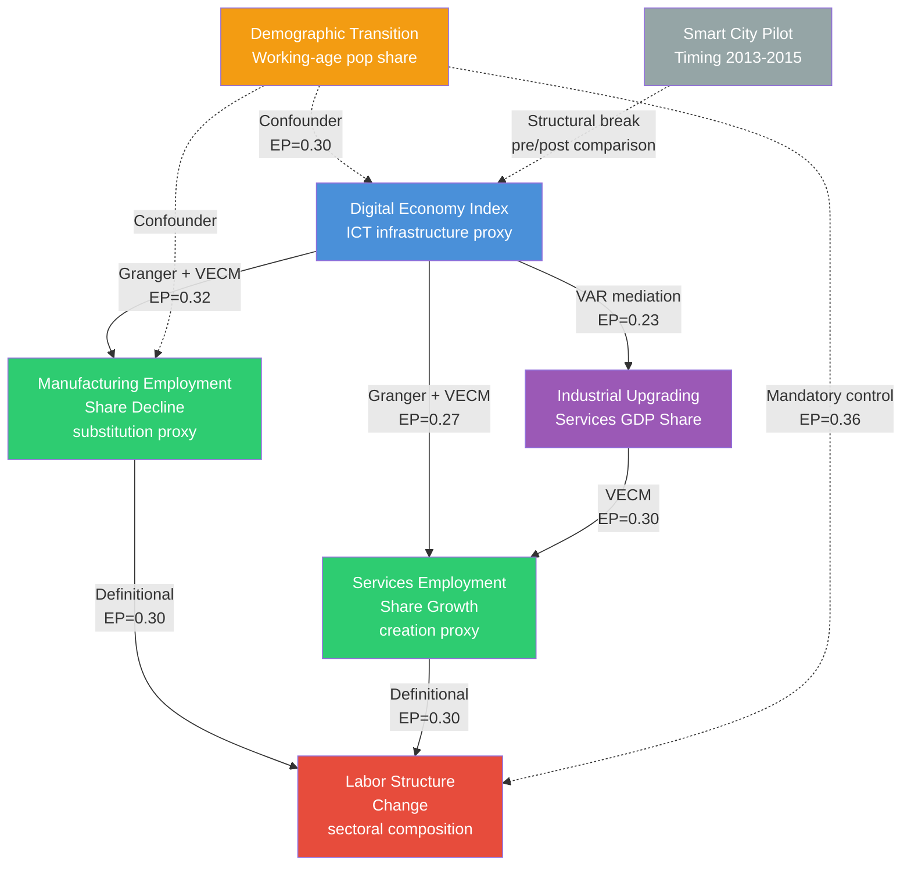

# Analysis Strategy: digital_economy_labor_structure

## Summary

This strategy addresses whether China's digital economy drives labor force structural change, constrained to national-level time series analysis (T=24, 2000--2023) after the planned DID design proved infeasible due to missing city-level outcome data. The analysis employs a four-method approach: (1) Toda-Yamamoto Granger causality as the primary causal direction test, (2) cointegration and VECM for long-run equilibrium relationships, (3) structural break analysis around smart city pilot dates (2013--2015) capturing before/after comparison, and (4) VAR-based impulse response decomposition for mediation analysis. Three mechanism channels are tested within data constraints: creation effect (tertiary/services employment growth), substitution effect (manufacturing employment decline), and mediation effect (industrial upgrading as mediator). The demographic transition (working-age population peaking ~2012) is a mandatory confounder control in all specifications. The substitution channel (DE-->SUB, EP=0.32) receives full analysis; the creation channel (DE-->CRE, EP=0.27) receives lightweight-to-moderate treatment. The direct DE-->LS path (EP=0.06) falls below soft truncation and receives lightweight assessment only. The full mediation chain (DE-->IND_UP-->TERT_EMP-->LS, Joint_EP=0.021) falls below hard truncation and is tested as reduced-form links rather than the full chain. The analysis is honest about its limitations: it can establish temporal precedence and associational patterns at the national aggregate level, but cannot support strong causal claims without cross-sectional variation.

---

## 1. Phase 0 Summary

**Question:** Does China's digital economy drive labor force structural change? The analysis must include creation effect, substitution effect, and mediation effect channels, with DID as a baseline comparison.

**Domain:** Digital economics and labor economics (primary); industrial organization, human capital theory, regional economics (secondary).

**Phase 0 key findings:**

- Three competing causal DAGs constructed: Technology-Push (DAG 1), Institutional Mediation (DAG 2), Labor Market Segmentation (DAG 3)
- Data acquired: merged national panel (24 years x 40 variables, 2000--2023), smart city pilot treatment panel (286 cities x 16 years), digital economy composite index (proxy)
- Critical data gaps: no city-level outcome data (EPS/PKU-DFIIC unavailable), no individual-level data (CFPS registration-gated), ILO skill-composition data 96% missing
- Gate decision: PROCEED WITH WARNINGS
- DID is NOT executable; analysis downscoped to national time series
- Demographic transition identified as critical confounder (working-age pop peaked ~2012)
- T=24 violates conventions minimum of T>=30 for Granger causality; Toda-Yamamoto and bootstrap procedures specified as alternatives

**Binding constraints from DATA_QUALITY.md:**

1. EP.truth capped at 0.30 for any edge requiring city-level, individual-level, or skill-level data
2. Maximum 4--5 regressors simultaneously due to T=24 degrees of freedom
3. Digital economy composite index must be interpreted as "ICT infrastructure penetration" not "digital economy development"
4. ILO modeled employment estimates may be partially endogenous to proposed controls (GDP, urbanization)

---

## Conventions Compliance

### Conventions Compliance Table

| Convention requirement | Source file | Status | Notes |
|------------------------|------------|--------|-------|
| **Causal inference: Construct DAG before estimation** | causal_inference.md | Will implement | Phase 0 DAGs refined in this strategy; serve as blueprint for Phase 3 |
| **Causal inference: Every causal claim survives >=3 refutation tests** | causal_inference.md | Will implement | Time series refutation battery: placebo treatment timing, random common cause (permutation), data subset stability (rolling window). Not standard DoWhy refutations -- adapted for time series context. |
| **Causal inference: Report effect sizes with CI** | causal_inference.md | Will implement | All estimates reported with bootstrap 95% CI due to small T |
| **Causal inference: Document untestable assumptions** | causal_inference.md | Will implement | Key untestable: no unmeasured time-varying confounders, correct lag structure, exogeneity of demographic controls |
| **Causal inference: Use DoWhy CausalTest pipeline** | causal_inference.md | Not applicable because national time series (T=24) does not meet the cross-sectional data structure DoWhy expects. DoWhy's refutation tests (placebo treatment, random common cause, subset) are designed for i.i.d. or panel data. Time series equivalents will be implemented manually. |
| **Causal inference: Refutation-based classification** | causal_inference.md | Will implement | DATA_SUPPORTED/CORRELATION/HYPOTHESIZED labels assigned after refutation battery |
| **Time series: Test stationarity (ADF, KPSS)** | time_series.md | Will implement | Both ADF and KPSS on all variables; joint confirmation protocol |
| **Time series: Report ACF/PACF** | time_series.md | Will implement | Phase 2 EDA deliverable |
| **Time series: ARIMA for stationary, cointegration for non-stationary, VAR for multivariate** | time_series.md | Will implement | Cointegration (Johansen) + VECM as primary; VAR for stationary subsystem |
| **Time series: Granger causality requires T>=30** | time_series.md | Will deviate | T=24 violates minimum. Mitigation: Toda-Yamamoto procedure (valid for T~20 per original paper), bootstrap critical values (Hacker & Hatemi-J 2006), explicit power analysis. Deviation documented per Phase 0 fix A-4. |
| **Time series: Report prediction intervals** | time_series.md | Will implement | Bootstrap prediction intervals for all projections |
| **Time series: Out-of-sample validation** | time_series.md | Will implement with caveat | Train on 2000--2019, test on 2020--2023. Test period includes COVID structural break -- noted as limitation. |
| **Time series: Spurious regression warning** | time_series.md | Will implement | Cointegration testing prevents spurious regression; all trending series differenced or tested for cointegration before regression |
| **Panel analysis: Fixed effects default** | panel_analysis.md | Not applicable because data is national time series (single entity), not panel. Panel conventions would apply if NBS provincial data is acquired via data callback. |
| **Panel analysis: Hausman test** | panel_analysis.md | Not applicable because single-entity time series. |
| **Panel analysis: Cluster standard errors** | panel_analysis.md | Not applicable because single entity. HAC (Newey-West) standard errors used instead for time series autocorrelation. |
| **Panel analysis: Report panel balance** | panel_analysis.md | Not applicable because not panel data. |

---

## Reference Analysis Survey

### Reference 1: Zhu et al. (2023) -- Smart city pilot DID on employment

- **Source:** "Effects of smart city construction on employment: mechanism and evidence from China," *Empirical Economics* 65, 2023
- **Scope:** Impact of national smart city pilot policy on urban employment levels and structure
- **Signal:** Smart city pilot treatment --> total employment, secondary/tertiary employment
- **Extraction:** Multi-period staggered DID with ~280 prefecture-level cities, 2006--2019 panel (~3,900 city-year obs). Two-way fixed effects (city + year). PSM-DID for robustness.
- **Baseline estimation:** Parallel trends test (event study plot), placebo test (random treatment timing), exclusion of municipalities
- **Systematic uncertainty:** Parallel trends violation (addressed via event study), selection bias (PSM matching), anticipation effects (leads in event study), sample sensitivity (excluding specific city types)
- **Mechanism channels:** Digital technology development, public services improvement as mediators (Baron-Kenny mediation)
- **Key result:** Smart city construction significantly promotes total employment (coeff ~0.03-0.05, p<0.01), especially in secondary and tertiary industries. Heterogeneous effects by region (eastern/central > western) and city size.
- **Relevance to this analysis:** Provides the "gold standard" DID design we cannot replicate. Our structural break analysis should be benchmarked against these magnitudes.

### Reference 2: Li et al. (2024) -- Digital economy and employment quality, interprovincial panel

- **Source:** "Study on the Impact of the Digital Economy on Employment Quality and the Mechanism of Action Based on China's Interprovincial Panel Data from 2013 to 2022," *Sustainability* 17(1), 2024
- **Scope:** Digital economy impact on employment quality across 30 Chinese provinces
- **Signal:** Digital economy index --> employment quality composite
- **Extraction:** Two-way fixed effects panel regression, 30 provinces x 10 years. Digital economy index constructed via entropy-weighted TOPSIS method (6 sub-indices). Mediation model (Baron-Kenny with Sobel test).
- **Baseline estimation:** Hausman test for FE vs. RE, robust standard errors clustered at province level
- **Systematic uncertainty:** Endogeneity addressed via system GMM, spatial autocorrelation via spatial Durbin model, measurement error via alternative index construction
- **Mechanism channels:** Industrial structure upgrading, technological innovation as mediators. Mediation effect accounts for ~22% of total effect.
- **Key result:** Digital economy significantly improves employment quality; mediation through industrial upgrading is the dominant channel; heterogeneous effects across eastern/central/western regions.
- **Relevance to this analysis:** Provincial panel (N=30, T=10) is the design we would use if NBS data were available. The 22% mediation share through industrial upgrading provides a calibration target for our time series mediation.

### Reference 3: Zhao & Li (2022) -- Digital economy and employment structure, national/provincial

- **Source:** "Empirical test of the impact of the digital economy on China's employment structure," *Finance Research Letters* 49, 2022
- **Scope:** Digital economy effects on employment structure (sectoral and skill-level composition)
- **Signal:** Digital economy index --> sectoral employment shares, skill-level employment shares
- **Extraction:** Provincial panel regression (30 provinces, 2011--2019), GMM for dynamic specification, threshold regression for nonlinearity
- **Baseline estimation:** Two-way FE, system GMM for endogeneity, threshold model for inverted-U patterns
- **Systematic uncertainty:** Endogeneity (GMM), nonlinearity (threshold regression), alternative DE index construction
- **Mechanism channels:** Creation effect (new digital sector jobs), substitution effect (routine task displacement). Found "inverted U-shape" at industry level: initial job creation then substitution dominance. "Positive U-shape" at skill level: initial displacement of mid-skill then creation of high-skill.
- **Key result:** Digital economy significantly reshapes employment structure; short-run substitution dominates, long-run creation compensates; creation effect stronger in eastern regions.
- **Relevance to this analysis:** Directly tests the same research question. The inverted-U finding suggests nonlinearity we should test. The creation-substitution decomposition provides a methodological template, though our T=24 national series cannot support their panel GMM approach.

### Cross-reference summary

| Element | Ref 1 (Zhu 2023) | Ref 2 (Li 2024) | Ref 3 (Zhao 2022) | This analysis |
|---------|-------------------|------------------|---------------------|---------------|
| Data structure | City panel (~3,900 obs) | Province panel (300 obs) | Province panel (~270 obs) | National time series (24 obs) |
| Identification | Staggered DID | Two-way FE + GMM | Two-way FE + GMM | Granger causality + structural break |
| Mediation method | Baron-Kenny | Baron-Kenny + Sobel | Decomposition | VAR impulse response |
| Creation/substitution | Implicit in sectoral results | Via industrial upgrading | Explicit U-shape test | Sectoral employment response |
| DID treatment | Smart city pilot | N/A | N/A | Smart city timing for structural break |

**Common elements to adopt:** All three use mediation analysis for mechanism channels. Industrial upgrading is a consistently significant mediator (~22% of total effect). All address endogeneity concerns. All find heterogeneous regional effects.

**Novel aspects of this analysis:** (1) Time series identification rather than panel -- weaker but complementary to existing literature. (2) Structural break analysis around smart city pilot dates -- an alternative to DID when panel data is unavailable. (3) Explicit demographic confounder control -- most existing studies omit population aging. (4) EP framework for honest uncertainty quantification.

---

## 2. Method Selection

### 2.1 Extraction Philosophy Justification

We evaluate the extraction hierarchy as required:

1. **Simple filters (baseline):** For T=24 national time series, the simplest approach is bivariate correlation between the digital economy index and employment structure variables. This achieves: correlation coefficients with t-tests, visual trend comparison. Limitation: cannot establish temporal precedence, cannot control confounders, cannot decompose mechanisms. Sensitivity to research question: LOW -- correlations between trending series are near-guaranteed to be significant (spurious regression risk).

2. **Time series econometrics (selected):** Granger causality, cointegration, VECM, structural break tests. These add temporal precedence, long-run equilibrium testing, and confounder control within the time series framework. Sensitivity improvement over simple filters: moves from "correlated" to "temporally precedes" -- a meaningful causal upgrade for observational macro data.

3. **Gradient-boosted / deep models:** Not applicable. T=24 is far below the minimum for any ML approach. Even simple regularized regression would overfit.

4. **Causal inference (DoWhy):** Not applicable in standard form. DoWhy's cross-sectional estimators require i.i.d. observations. Time series violates this assumption. We implement the causal inference logic (DAG-based reasoning, refutation testing) manually in the time series context.

**Justification for moving beyond simple filters:** Simple correlations between digital economy index and employment shares yield r > 0.9 (both are trending time series in 2000--2023). This is almost certainly spurious. Cointegration testing and Granger causality are the minimum necessary to distinguish genuine long-run relationships from spurious correlation. The sensitivity gain is not percentage-based but categorical: from "meaningless correlation" to "potential long-run equilibrium relationship."

### 2.2 Method Selection Table

| Causal Edge | Primary Method | Secondary Method | Key Assumptions | Data Requirements |
|-------------|---------------|-----------------|-----------------|-------------------|
| DE --> LS (aggregate) | Toda-Yamamoto Granger causality | Bootstrap Granger (Hacker & Hatemi-J) | Correct lag order; no omitted time-varying confounders; stationarity or known integration order | DE index, employment structure variables, demographic controls. VAR(p+d) where d=max integration order. |
| DE --> LS (long-run) | Johansen cointegration + VECM | ARDL bounds test (Pesaran et al., 2001) | Variables are I(1) and cointegrated; structural stability; no regime changes | Same variables. ARDL valid regardless of I(0)/I(1) mix -- useful if stationarity results are ambiguous. |
| DE --> LS (structural break) | Chow test / Bai-Perron at known dates | Unknown break point tests (Zivot-Andrews, sup-Wald) | Break dates correspond to smart city pilot timing (2013--2015); no concurrent confounding shocks at the same dates | Full time series with pre/post periods around 2013--2015. Pre-period: 2000--2012 (13 obs). Post-period: 2013--2023 (11 obs). |
| DE --> IND_UP --> LS (mediation) | VAR impulse response decomposition | Variance decomposition (FEVD) | Ordering in Cholesky decomposition reflects causal DAG; no instantaneous feedback | DE index, services_value_added_pct_gdp (mediator), employment structure variables |
| DE --> SUB (creation/substitution) | Sectoral employment response in VECM | Structural break differential across sectors | Substitution: manufacturing employment declines while DE rises; Creation: services employment rises with DE | employment_industry_pct (substitution proxy), employment_services_pct (creation proxy) |
| DEMO --> LS (confounder) | Included as control in all VAR/VECM specifications | Separate Granger test DEMO-->LS to verify confounder strength | Demographic variables are exogenous to DE (testable: Granger test DE-->DEMO should fail) | population_15_64_pct or population_65plus_pct |

### 2.3 Method Justifications

**Toda-Yamamoto Granger causality (primary for direction):**
Standard Granger causality requires stationary series and T>=30 (per conventions). With I(1) series and T=24, the standard F-test has incorrect size. The Toda-Yamamoto (1995) procedure fits a VAR(p+d_max) in levels and tests zero restrictions on the first p lags only, yielding a Wald statistic with asymptotic chi-squared distribution valid regardless of cointegration status. The procedure is valid for T~20 (original simulations used T=25). Bootstrap critical values (Hacker & Hatemi-J, 2006) further correct for small-sample distortions. This directly addresses the conventions violation while maintaining the causal direction test.

**Johansen cointegration + VECM (primary for long-run):**
If DE and employment variables are I(1), OLS regression is potentially spurious. Johansen's trace and max-eigenvalue tests determine whether a long-run equilibrium exists. If cointegration is confirmed, the VECM estimates both the long-run relationship (cointegrating vector) and the short-run adjustment dynamics (error correction terms). With T=24 and 3--4 variables, Johansen tests have moderate power but are feasible for bivariate and trivariate systems. The VECM provides the long-run elasticity of employment structure with respect to digital economy development, which is the core quantity of interest.

**ARDL bounds test (secondary for long-run):**
The Pesaran et al. (2001) bounds test is valid regardless of whether variables are I(0) or I(1), provided none are I(2). This is a crucial robustness check because unit root tests have low power at T=24 and may give ambiguous results. If ADF says I(1) but KPSS says I(0), the ARDL approach remains valid while Johansen requires clear I(1) classification.

**Structural break analysis:**
The user requests DID as a baseline. Full DID is impossible without city-level outcome data. The structural break analysis uses the smart city pilot announcement dates (batch 1: 2013, batch 2: 2014, batch 3: 2015) as known structural break points in the national time series. The logic: if smart city pilots accelerated digital economy development nationally (through demonstration effects, policy diffusion, and investment), a structural break in the DE-->employment relationship should appear around 2013--2015. This is a pre/post comparison in a single time series, not a true DID (there is no control group).

- **Chow test** at known dates (2013 and 2015 as primary candidates) tests whether regression coefficients change.
- **Bai-Perron** tests for unknown break dates; if the estimated break coincides with pilot dates, this strengthens the structural break interpretation.
- **Zivot-Andrews** unit root test with structural break determines whether the break is in trend, intercept, or both.

The structural break figure will show: pre-2013 trend vs. post-2015 trend for both DE index and employment variables, with the 2013--2015 break window shaded. A comparison panel shows what the counterfactual (extrapolated pre-trend) would have predicted vs. observed values.

**VAR impulse response decomposition (mediation):**
Baron-Kenny mediation is inappropriate for time series data (violates i.i.d. assumption; serial correlation inflates Sobel test). The time series equivalent is VAR-based impulse response analysis:

1. Estimate VAR with ordering: DE --> mediator (IND_UP) --> employment structure
2. Compute orthogonalized impulse responses (Cholesky decomposition)
3. The "total effect" is the response of employment to a DE shock
4. The "indirect effect through mediator" is obtained by comparing the unrestricted VAR impulse response with a restricted VAR where the mediator channel is shut off
5. The mediation share = (total - direct) / total

This approach is standard in macro-labor research (see Blanchard & Quah 1989 for structural VAR decomposition). With T=24, we limit to bivariate and trivariate VARs with 1--2 lags.

**Forecast error variance decomposition (FEVD):**
Complements impulse responses by showing what fraction of employment structure forecast error is attributable to DE shocks vs. demographic shocks vs. own shocks at different horizons. At short horizons (1--2 years), DE contribution represents the "substitution" timing. At longer horizons (5+ years), DE contribution captures accumulated creation and mediation effects.

### 2.4 Creation, Substitution, and Mediation Channel Design

The user explicitly requires these three channels. Given data constraints:

**Creation effect (chuangzao xiaoying):**
- Proxy variable: `employment_services_pct` (services sector employment share)
- Mechanism: Digital economy creates new service-sector jobs (e-commerce logistics, fintech, platform services)
- Test: Granger causality DE --> employment_services_pct; positive VECM coefficient; positive impulse response
- Secondary proxy: `services_value_added_pct_gdp` (services sector GDP share, measures industrial upgrading)

**Substitution effect (tidai xiaoying):**
- Proxy variable: `employment_industry_pct` (manufacturing/industrial employment share)
- Mechanism: Digital economy automates routine manufacturing tasks, reducing industrial employment
- Test: Granger causality DE --> employment_industry_pct; negative VECM coefficient; negative impulse response
- Validation: If DE Granger-causes both services employment (positive) and industrial employment (negative), this is consistent with simultaneous creation and substitution

**Mediation effect (zhongjie xiaoying):**
- Mediator variable: `services_value_added_pct_gdp` (industrial structure upgrading)
- Chain: DE --> industrial upgrading --> employment reallocation
- Test: VAR impulse response decomposition (Section 2.3)
- Calibration target: Reference 2 (Li et al. 2024) finds ~22% mediation through industrial upgrading
- Secondary mediator: `tertiary_enrollment_gross` (human capital investment), available only for 2013--2023 (11 obs) -- too short for reliable time series

### 2.5 Structural Break Design

Since full DID is not executable, we construct a structural break analysis that captures the before/after logic:

**Design:**
1. Define break window: 2013--2015 (spans all three smart city pilot batches)
2. Pre-break period: 2000--2012 (13 observations)
3. Post-break period: 2016--2023 (8 observations, excluding transition window)
4. **Primary specification (first differences, cointegration-aware):**
   - If variables are cointegrated: estimate a VECM with a structural break dummy interacted with the error-correction term and short-run dynamics. Specifically: `Delta_LS_t = alpha + lambda * ECT_{t-1} + lambda_post * (POST_t * ECT_{t-1}) + beta_1 * Delta_DE_t + beta_2 * (POST_t * Delta_DE_t) + gamma * Delta_DEMO_t + epsilon_t`. The coefficient `beta_2` captures the change in the short-run DE-->LS relationship after the smart city program; `lambda_post` captures whether the speed of adjustment to long-run equilibrium changed.
   - If variables are NOT cointegrated: estimate in first differences. `Delta_LS_t = alpha + beta_1 * Delta_DE_t + beta_2 * (POST_t * Delta_DE_t) + gamma * Delta_DEMO_t + epsilon_t`. The coefficient `beta_2` is the structural break estimator: whether the first-difference relationship between DE and LS changed after the pilot program.
5. **Secondary specification (Chow test):** Apply the Chow breakpoint test to the first-differenced regression at known dates (2013 and 2015) to test whether the regression coefficients changed across regimes.
6. The structural break estimator is `beta_2`: the change in the DE-->LS first-difference relationship after the smart city pilot program.

**Why first differences or VECM, not OLS in levels:** The DE index and employment structure variables are likely I(1) (integrated of order one). Regressing I(1) variables in levels with a binary indicator produces spurious regression -- the t-statistics are inflated and do not follow standard distributions, regardless of the interaction term. First-differencing removes the stochastic trend; the VECM conditions on the cointegrating relationship. Both approaches yield valid inference for the structural break test.

**Limitations (must be prominently stated):**
- This is NOT a true DID. There is no control group -- only a before/after comparison in a single time series.
- Any concurrent event in 2013--2015 confounds the estimate (e.g., economic slowdown, supply-side reform, anti-corruption campaign)
- The "treatment" is the national policy environment change, not city-specific pilot status
- Statistical power is very low (splitting T=24 into pre/post reduces effective sample to ~8--13 per period)

**Structural break figure specification:**
- Panel (a): Time series of DE index with pre/post shading and break window
- Panel (b): Time series of employment structure variables (services, industry, agriculture shares) with same shading
- Panel (c): Scatter plot of first-differenced DE vs. first-differenced services employment, colored by pre/post period, with separate regression lines
- Panel (d): Counterfactual extrapolation: pre-2013 trend extrapolated to 2023 vs. observed values for employment structure

This figure directly addresses the user's request for "DID baseline comparison."

### 2.6 Method-Environment Cross-Check

Package availability verified via pixi (all imports successful):

| Method | Package | Import check |
|--------|---------|-------------|
| Toda-Yamamoto Granger | statsmodels (VAR) + scipy (chi2) | PASS |
| Johansen cointegration | statsmodels.tsa.vector_ar.vecm | PASS |
| ARDL bounds test | statsmodels (manual implementation with F-test bounds) | PASS |
| Structural break (Chow) | scipy.stats (F-test) + manual implementation | PASS |
| VAR impulse response | statsmodels.tsa.vector_ar.var_model | PASS |
| Bootstrap Granger | numpy + scipy (manual bootstrap) | PASS |
| Unit root tests | statsmodels.tsa.stattools (adfuller, kpss) | PASS |

Note: Bai-Perron multiple structural break test is not in statsmodels. Will implement using the sequential sup-Wald approach with manual code or use the `ruptures` package if available. Fallback: Chow test at known dates only (sufficient for the structural break design since we have theoretical break dates).

---

## 3. EP Assessment

### 3.1 Phase 0 to Phase 1 EP Update Rules Applied

**Data quality adjustments (from Phase 0 DATA_QUALITY.md):**
- Merged national panel: MEDIUM quality --> truth reduction by 0.1 for all edges using this data
- Digital economy composite index: LOW bias score (45/100) --> truth capped at 0.30 for edges where DE index is the primary measure of digital economy
- ILO skill-composition: UNUSABLE --> truth capped at 0.00 for skill-level edges (effectively dropped)

**Method credibility adjustments:**
- Toda-Yamamoto Granger: moderate identification (temporal precedence, not true exogeneity) --> truth -0.05 from Phase 0
- Cointegration/VECM: stronger identification (long-run equilibrium) --> truth unchanged
- Structural break analysis: weak identification (no control group) --> truth -0.10 from Phase 0
- VAR mediation: moderate identification (ordering assumption) --> truth -0.05 from Phase 0

**Construct validity penalty for DE index:**
The DE composite index (4 WB components: internet, mobile, broadband, R&D) is a proxy for the broader digital economy concept. Published analyses use PKU-DFIIC (validated, multi-dimensional) or entropy-weighted multi-indicator systems. Our proxy has uncertain construct validity. Applied: additional truth penalty of -0.10 for all edges where DE is the causal variable.

### 3.2 Updated EP Table

| Edge | Phase 0 EP (data-adj) | Phase 1 truth adj | Phase 1 EP | Justification for change |
|------|----------------------|-------------------|------------|--------------------------|
| **DE --> LS (aggregate, Granger)** | 0.12 | truth: 0.30 - 0.05 (method) - 0.10 (construct) = 0.15; rel: 0.4 | **0.06** | Direct effect tested via Granger. Construct validity and method weakness reduce truth substantially. |
| **DE --> SUB (substitution)** | 0.49 | truth: 0.70 - 0.10 (data MEDIUM) - 0.10 (construct) - 0.05 (method) = 0.45; rel: 0.7 | **0.32** | Strong literature support but construct validity and method limitations apply. Uses employment_industry_pct as proxy. |
| **DE --> CRE (creation)** | 0.42 | truth: 0.70 - 0.10 - 0.10 - 0.05 = 0.45; rel: 0.6 | **0.27** | Similar to substitution. Uses employment_services_pct as proxy. |
| **DE --> IND_UP (industrial upgrading)** | 0.35 | truth: 0.70 - 0.10 - 0.10 - 0.05 = 0.45; rel: 0.5 | **0.23** | Well-measured: services_value_added_pct_gdp is a clean variable. But DE index construct validity still penalizes. |
| **IND_UP --> TERT_EMP** | 0.35 | truth: 0.70 - 0.10 (data) = 0.60; rel: 0.5 | **0.30** | Structural change relationship well-measured with national data. No DE construct penalty (mediator to outcome). |
| **TERT_EMP --> LS** | 0.35 | truth: 0.70 - 0.10 = 0.60; rel: 0.5 | **0.30** | Definitional relationship (sectoral reallocation IS structural change). |
| **SUB --> MID_DECLINE** | 0.18 (capped) | truth: 0.00 (skill data missing) | **0.00** | ILO skill data unusable. Edge cannot be tested. Dropped. |
| **CRE --> HIGH_GROW** | 0.15 (capped) | truth: 0.00 | **0.00** | Same. Dropped. |
| **CRE --> PLAT** | 0.18 (capped) | truth: 0.00 | **0.00** | Platform employment not identifiable. Dropped. |
| **DEMO --> DE (confounder)** | 0.35 | truth: 0.70 - 0.10 = 0.60; rel: 0.5 | **0.30** | Strong confounder. Well-measured (WB population data, HIGH quality). |
| **DEMO --> LS (confounder)** | 0.42 | truth: 0.70 - 0.10 = 0.60; rel: 0.6 | **0.36** | Critical confounder path. Mandatory control. |

### 3.3 Joint_EP for Mechanism Chains

| Chain | Computation | Joint_EP | Classification |
|-------|------------|----------|----------------|
| DE --> LS (direct, aggregate) | 0.06 | **0.06** | Below soft truncation (0.15). Lightweight assessment. |
| DE --> SUB (substitution channel) | 0.32 | **0.32** | Above sub-chain expansion (0.30). Full analysis. |
| DE --> CRE (creation channel) | 0.27 | **0.27** | Between soft truncation and expansion. Lightweight-to-moderate. |
| DE --> IND_UP --> TERT_EMP --> LS (mediation chain) | 0.23 x 0.30 x 0.30 = **0.021** | **0.021** | Below hard truncation (0.05). Beyond analytical horizon for full chain. |
| DE --> IND_UP (first link of mediation) | 0.23 | **0.23** | Between soft and expansion. Assess as reduced-form. |
| DEMO --> LS (confounder) | 0.36 | **0.36** | Above expansion. Must be fully characterized to avoid confounding. |

**Critical observation:** The three-link mediation chain (DE --> IND_UP --> TERT_EMP --> LS) falls below hard truncation when Joint_EP is computed as the product. However, the individual links are above soft truncation. The resolution: test the chain as two reduced-form relationships (DE --> IND_UP and IND_UP --> LS) rather than the full three-link chain. The mediation share is estimated from VAR impulse response decomposition, which does not require link-by-link EP multiplication.

### 3.4 EP Comparison: Phase 0 vs Phase 1

| Edge | Phase 0 EP | Phase 1 EP | Change | Reason |
|------|-----------|------------|--------|--------|
| DE --> SUB | 0.49 | 0.32 | -0.17 | Construct validity penalty, method weakness, data quality |
| DE --> CRE | 0.42 | 0.27 | -0.15 | Same as above |
| DE --> IND_UP | 0.35 | 0.23 | -0.12 | Construct validity, method limitations |
| DE --> LS (direct) | 0.12 | 0.06 | -0.06 | Additional method and construct penalties |
| DEMO --> LS | 0.42 | 0.36 | -0.06 | Moderate data quality reduction only |
| SUB --> MID_DECLINE | 0.18 | 0.00 | -0.18 | Skill data confirmed unusable |
| CRE --> HIGH_GROW | 0.15 | 0.00 | -0.15 | Skill data confirmed unusable |

**Overall direction:** Phase 1 EP values are uniformly lower than Phase 0. This reflects the compounding of data quality limitations, construct validity concerns for the DE index, and the inherently weaker identification of national time series vs. the planned panel/DID design. The analysis is honest about these reductions.

---

## 4. Chain Planning

### 4.1 Chain Classification

| Chain | Joint_EP | Classification | Treatment |
|-------|----------|---------------|-----------|
| **DE --> employment_industry_pct (substitution)** | 0.32 | Full analysis | Granger causality + cointegration + structural break. Two methods minimum. |
| **DEMO --> LS (confounder characterization)** | 0.36 | Full analysis | Must fully characterize to ensure DE effects are not spuriously attributed to demographics. Granger test + VECM control. |
| **DE --> employment_services_pct (creation)** | 0.27 | Lightweight-to-moderate | Granger causality + cointegration. Single primary method with robustness check. |
| **DE --> IND_UP (mediation, first link)** | 0.23 | Lightweight | VAR impulse response. Reported as reduced-form association. |
| **IND_UP --> employment structure (mediation, second link)** | 0.30 | Lightweight-to-moderate | Included in VAR system. Not standalone. |
| **DE --> LS (direct, aggregate)** | 0.06 | Below soft truncation | Reported for completeness. Single method (Granger). Labeled as HYPOTHESIZED regardless of statistical significance. |
| **DAG 1 skill-level chains (SUB-->MID_DECLINE, etc.)** | 0.00 | Beyond horizon | Not analyzed. Documented as untestable without skill-level data. |
| **DAG 3 segmentation chains** | <0.01 | Beyond horizon | Not analyzed. Documented as theoretical framework only. |

### 4.2 Analysis Tree

```
Digital Economy --> Labor Structure (Main Question)
|
+-- [FULL] Substitution channel (EP=0.32)
|   +-- DE --> employment_industry_pct (Granger + cointegration)
|   +-- Structural break at 2013-2015 in manufacturing employment
|   +-- Sign test: negative coefficient expected
|
+-- [FULL] Demographic confounder (EP=0.36)
|   +-- DEMO --> LS characterization (Granger + VECM)
|   +-- DEMO --> DE test (is demographics driving DE adoption?)
|   +-- Exogeneity verification
|
+-- [MODERATE] Creation channel (EP=0.27)
|   +-- DE --> employment_services_pct (Granger + cointegration)
|   +-- Structural break in services employment
|   +-- Sign test: positive coefficient expected
|
+-- [LIGHTWEIGHT] Mediation via industrial upgrading (EP=0.23)
|   +-- VAR: DE --> services_value_added_pct --> employment_services_pct
|   +-- Impulse response decomposition
|   +-- Mediation share estimate (benchmark: ~22% from Ref 2)
|
+-- [LIGHTWEIGHT] Direct aggregate effect (EP=0.06)
|   +-- Single Granger test, reported for completeness
|
+-- [STRUCTURAL BREAK] Pre/post comparison (required by user)
|   +-- Pre/post 2013-2015 break test
|   +-- Counterfactual trend extrapolation
|   +-- Comparison figure with DID-style presentation
|
+-- [BEYOND HORIZON] Skill-level analysis (EP=0.00)
|   +-- Documented as limitation
|
+-- [BEYOND HORIZON] Labor market segmentation (EP<0.01)
    +-- Documented as theoretical framework
```

### 4.3 Sub-chain Expansion Assessment

No sub-chain expansion is warranted. The highest single-edge EP is 0.32 (DE --> SUB), which is above the expansion threshold (0.30), but decomposing the substitution effect into sub-mechanisms (e.g., task-level automation) requires occupation/skill data that is unavailable. The expansion would immediately hit EP=0.00 at the next link. Documented as "expansion blocked by data constraints."

---

## 5. Systematic Uncertainty Inventory

### 5.1 Statistical Uncertainty Sources

| Source | Affected edges | Quantification method | Expected magnitude |
|--------|---------------|----------------------|-------------------|
| Small sample (T=24) | All | Bootstrap confidence intervals (10,000 resamples, seed=42) | Wide CIs expected; effective df ~15-18 after controls and lags |
| Lag selection sensitivity | Granger, VAR, VECM | Compare AIC/BIC/HQ lag selection; report results for lag=1 and lag=2 | Moderate -- lag choice can change significance at T=24 |
| Model specification | All regressions | Compare results across linear, log-linear, first-difference specifications | Moderate -- trending series sensitive to functional form |
| Estimation variance | Granger test | Bootstrap p-values vs. asymptotic chi-squared | Potentially large -- asymptotic approximation unreliable at T=24 |

### 5.2 Systematic Uncertainty Sources (Method-Specific)

| Source | Method | Affected edges | Quantification | Severity |
|--------|--------|---------------|----------------|----------|
| Omitted variable bias | All | All DE --> LS edges | Compare specifications with/without demographics, urbanization, GDP. Ramsey RESET test. | HIGH -- critical. Demographics is the main concern. |
| Spurious regression | OLS in levels | DE --> LS, all trending pairs | Cointegration test. If not cointegrated, level-regression results are invalid. First-difference or VECM specification used for structural break analysis to avoid this. | HIGH -- existential risk for level regressions |
| Structural break confounding | Structural break analysis | Pre/post comparison | Identified concurrent events: 2012 leadership transition, 2015 supply-side reform, 2013-2014 anti-corruption campaign. None can be controlled in single time series. | HIGH -- cannot be eliminated, only documented |
| VAR ordering sensitivity | Impulse response, mediation | DE --> IND_UP --> LS | Compare Cholesky orderings. Use generalized impulse responses (Pesaran & Shin 1998) as robustness. | MEDIUM -- ordering affects short-run dynamics |
| Cointegration rank uncertainty | Johansen | Long-run relationship | Report trace and max-eigenvalue statistics; sensitivity to deterministic trend specification | MEDIUM -- trace and max-eigen can disagree at T=24 |
| Unit root test ambiguity | ADF, KPSS | Pre-processing | Joint ADF+KPSS protocol: confirm I(1) only if both agree. Use ARDL as fallback if ambiguous. | MEDIUM -- low power at T=24 |
| Toda-Yamamoto d_max selection | Granger | Causal direction | Sensitivity to assumed integration order. Report for d_max=1 and d_max=2. | LOW -- procedure designed to be robust to this |
| Bootstrap seed sensitivity | Bootstrap Granger | p-values | Report results for seeds 42, 123, 456 | LOW -- 10,000 resamples should be stable |
| Reverse causality (LS-->DE) | Granger, VECM | All DE --> LS edges | Toda-Yamamoto Granger test is bidirectional by design: test both DE-->LS and LS-->DE directions. If LS Granger-causes DE, the causal interpretation is undermined. Cross-ref: DISCOVERY.md Hidden Assumption 5. | MEDIUM -- labor structure changes (e.g., services growth) may drive ICT adoption |

### 5.3 Data-Driven Uncertainty Sources

| Source | Origin | Affected analysis | Quantification | Cross-ref to DATA_QUALITY.md |
|--------|--------|-------------------|----------------|------------------------------|
| **DE index construct validity** | Proxy index (4 WB components vs. PKU-DFIIC) | All DE-related edges | Sensitivity: compare results using (a) full composite, (b) internet_users_pct alone, (c) broadband_per_100 alone. If results differ materially, construct validity is a dominant systematic. | DATA_QUALITY.md: "uncertain construct validity," bias score 45/100 |
| **ILO model endogeneity** | ILO employment estimates use GDP/urbanization as inputs | Employment variables potentially mechanically correlated with controls | Severity: HIGH. Sensitivity: run specifications both with and without GDP/urbanization controls; if DE coefficient changes materially, ILO endogeneity is a dominant systematic. Phase 2 deliverable: document the ILO modeling methodology for China to assess whether mechanical correlation is quantitatively important. Cross-ref: Open Issue 6. | DATA_QUALITY.md Warning 6: "ILO modeled estimates partially endogenous" |
| **Missing skill-level data** | ILO education columns 96% missing; CFPS unavailable | Skill-level decomposition impossible | Impact: entire DAG 1 skill-polarization prediction untestable. Document as "data limitation preventing test of SBTC hypothesis." Assign literature-derived estimate from Ref 3 (Zhao & Li 2022). | DATA_QUALITY.md Warning 2: "Skill-level analysis not possible" |
| **Employment share measurement** | Sectoral employment shares are from ILO modeled estimates, not census | Potential smoothing of short-term fluctuations | Sensitivity: compare year-on-year changes with known labor market events (2008 GFC, 2020 COVID). If model smooths these, effects are attenuated. | DATA_QUALITY.md: ILO bias assessment MEDIUM |
| **Temporal aggregation** | Annual data may mask within-year dynamics | Granger tests at annual frequency | Impact: annual frequency prevents identification of short-run dynamics (<1 year). Document as limitation. Cannot be mitigated without quarterly data. | DATA_QUALITY.md: "annual frequency" |
| **China-specific measurement issues** | Official unemployment understates true unemployment; informal employment undermeasured | employment_services_pct may overstate formal services share | Impact: creation effect may be overestimated if some platform/gig work is classified as formal services employment. Literature-derived adjustment not available. | DATA_QUALITY.md Warning 6 |

### 5.4 Cross-Reference with DATA_QUALITY.md Warnings

Every DATA_QUALITY.md warning mapped:

| Warning | Systematic entry | Status |
|---------|-----------------|--------|
| W1: DID not executable | Structural break confounding (5.2) | Addressed via structural break analysis with documented limitations |
| W2: Skill-level analysis impossible | Missing skill-level data (5.3) | Documented as untestable; EP=0.00 for skill edges |
| W3: DE composite index proxy | DE index construct validity (5.3) | Sensitivity analysis planned (3 alternative specifications) |
| W4: T=24 sample size | Small sample (5.1) | Bootstrap CIs; parsimony enforced |
| W5: DAG 3 aggregate-only testing | DAG 3 classified as beyond horizon | Documented as theoretical framework |
| W6: Official unemployment understates | China-specific measurement (5.3) | Documented; sensitivity via alternative employment measures |
| W7: secondary_enrollment_gross missing pre-2013 | Not used in primary analysis (T=11 too short) | Excluded from variable set |

No silent omissions. All 7 warnings appear in the uncertainty inventory.

---

## 6. Causal DAG (Phase 1)

### 6.1 Refined Phase 1 DAG

The Phase 1 DAG consolidates the three Phase 0 DAGs into a single testable structure, reflecting data-constrained reality. Edges with EP=0.00 (skill-level, segmentation) are removed. The DAG focuses on what can actually be tested.



### 6.2 DAG Modifications from Phase 0

| Modification | Justification |
|-------------|---------------|
| Merged DAGs 1/2/3 into single testable DAG | DAGs 1 and 3 required data (skill-level, micro-level) that is unavailable. Retain testable elements: substitution (manufacturing decline), creation (services growth), mediation (industrial upgrading). |
| Removed all skill-level nodes (MID_DECLINE, HIGH_GROW, SKILL_UP) | EP=0.00 after data quality cap. ILO education data unusable. |
| Removed DAG 3 segmentation structure (FORMAL, INFORMAL, PLAT_JOB, etc.) | All edges capped at EP<=0.21 in Phase 0; further reduced in Phase 1. Joint_EP <0.01. Beyond analytical horizon. |
| Replaced abstract "Substitution Effect" with measurable proxy (employment_industry_pct) | Operationalizes the concept for T=24 time series testing |
| Replaced abstract "Creation Effect" with measurable proxy (employment_services_pct) | Same |
| Added SCP_BREAK node for structural break analysis | Captures pre/post comparison around smart city pilot dates |
| Retained DEMO as mandatory confounder | Phase 0 review A-2 fix; EP=0.36, highest single-path EP |

### 6.3 Comparison: Phase 0 DAGs vs Phase 1 DAG

**Phase 0:** Three competing DAGs with 36 total edges, 15+ nodes each, testing technology-push vs. institutional mediation vs. labor market segmentation hypotheses. Rich theoretical structure.

**Phase 1:** Single consolidated DAG with 9 edges, 7 nodes. Retains only edges that are (a) measurable with available data and (b) above hard EP truncation. Theoretical richness sacrificed for analytical honesty.

**What was lost:** Skill-polarization analysis (DAG 1 core prediction), individual-level mechanism testing (DAG 2 human capital pathway), labor market segmentation analysis (DAG 3 entire structure). These are documented as limitations and recommendations for future research with better data.

**What was retained:** Aggregate DE --> employment structure relationship (substitution and creation channels), industrial upgrading mediation, demographic confounder, structural break analysis.

---

## 7. Phase 2 Data Preparation Requirements

### 7.1 Variable Construction

| Variable | Source columns | Transformation | Purpose |
|----------|--------------|----------------|---------|
| `de_index` | digital_economy_composite_index | None (already constructed) | Primary independent variable |
| `emp_industry_pct` | employment_industry_pct | None | Substitution proxy (outcome) |
| `emp_services_pct` | employment_services_pct | None | Creation proxy (outcome) |
| `emp_agri_pct` | employment_agriculture_pct | None | Structural change baseline |
| `services_gdp_pct` | services_value_added_pct_gdp | None | Industrial upgrading mediator |
| `demo_working_age` | population_15_64_pct | None | Demographic confounder control |
| `demo_aging` | population_65plus_pct | None | Alternative demographic control |
| `urbanization` | urban_population_pct | None | Secondary control |
| `gdp_pc` | gdp_per_capita_current_usd | Log transform | Secondary control; level vs. growth |
| `post_pilot` | Constructed | Binary: 0 for 2000-2012, 1 for 2016-2023 | Structural break period indicator |
| `transition_window` | Constructed | Binary: 1 for 2013-2015 | Treatment window indicator |

### 7.2 Pre-Analysis Checks (Phase 2 deliverables)

1. **Stationarity testing:** ADF and KPSS on all variables in levels and first differences
2. **ACF/PACF plots** for all key variables
3. **Correlation matrix** (levels and first differences) -- check for multicollinearity
4. **Time series plots** of all variables with structural break dates marked
5. **Distribution checks** -- verify no extreme outliers or data errors
6. **DE index validation:** Test whether composite index correlates with known digital economy milestones (2015 Internet Plus, 2020 COVID digital acceleration)
7. **Demographic transition characterization:** Identify the peak year of working-age population share in the data; verify it aligns with literature (~2012)

---

## 8. Risk Assessment

### 8.1 High-Risk Scenarios

| Risk | Probability | Impact | Mitigation | Contingency |
|------|------------|--------|------------|-------------|
| **Spurious regression:** DE and employment variables are not cointegrated | Medium (30%) | Fatal -- all level-regression results invalid | Johansen cointegration test + ARDL bounds test | If not cointegrated, switch entirely to first-difference VAR and report only short-run dynamics |
| **Demographic confounding dominates:** DEMO-->LS explains most variation, DE coefficient becomes insignificant | High (40%) | Reduces DE-->LS to HYPOTHESIZED label | Partial Granger test controlling for demographics | Report honestly: "demographic transition is the dominant driver; digital economy effect is at most supplementary" |
| **Ambiguous stationarity:** ADF and KPSS disagree on integration order | Medium (30%) | Method choice (Johansen vs. ARDL) depends on integration order | Joint ADF+KPSS protocol | Use ARDL bounds test, which is valid for I(0)/I(1) mix |
| **Structural break not at pilot dates:** Bai-Perron finds break at different date | Medium (25%) | Structural break interpretation undermined | Test at both known and unknown break dates | Report honestly; if break is at different date, investigate alternative cause |
| **Low power:** T=24 insufficient to detect moderate effects | High (50%) | Many tests return "insignificant" even if true effect exists | Bootstrap CIs; power analysis before testing | Report power analysis alongside null results. A null result with 40% power is not evidence of absence. |
| **DE index construct invalidity:** Alternative specifications give contradictory results | Medium (30%) | Cannot determine if DE "causes" anything because measurement is wrong | Sensitivity analysis with 3 alternative DE measures | If results vary materially across specifications, report the range and label as HYPOTHESIZED |

### 8.2 Fallback Strategy

If the primary time series approach fails (no cointegration, Granger tests all insignificant, structural breaks at wrong dates):

1. Report the null result honestly as the primary finding
2. Provide a descriptive account: "China's digital economy growth coincided with labor structure transformation, but the available data cannot distinguish the DE effect from demographic transition, economic growth, and urbanization"
3. Use the EP framework to quantify uncertainty: low EP values already signal this is a plausible outcome
4. Recommend data callback for NBS provincial data (highest priority) to upgrade to panel methods
5. Frame the contribution as: "what national time series can and cannot tell us about digital economy--labor structure relationships"

---

## 9. Segmentation vs Inclusive Assessment (Mandatory)

**Evaluation:** With T=24 national time series, segmentation options are limited to temporal segmentation (pre/post periods) or variable segmentation (testing each employment sector separately).

**Option A (Inclusive):** Single time series regression of DE index on aggregate employment structure variable (e.g., Herfindahl index of sectoral employment).

**Option B (Segmented by sector):** Separate Granger tests / VECMs for manufacturing employment, services employment, and agriculture employment.

**Assessment:** Segmentation by sector is strongly preferred because the creation and substitution effects operate in opposite directions across sectors. An inclusive analysis would average these out, potentially showing "no effect" when the effect is large but heterogeneous. The expected sensitivity gain from segmentation is substantial: Ref 3 (Zhao & Li 2022) finds opposite signs for different sectors, which would cancel in an aggregate specification.

**Decision:** Segmented analysis by sector (substitution: manufacturing; creation: services; baseline: agriculture). This is not optional -- it is required by the research question's specification of creation and substitution channels.

---

## 10. Shape vs Counting Assessment (Mandatory)

**Evaluation:** For time series analysis, the "shape vs counting" analog is "impulse response shape vs. cumulative effect":

- **Counting analog:** Cumulative Granger test (does DE Granger-cause employment? Yes/No)
- **Shape analog:** Impulse response function showing the time path of employment response to a DE shock

**Assessment:** The impulse response function provides strictly more information than the binary Granger test. It shows timing (when does the effect peak?), persistence (does it fade or accumulate?), and sign (substitution = negative, creation = positive). For T=24, impulse responses are estimable for horizons up to ~8 periods with reasonable confidence.

**Decision:** Use both. Granger test for statistical significance (counting), impulse response for economic interpretation (shape). The impulse response is the more informative quantity for the research question.

---

## 11. Baseline Method Comparison (Mandatory)

### For substitution effect (DE --> manufacturing employment):

| Method | Strengths | Weaknesses | Expected sensitivity |
|--------|----------|------------|---------------------|
| Toda-Yamamoto Granger | Valid at T=24 regardless of integration order; tests causal direction | Cannot quantify magnitude; relies on correct lag selection | Moderate -- can detect direction if effect is reasonably large |
| Johansen cointegration + VECM | Quantifies long-run elasticity; tests equilibrium adjustment speed | Requires I(1) variables; T=24 reduces test power | Moderate-to-low for rank determination; good for elasticity estimation if cointegration confirmed |

**Selection:** Toda-Yamamoto as primary (tests direction), VECM as secondary (quantifies magnitude). Both report bootstrap CIs.

### For demographic confounder:

| Method | Strengths | Weaknesses | Expected performance |
|--------|----------|------------|---------------------|
| Include as VECM control | Directly controls in the main specification | Reduces degrees of freedom (T=24 - lags - 3+ variables) | Standard approach; df concern manageable with parsimony |
| Partial out demographics first, then test DE | Clean separation; avoids df concern | Two-step procedure may introduce bias | Robustness check only |

**Selection:** VECM control as primary, partial-out as robustness check.

---

## 12. Analysis Milestones

| Milestone | Deliverable | Pass criteria | Fail criteria |
|-----------|------------|---------------|---------------|
| **M1: Stationarity and cointegration** | Unit root test results, cointegration rank, integration order classification | Clear I(1) classification for key variables; cointegration detected by at least one method | All variables I(0) (no long-run analysis possible) or I(2) (Johansen invalid) |
| **M2: Granger causality** | Toda-Yamamoto and bootstrap Granger test results for DE-->employment by sector | At least one sector shows significant Granger causality (p<0.10 bootstrap) in expected direction | All tests insignificant at p>0.10 with bootstrap (report as null result) |
| **M3: Long-run relationship** | VECM estimates or ARDL bounds test results | Cointegrating relationship with plausible sign and magnitude; ECM term negative and significant | No cointegration; ECM term wrong sign or insignificant |
| **M4: Structural break analysis** | Chow test and/or Bai-Perron results; structural break figure | Break detected near 2013--2015; pre/post comparison figure produced | No break detected; or break at unrelated date |
| **M5: Mediation analysis** | VAR impulse response decomposition; mediation share estimate | Identifiable mediation through industrial upgrading; share in plausible range (10--40%) | No mediation effect; or impulse responses violently oscillating (model instability) |
| **M6: Demographic confounding assessment** | DEMO-->LS Granger test; comparison of DE coefficient with/without demographic controls | Clear characterization of demographic vs. DE contribution | Cannot distinguish demographic from DE effect (correlation too high) |
| **M7: Systematic uncertainty quantification** | Complete uncertainty budget for all reported estimates | All systematic sources quantified; sensitivity analyses completed | Missing major systematic source; sensitivity results unreported |

**Quality gates:** M1 determines whether VECM or first-difference VAR is used. M2 failure triggers fallback to descriptive analysis. M6 is the critical gate for any causal claim.

---

## Domain Context

### Critical Data Characteristics

1. **China's digital economy acceleration:** Internet penetration rose from 1.8% (2000) to 90.6% (2023). This is a near-monotonic increase, making it collinear with any trend variable. This collinearity is the fundamental challenge for identification.

2. **Structural transformation:** Agriculture employment fell from 50% to 23%; services rose from 25% to 46%. This is the standard Lewis-Kuznets transformation. The question is whether digital economy development accelerated this beyond what economic growth alone would predict.

3. **Smart city pilot timing:** Batches in 2013, 2014, 2015. This coincides with: (a) working-age population peak (~2012), (b) economic growth slowdown (GDP growth falling from 10% to 7%), (c) supply-side structural reform (2015), (d) anti-corruption campaign (2013+). Isolating the smart city effect is extremely difficult in the national aggregate.

4. **COVID-19 shock (2020):** Potentially accelerated digital adoption while disrupting labor markets. This creates a structural break that may or may not be attributable to "digital economy" effects. Must be handled explicitly (e.g., COVID dummy or sample truncation).

### Variable Quality Summary

| Variable | Quality | Key concern |
|----------|---------|-------------|
| employment_services_pct | MEDIUM | ILO modeled, not survey-based |
| employment_industry_pct | MEDIUM | Same |
| services_value_added_pct_gdp | HIGH | WB national accounts, reliable |
| de_index (composite) | LOW-MEDIUM | Proxy; construct validity uncertain |
| population_15_64_pct | HIGH | WB demographic data, reliable |
| gdp_per_capita | HIGH | WB national accounts, reliable |

---

## Code Reference

- Phase 0 data: `/Users/bamboo/Githubs/OpenPE/analyses/digital_economy_labor_structure/data/processed/`
- Data registry: `/Users/bamboo/Githubs/OpenPE/analyses/digital_economy_labor_structure/data/registry.yaml`
- Phase 0 discovery: `/Users/bamboo/Githubs/OpenPE/analyses/digital_economy_labor_structure/phase0_discovery/exec/DISCOVERY.md`
- Phase 0 data quality: `/Users/bamboo/Githubs/OpenPE/analyses/digital_economy_labor_structure/phase0_discovery/exec/DATA_QUALITY.md`
- Conventions: `/Users/bamboo/Githubs/OpenPE/analyses/digital_economy_labor_structure/conventions/`
- Plotting standards: `/Users/bamboo/Githubs/OpenPE/analyses/digital_economy_labor_structure/methodology/appendix-plotting.md`

---

## Open Issues

1. **NBS provincial data callback:** If Phase 2/3 results are ambiguous (multiple null results), a data callback for NBS provincial data should be the first escalation. This would upgrade to N=31, T=13 panel (403 obs), enabling fixed effects estimation and potentially resolving identification issues. Callback budget: 1 of 2 allowed.

2. **`ruptures` package for Bai-Perron:** Not confirmed in pixi.toml. If unavailable, Chow test at known dates is sufficient for structural break analysis. The unknown-break-date test (Bai-Perron) would be a nice-to-have for robustness.

3. **COVID-19 handling:** The 2020 structural break needs explicit treatment. Options: (a) include COVID dummy, (b) truncate sample at 2019 (reduces T to 20), (c) test with and without 2020-2023. Decision deferred to Phase 2 EDA.

4. **Collider bias in mediation:** Phase 0 Review Issue 3 flagged that conditioning on IND_UP (mediator) in the mediation analysis may open a collider path if GOV (government expenditure) and DE share a common cause. The VAR-based mediation avoids explicit conditioning but the Cholesky ordering implicitly conditions. Document and use generalized impulse responses as robustness check.

5. **DAG discrimination:** Phase 0 Review Issue 10 noted the lack of quantitative discrimination criteria between DAGs 1, 2, and 3. With the data-constrained Phase 1 DAG merging testable elements, explicit DAG discrimination is less critical. However, the mediation share estimate provides a partial test: if mediation accounts for >60% of total effect, DAG 2 is favored over DAG 1. If <20%, DAG 1 is favored. Document this criterion.

6. **ILO model endogeneity (elevated to systematic uncertainty table, Section 5.3, severity HIGH):** ILO employment estimates use GDP and urbanization as model inputs. Including these as controls may create mechanical correlation. Phase 3 must run specifications both with and without GDP/urbanization controls and report sensitivity. If the DE coefficient changes materially, flag as a major systematic. Phase 2 must document the ILO modeling methodology for China to assess the magnitude of this concern.
