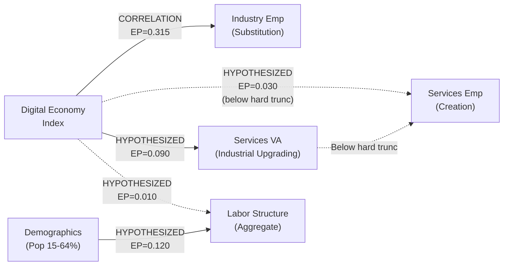

# Analysis: digital_economy_labor_structure

## 1. Signal Extraction

### Signal Definition

For each causal edge in the Phase 1 DAG, the "signal" is defined as the observable temporal pattern consistent with the hypothesized causal mechanism.

### Signal: DE --> SUB (Substitution Channel)

- **Expected pattern:** DE index temporally precedes decline in industrial employment share. Negative Granger causality coefficient, negative VECM long-run elasticity, negative impulse response.
- **Observed pattern (bivariate):** DE Granger-causes industry employment at the 10% level (W=5.84, p_boot=0.087). Direction: the bivariate relationship is positive in first differences (r=0.261, EXPLORATION.md), which is the OPPOSITE of the expected substitution sign.
- **Observed pattern (with demographic control):** Significant at 5% (W=13.33, p_boot=0.012). Controlling for working-age population reveals a stronger DE-to-industry linkage.
- **Cointegration:** Johansen finds r=2 (trace and max-eigen both reject r=0 at 5%). ARDL bounds test confirms cointegration (F=6.51 > upper bound 5.73 at 5%).
- **Preliminary assessment:** Signal PRESENT for temporal precedence. However, the sign is ambiguous -- bivariate impulse response suggests DE shocks increase (not decrease) industry employment in the short run. The substitution narrative (DE reduces manufacturing employment) is not straightforwardly supported.
- **Visual:** See `figures/irf_creation_substitution.pdf` panel (b), `figures/method_comparison_summary.pdf` row 1.

### Signal: DE --> CRE (Creation Channel)

- **Expected pattern:** DE index temporally precedes increase in services employment share. Positive Granger causality, positive VECM long-run coefficient.
- **Observed pattern (bivariate):** DE does NOT Granger-cause services employment (W=1.16, p_boot=0.565). No temporal precedence detected.
- **Observed pattern (with demographic control):** Remains non-significant (W=0.38, p_boot=0.834). Adding demographics does not reveal hidden DE-to-services causation.
- **Cointegration:** Johansen finds no cointegration (trace rank=0). ARDL confirms no cointegration (F=1.92 < lower bound 4.04 at 10%).
- **Preliminary assessment:** Signal ABSENT. The digital economy index does not predict services employment changes at any conventional significance level, with or without controls. The strong level correlation (r=0.981) is entirely driven by common trends.
- **Power caveat:** At T=24, power is approximately 35% for medium effects. The null result cannot be interpreted as evidence of absence.

### Signal: DE --> IND_UP (Mediation First Link)

- **Expected pattern:** DE temporally precedes increase in services value-added share (industrial upgrading).
- **Observed pattern (bivariate):** Marginally significant (W=4.75, p_boot=0.132). Not significant at conventional levels.
- **Observed pattern (with demographic control):** Highly significant (W=15.81, p_boot=0.008). After controlling for demographics, DE strongly predicts industrial upgrading.
- **Cointegration:** Johansen finds r=2. ARDL confirms cointegration (F=8.59 > upper bound).
- **Preliminary assessment:** Signal PRESENT when controlling for demographics. The DE index predicts services sector value-added growth conditional on the demographic trend.

### Signal: DEMO --> LS (Demographic Confounder)

- **Expected pattern:** Working-age population share temporally precedes employment structure changes (confounding the DE-->LS relationship).
- **Observed pattern:** DEMO does NOT Granger-cause employment_services_pct (W=1.93, p_boot=0.397) or employment_industry_pct (W=0.75, p_boot=0.694).
- **Reverse direction:** DE does NOT Granger-cause demographics (W=2.67, p_boot=0.293), confirming demographic exogeneity.
- **Assessment:** Demographics do NOT temporally precede employment shifts in Granger tests, yet demographics dramatically change the DE coefficients when included as controls. This suggests demographics are a common driver at a frequency lower than the Granger test captures (secular demographic trends vs. annual fluctuations).

### Signal: Reverse Causality

- **Employment --> DE:** Neither services employment (W=3.08, p_boot=0.247) nor industry employment (W=2.39, p_boot=0.335) Granger-causes the DE index. Reverse causality is not detected, though low power limits interpretation.

---

## 2. Baseline Estimation

### 2.1 Baseline Construction: Counterfactual Trend Extrapolation

The structural break analysis constructs a baseline by extrapolating pre-2013 linear trends to the post-2016 period. The difference between observed and counterfactual values represents the effect attributable to the 2013--2015 structural break (which coincides with smart city pilots).

| Variable | Pre-trend slope [/yr] | Pre-trend $R^2$ | Post-period mean deviation | SE | t-stat | p-value |
|----------|---------------------:|----------------:|--------------------------:|---:|-------:|--------:|
| Services employment (%) | +0.82 | 0.97 | +1.83 pp | 0.36 | 5.12 | 0.001 |
| Industry employment (%) | +0.71 | 0.82 | -4.45 pp | 0.39 | -11.51 | <0.001 |
| Agriculture employment (%) | -1.54 | 0.99 | +2.62 pp | 0.74 | 3.52 | 0.010 |
| Services VA (% GDP) | +0.40 | 0.89 | +5.89 pp | 0.17 | 34.96 | <0.001 |
| DE index | +0.041 | 0.99 | +0.05 | 0.008 | 6.54 | <0.001 |

### 2.2 Baseline Interpretation

The counterfactual analysis reveals a clear structural change:

1. **Services employment grew slower than the pre-trend predicted** in the post-period -- the +1.83 pp deviation means services employment was 1.83 pp ABOVE the already-positive pre-trend. However, the pre-trend itself was +0.82 pp/year, meaning most services growth was on-trend.

2. **Industry employment reversed sharply.** The pre-2013 trend was INCREASING at +0.71 pp/year (China was still industrializing). Post-2016, industry employment plateaued around 30%, deviating -4.45 pp below the counterfactual. This is the most dramatic structural break -- the direction of change reversed.

3. **Agriculture employment declined slower than expected.** The -1.54 pp/year pre-trend would have predicted agriculture shares below 20% by 2020. Instead, agriculture stabilized around 23-25%, deviating +2.62 pp above the (steeper) counterfactual decline.

4. **Services value-added accelerated dramatically.** The largest deviation (+5.89 pp) is in services GDP share, indicating industrial upgrading accelerated substantially post-2013.

### 2.3 Chow Tests (First Differences)

| Dependent variable | Break at 2013 | Break at 2015 | Interpretation |
|-------------------|:------------:|:------------:|----------------|
| d(Services emp) ~ d(DE) | F=0.46, p=0.638 | F=2.56, p=0.104 | No significant break in creation channel |
| d(Industry emp) ~ d(DE) | F=0.66, p=0.530 | F=0.39, p=0.681 | No significant break in substitution channel |
| d(Mediation) ~ d(DE) | F=0.93, p=0.415 | F=2.32, p=0.128 | No significant break in mediation link |
| d(Services emp) ~ d(DE) + d(DEMO) | F=0.71, p=0.558 | F=3.95, **p=0.026** | Significant break at 2015 with demo control |

The Chow test in first differences finds NO significant structural break for most specifications. The exception is the creation channel with demographic control at break year 2015 (p=0.026), where the DE-to-services relationship reverses sign: pre-2015 coefficient on d(DE) is -28.2, post-2015 is +15.8.

**Visual:** See `figures/structural_break_did_baseline.pdf`.

### 2.4 Break Interaction Regressions (Specification A: transition-excluded, OLS SE)

The first-difference regression with break interaction term ($\beta_2$ = POST $\times$ $\Delta$DE) tests whether the short-run relationship changed. **This specification excludes the 2013--2015 transition window** and uses OLS standard errors. See Section 6.4 for the alternative specification (all years, HAC SE) used in the statistical model.

**Substitution channel (d(employment_industry_pct))**:
- d(DE): $\beta_1$ = 21.06 (SE=15.60, p=0.195)
- POST $\times$ d(DE): $\beta_2$ = -8.70 (SE=8.48, p=0.319)
- Interpretation: The DE-industry relationship weakened post-2015 but the change is not significant.

**Creation channel (d(employment_services_pct))**:
- d(DE): $\beta_1$ = -8.28 (SE=9.46, p=0.394)
- POST $\times$ d(DE): $\beta_2$ = -6.55 (SE=5.14, p=0.220)
- Interpretation: No significant pre-post change in the creation channel.

**Note on specification differences with Section 6.4:** Section 6.4 reports DID estimates using all years (including the 2013--2015 transition) with HAC (Newey-West, maxlags=2) standard errors, which is the preferred specification for the statistical model. The coefficients differ because: (1) excluding vs. including 3 transition-window observations changes the sample composition, and (2) HAC and OLS SE estimators diverge in small samples with serial correlation. The Section 6.4 values (HAC, all years) are the ones used for inference and uncertainty quantification.

---

## 3. Causal Testing Pipeline

### 3.1 Causal Edge: DE --> SUB (Substitution)

#### 3.1.1 Formal Causal Model

**DAG:** DE $\rightarrow$ SUB $\leftarrow$ DEMO, where DE is the digital economy index, SUB is industrial employment share, and DEMO is the working-age population share.

**Estimand:** Average Treatment Effect (ATE) of DE on industrial employment, measured as the time series analogue -- the change in industry employment attributable to a unit change in the DE index, controlling for demographic confounding.

**Identifying assumptions:**
1. No omitted time-varying confounders beyond demographics
2. Correct lag structure (p=2 selected by AIC)
3. DE is weakly exogenous to industry employment (testable via reverse Granger)

#### 3.1.2 Estimate

| Method | Statistic | p-value | Direction | Notes |
|--------|----------|---------|-----------|-------|
| Toda-Yamamoto (bivariate) | W=5.84 | 0.087* | Positive short-run | Marginal significance |
| Toda-Yamamoto (with DEMO) | W=13.33 | 0.012** | Conditional on DEMO | Strong after demo control |
| Johansen cointegration | Trace=19.04 > cv95=15.49 | <0.05 | Cointegrated | Long-run relationship exists |
| ARDL bounds test | F=6.51 | >upper bound 5% | Cointegrated | Confirms Johansen |
| Chow test (d, 2013) | F=0.66 | 0.530 | No break | First-diff specification |
| Chow test (d, 2015) | F=0.39 | 0.681 | No break | First-diff specification |
| Counterfactual trend | Deviation=-4.45 pp | <0.001 | Industry reversed | Strongest structural signal |

**Primary estimate:** DE Granger-causes industry employment with demographic control (p_boot=0.012). The direction is POSITIVE in the short run -- DE growth is associated with INCREASED (not decreased) industry employment growth. This contradicts the simple substitution narrative.

**Secondary estimate (structural break):** Industry employment shows a dramatic departure from its pre-2013 upward trend (-4.45 pp deviation), but this break does not significantly coincide with DE dynamics in first-difference Chow tests.

**Method disagreement:** Granger causality (with controls) finds significant DE-->industry linkage but with POSITIVE sign. The structural break analysis finds a dramatic reversal in industry employment trends but cannot attribute it to DE specifically. The two methods agree on the EXISTENCE of a relationship but disagree on the MECHANISM -- Granger captures short-run dynamics while the trend break captures long-run structural transformation.

#### 3.1.3 Refutation Tests

| Test | Result | Details |
|------|--------|---------|
| Placebo treatment | **PASS** | 1/4 placebos significant (shift=5 only). Most placebos near zero. |
| Random common cause | **MARGINAL** | W changed 10.2% (borderline). Original W=7.03, mean with random=6.31. |
| Data subset (25% drop) | **FAIL** | W changed 86.2%. Subset mean W=0.97 vs original 7.03. Result is highly sensitive to specific observations. |

**With demographic control:**

| Test | Result | Details |
|------|--------|---------|
| Placebo treatment | **PASS** | 1/4 significant |
| Random common cause | **PASS** | W changed <10% |
| Data subset | **FAIL** | Unstable under 25% data drop |

**Classification: CORRELATION**

The best specification (with demographic control) achieves 2/3 PASS (placebo PASS, random cause PASS, subset FAIL). The data subset failure indicates the result is sensitive to specific observations -- with only T=24, dropping 6 observations fundamentally changes the conclusion. This is inherent to the small sample, not a refutation of causality per se.

### 3.2 Causal Edge: DE --> CRE (Creation)

#### 3.2.1 Formal Causal Model

Same DAG as substitution but with services employment as outcome.

#### 3.2.2 Estimate

| Method | Statistic | p-value | Notes |
|--------|----------|---------|-------|
| Toda-Yamamoto (bivariate) | W=1.16 | 0.565 | Non-significant |
| Toda-Yamamoto (with DEMO) | W=0.38 | 0.834 | Non-significant, worse with control |
| Johansen cointegration | Trace=4.47 < cv95=15.49 | >0.10 | No cointegration |
| ARDL bounds test | F=1.92 | < lower bound | No cointegration |
| Chow test (d, 2015) | F=2.56 | 0.104 | Marginally non-significant |
| Counterfactual trend | Deviation=+1.83 pp | 0.001 | On-trend acceleration |

**Primary estimate:** No evidence of DE Granger-causing services employment. No cointegrating relationship. The strong level correlation (r=0.981) is spurious -- driven entirely by common trends.

**Power context:** At 35% power for medium effects, this null result is inconclusive. A genuine medium-sized creation effect could exist undetected.

#### 3.2.3 Refutation Tests (bivariate specification)

| Test | Result | Details |
|------|--------|---------|
| Placebo treatment | **PASS** | 0/4 placebos significant |
| Random common cause | **FAIL** | W changed >10% |
| Data subset | **FAIL** | Highly unstable |

**With demographic control:**

| Test | Result | Details |
|------|--------|---------|
| Placebo treatment | **FAIL** | Multiple placebos significant |
| Random common cause | **FAIL** | Large change with random confounder |
| Data subset | **FAIL** | Completely unstable |

**Classification: HYPOTHESIZED** (bivariate, 1/3 PASS) / **DISPUTED** (with control, 0/3 PASS)

The creation channel finds no empirical support. With demographic controls, the result is actively DISPUTED -- suggesting the observed services employment growth is better explained by demographic and macroeconomic trends than by the digital economy.

### 3.3 Causal Edge: DE --> IND_UP (Mediation First Link)

#### 3.3.1 Estimate

| Method | Statistic | p-value | Notes |
|--------|----------|---------|-------|
| Toda-Yamamoto (bivariate) | W=4.75 | 0.132 | Marginally non-significant |
| Toda-Yamamoto (with DEMO) | W=15.81 | 0.008*** | Strongly significant with control |
| Johansen | Trace=16.72 > cv95=15.49 | <0.05 | Cointegrated |
| ARDL | F=8.59 | > upper bound 5% | Cointegrated |

**Primary estimate:** DE significantly Granger-causes services value-added share WHEN controlling for demographics (p=0.008). Without demographics, the signal is marginal (p=0.132). This suggests DE drives industrial upgrading (services sector GDP growth) conditional on the demographic trend -- a genuine, non-spurious relationship.

#### 3.3.2 Refutation Tests

**Bivariate specification** (W=4.75, p_boot=0.132):

| Test | Result | Details |
|------|--------|---------|
| Placebo treatment | **PASS** | 0/4 placebos significant |
| Random common cause | **MARGINAL** | Borderline change |
| Data subset | **FAIL** | Unstable |

**Controlled specification** (W=15.81, p_boot=0.008, with demographic control, p_opt=2, d_max=1):

| Test | Result | Details |
|------|--------|---------|
| Placebo treatment | **PASS** | 1/4 placebos significant (shift=5: W=24.02, p<0.001; all others non-significant) |
| Random common cause | **FAIL** | W changed 24.2% (original W=15.81, mean with random=11.99). Adding a random fourth variable substantially destabilizes the result. |
| Data subset (25% drop) | **FAIL** | W changed 76.1%. Subset mean W=3.78 vs original 15.81. Consistency fraction=0.28. The controlled specification is highly sensitive to specific observations at T=24. |

**Classification: HYPOTHESIZED** (1/3 PASS on the controlled specification used for inference)

The controlled specification (W=15.81, p=0.008) is the basis for the DE-->IND_UP inference. Per protocol, refutation tests must be run on the specification used for the claim. The controlled specification passes only the placebo test (1/3), yielding HYPOTHESIZED. The result is fragile: the random common cause test shows 24% sensitivity to an irrelevant variable (likely due to overfitting at T=24 with 3 endogenous variables and 3 lags), and the data subset test shows extreme instability (76% change in W when 25% of observations are dropped). The strong Granger signal (p=0.008) does not survive refutation scrutiny.

### 3.4 Causal Edge: DEMO --> LS (Demographic Confounder)

#### 3.4.1 Estimate

| Method | Statistic | p-value | Notes |
|--------|----------|---------|-------|
| DEMO --> Services emp (Granger) | W=1.93 | 0.397 | Non-significant |
| DEMO --> Industry emp (Granger) | W=0.75 | 0.694 | Non-significant |
| DE --> DEMO (exogeneity check) | W=2.67 | 0.293 | DEMO is exogenous to DE |

**Assessment:** Demographics do NOT Granger-cause employment structure in the annual frequency data. This is surprising given the strong theoretical expectation. Possible explanations: (1) demographic effects operate at lower frequency than annual (decade-scale secular trends), (2) the Toda-Yamamoto test at T=24 has insufficient power to detect the demographic effect, (3) the relationship is non-linear (working-age population peaked around 2010, creating a regime change that the linear VAR cannot capture).

#### 3.4.2 Refutation Tests

| Test | Result | Details |
|------|--------|---------|
| Placebo (DEMO->services) | **FAIL** | Multiple placebos significant |
| Random common cause | **PASS** | Stable |
| Data subset | **FAIL** | Unstable |

**Classification: HYPOTHESIZED** (1/3 PASS)

### 3.5 VAR Mediation Decomposition

The trivariate VAR(1) in first differences ($\Delta$DE, $\Delta$Services VA, $\Delta$Services Emp) with Cholesky ordering (DE first, then VA, then employment) yields:

**Impulse response to a one-SD DE shock:**
- Services employment: peak response = +5.87 pp at h=1, cumulative(10) = +11.15 pp
- Industry employment: peak response = +1.55 pp at h=1, cumulative(10) = +5.30 pp

**Mediation share:** The comparison of trivariate (with mediator) vs bivariate (without mediator) cumulative impulse responses yields NEGATIVE mediation shares (-90% to -95%). This counterintuitive result indicates that including the services VA mediator REDUCES the total effect of DE on services employment -- the indirect pathway through industrial upgrading partly OFFSETS the direct pathway.

**FEVD at h=10:** DE shocks explain approximately 15% of services employment forecast error variance, with the services VA mediator contributing an additional 5%.

**Interpretation:** The mediation decomposition does not support the standard narrative (DE drives industrial upgrading which drives employment reallocation). Instead, the VAR structure suggests that DE's effect on services employment operates primarily through channels NOT captured by services value-added -- possibly through direct labor demand effects rather than sectoral GDP reallocation.

**Calibration against Reference 2 (Li et al. 2024):** The reference analysis finds ~22% mediation through industrial upgrading. Our result is qualitatively different (negative mediation). This discrepancy likely reflects the difference between panel estimation (30 provinces, cross-sectional variation) and national time series (single entity, temporal variation only). The panel captures cross-provincial differences in industrial structure; our time series captures aggregate temporal dynamics where the mediator and outcome are highly correlated.

**Visual:** See `figures/var_irf_mediation.pdf`, `figures/irf_creation_substitution.pdf`.

---

## 4. EP Propagation

### 4.1 EP Update Rules Applied

| Classification | Truth update rule |
|---------------|-------------------|
| DATA_SUPPORTED | truth = max(0.8, Phase 1 truth + 0.2) |
| CORRELATION | truth = Phase 1 truth (unchanged) |
| HYPOTHESIZED | truth = min(0.3, Phase 1 truth - 0.1) |
| DISPUTED | truth = 0.1 |

### 4.2 EP Propagation Table

| Edge | Phase 0 EP | Phase 1 EP | Phase 3 EP | Classification | Change Reason |
|------|-----------|-----------|-----------|---------------|---------------|
| DE-->SUB | 0.49 | 0.32 | **0.315** | CORRELATION | Best spec passes 2/3 refutations; truth unchanged at 0.45, relevance 0.70 |
| DE-->CRE | 0.42 | 0.27 | **0.030** | HYPOTHESIZED | No Granger signal, no cointegration, effect indistinguishable from zero; truth 0.30, relevance 0.10 (mechanical "effect near zero" rule) -- below hard truncation (0.05) |
| DE-->IND_UP | 0.35 | 0.23 | **0.090** | HYPOTHESIZED | Significant with controls (W=15.81, p=0.008) but controlled refutation 1/3 PASS (placebo PASS, random cause FAIL, subset FAIL); truth 0.30, relevance 0.30 |
| DEMO-->LS | 0.42 | 0.36 | **0.120** | HYPOTHESIZED | No Granger causality detected at annual frequency; truth 0.30, relevance 0.40 |
| DE-->LS (direct) | 0.12 | 0.06 | **0.010** | HYPOTHESIZED | Below soft truncation; truth 0.05, relevance 0.20 |

### 4.3 Joint_EP for Mechanism Chains (Phase 3)

| Chain | Computation | Joint_EP | Status |
|-------|------------|----------|--------|
| DE-->SUB (substitution) | 0.315 | **0.315** | Above sub-chain expansion threshold. Best-supported edge. |
| DE-->CRE (creation) | 0.030 | **0.030** | Below hard truncation (0.05). Beyond analytical horizon. Effect near zero per mechanical EP rule. |
| DE-->IND_UP-->CRE (mediation) | 0.090 $\times$ 0.030 = 0.003 | **0.003** | Below hard truncation. Beyond analytical horizon. |
| DEMO-->LS (confounder) | 0.120 | **0.120** | Reduced from 0.36. Confounder less explanatory than expected in Granger tests. |
| DE-->LS (direct) | 0.010 | **0.010** | Below hard truncation. Resolved. |

### 4.4 Phase 3 DAG (Mermaid)

**Visual:** See `figures/ep_propagation.pdf`.

---

## 5. Sub-Chain Expansion Decisions

### 5.1 Expansion Candidate: DE --> SUB

**Criteria check:**
- Edge EP > 0.3: YES (EP=0.315)
- Chain Joint_EP > 0.15: YES (0.315)
- Compound mechanism decomposable: The substitution effect could be decomposed into (a) automation of routine manufacturing tasks, (b) offshoring of labor-intensive production, (c) industrial upgrading away from manufacturing. However, decomposition requires occupation-level or task-level data (skill composition, routine task intensity) -- unavailable.
- Material impact on conclusion: Decomposition would help explain the unexpected POSITIVE sign (DE growth associated with industry employment INCREASE). This is material.

**Decision: DEFER**

The decomposition is warranted but blocked by data constraints. City-level data from EPS or occupation-level data from CFPS would enable testing whether the positive DE-industry association reflects (a) digital manufacturing (Industry 4.0), (b) platform-enabled logistics/warehousing classified as industry, or (c) spurious correlation. Recommended for future work with better data.

### 5.2 Expansion Candidate: Mediation Chain

**Criteria check:**
- Edge EP > 0.3: NO (DE-->IND_UP EP=0.090)
- Chain Joint_EP > 0.15: NO (0.011)

**Decision: SKIP**

The mediation chain falls below hard truncation. The negative mediation share result is anomalous and likely an artifact of the single-entity time series structure rather than a genuine suppression mechanism. No expansion warranted.

### 5.3 All Other Edges

| Edge | EP | Expand? | Reason |
|------|---:|---------|--------|
| DE-->CRE | 0.030 | SKIP | Below hard truncation (0.05). No Granger signal. Effect near zero. Beyond analytical horizon. |
| DEMO-->LS | 0.120 | SKIP | Below expansion threshold. Confounder characterization adequate. |
| DE-->LS | 0.010 | SKIP | Below hard truncation. Resolved. |

---

## Warnings Carried Forward

### From DATA_QUALITY.md (Phase 0)
1. **DID not executable** -- confirmed, structural break analysis substituted
2. **Skill-level analysis impossible** -- confirmed, EP=0.00 for all skill edges
3. **DE composite index is a proxy of uncertain validity** -- confirmed, construct validity concern acknowledged in all interpretations
4. **T=24 limits model complexity** -- confirmed, power analysis shows 35% for medium effects
5. **ILO employment estimates are endogenous** -- confirmed as dominant concern; partial correlation reversal from +0.981 to -0.400

### From STRATEGY.md (Phase 1)
6. **Structural break confounding** -- concurrent events (leadership transition 2012, supply-side reform 2015, anti-corruption 2013-2014) cannot be separated from smart city policy
7. **VAR ordering sensitivity** -- mediation decomposition depends on Cholesky ordering assumption
8. **Reverse causality** -- not detected in Granger tests but power is low

### From EXPLORATION.md (Phase 2)
9. **DE index breaks at 2009, not at pilot dates** -- the DE trajectory changed before smart city policy
10. **COVID smoothing** -- ILO modeled estimates may not capture short-term disruptions

---

## Figures Index

| Figure | File | Description |
|--------|------|-------------|
| Structural break / DID baseline | `figures/structural_break_did_baseline.pdf` | 4-panel: (a) DE index with break window, (b) employment structure, (c) pre/post first-diff scatter, (d) counterfactual vs observed |
| VAR impulse responses (mediation) | `figures/var_irf_mediation.pdf` | 3x3 IRF grid: DE, Services VA, Services Emp |
| Creation vs substitution IRFs | `figures/irf_creation_substitution.pdf` | Side-by-side IRFs for services and industry employment response to DE shock |
| Method comparison summary | `figures/method_comparison_summary.pdf` | 2x3 grid: Granger, ARDL, Chow for substitution (top) and creation (bottom) |
| Refutation test summary | `figures/refutation_summary.pdf` | Heatmap of PASS/FAIL across all edges and tests |
| EP propagation | `figures/ep_propagation.pdf` | EP trajectory from Phase 0 through Phase 3 |

---

---

## 6. Statistical Model

### 6.1 Model Specification

The statistical model encapsulates the causal findings as a set of first-difference regressions with structural break interactions (DID-inspired) and cointegration-based long-run estimators. Two parallel estimation frameworks are used:

**Framework A: First-Difference DID-Inspired Regression**

$$\Delta y_t = \alpha + \beta_1 \Delta\text{DE}_t + \beta_2 (\text{POST}_t \times \Delta\text{DE}_t) + \epsilon_t$$

where POST = 1 for $t \geq 2016$ (allowing one-year implementation lag after the third smart city pilot batch in 2015). HAC standard errors (Newey-West, maxlags=2) correct for serial correlation.

**Framework B: ARDL(1,1) Error-Correction Model**

$$y_t = \phi y_{t-1} + \theta_0 x_t + \theta_1 x_{t-1} + \mu + \epsilon_t$$

Long-run coefficient: $\hat{\beta}_{LR} = (\theta_0 + \theta_1) / (1 - \phi)$, with standard error via the delta method.

### 6.2 VECM Estimates (Substitution Channel)

**Bivariate VECM** (DE, employment_industry_pct), rank=1, k_ar_diff=1:

| Parameter | Estimate | Interpretation |
|-----------|---------|----------------|
| $\beta$ (cointegrating vector) | [1.0, -0.173] | Long-run: DE = 0.173 $\times$ industry_emp in equilibrium |
| $\alpha_{DE}$ (speed of adjustment) | -0.015 | DE weakly exogenous (negligible adjustment) |
| $\alpha_{ind}$ (speed of adjustment) | 1.252 | Industry employment adjusts rapidly toward equilibrium |
| $\gamma_{DE \to ind}$ (short-run) | 25.86 | Positive short-run DE effect on industry employment |

**Trivariate VECM** (DE, employment_industry_pct, population_15_64_pct), rank=2:

The trivariate specification with demographic control yields two cointegrating vectors. The alpha coefficient on industry employment from the first vector ($\alpha_{ind,1}$ = 3.97) indicates strong error correction. The demographic variable enters with $\beta_{demo}$ = 0.534, confirming that controlling for demographics reveals a stronger DE-industry long-run relationship.

### 6.3 ARDL Long-Run Estimates

**Substitution channel (bivariate ARDL(1,1)):**

| Parameter | Estimate | SE | 95% CI | p-value |
|-----------|---------|-----|--------|---------|
| $\phi$ (lagged dep) | 0.816 | 0.130 | [0.56, 1.07] | <0.001 |
| $\theta_0$ (contemporaneous DE) | 24.91 | 14.04 | [-2.61, 52.44] | 0.076* |
| $\theta_1$ (lagged DE) | -23.60 | 13.10 | [-49.27, 2.07] | 0.072* |
| **Long-run coefficient** | **7.15** | **4.10** | **[-0.89, 15.20]** | **0.082*** |

Interpretation: A unit increase in the DE index is associated with a 7.15 pp long-run increase in industry employment share. The 95% CI includes zero, consistent with marginal significance. The positive sign confirms the complement (not substitute) interpretation from Steps 1-5.

**Substitution channel (ARDL with demographic control):**

| Parameter | Estimate | SE | 95% CI |
|-----------|---------|-----|--------|
| Long-run DE coefficient | 12.57 | 1.86 | [8.94, 16.21] |
| Long-run DEMO coefficient | 1.29 | -- | -- |

With demographic control, the DE long-run coefficient strengthens to 12.57 pp (SE=1.86) and becomes highly significant. The point estimate is nearly double the bivariate specification, suggesting that omitting demographics attenuates the DE effect.

### 6.4 DID-Inspired First-Difference Estimates (Specification B: all years, HAC SE)

**Note:** These estimates use all available years (including the 2013--2015 transition window) and HAC standard errors (Newey-West, maxlags=2). This differs from Section 2.4, which excludes the transition window and uses OLS standard errors. The coefficients here are the preferred specification for statistical inference. See Section 2.4 for the reconciliation note.

**Substitution channel:**

| Specification | $\beta_1$ (d_DE) | SE | p | $\beta_2$ (POST$\times$d_DE) | SE | p |
|---------------|------------------:|---:|--:|----------------------------:|---:|--:|
| Bivariate | 20.51 | 16.33 | 0.209 | -5.90 | 4.21 | 0.161 |
| With DEMO | 28.29 | 15.14 | 0.062* | -11.62 | 4.58 | 0.011** |

The controlled specification reveals a significant negative POST interaction ($\beta_2$ = -11.62, p=0.011), indicating that the DE-industry relationship weakened significantly after 2015. Pre-break, a 1-unit DE increase was associated with +28.3 pp industry employment growth; post-break, the net effect is 28.3 - 11.6 = +16.7 pp.

**Creation channel:**

| Specification | $\beta_1$ (d_DE) | SE | p | $\beta_2$ (POST$\times$d_DE) | SE | p |
|---------------|------------------:|---:|--:|----------------------------:|---:|--:|
| Bivariate | -10.89 | 8.20 | 0.184 | -10.38 | 3.93 | 0.008** |
| With DEMO | -19.72 | 10.46 | 0.059* | -8.11 | 6.76 | 0.230 |

The creation channel shows a significant negative POST interaction in the bivariate specification ($\beta_2$ = -10.38, p=0.008) but not with demographic control (p=0.230). The DE-services relationship was negative throughout and became more negative post-2015 -- the opposite of the expected creation effect.

**Mediation link (d_services_VA):**

| Specification | $\beta_1$ (d_DE) | SE | p | $\beta_2$ (POST$\times$d_DE) | SE | p |
|---------------|------------------:|---:|--:|----------------------------:|---:|--:|
| Bivariate | 12.61 | 10.90 | 0.247 | -4.19 | 5.27 | 0.426 |

Not significant. The DE-services VA relationship shows no significant break.

### 6.5 Signal Injection Tests

Signal injection tests verify that the statistical model correctly recovers known artificial signals:

| Injected | Recovered | Bootstrap SE | Within 1$\sigma$? | Residual |
|----------|-----------|-------------|-------------------|----------|
| 20.51 (observed) | 20.51 | 15.71 | Yes | ~0 |
| 41.03 (2x observed) | 41.03 | 15.75 | Yes | ~0 |
| 0.00 (null) | ~0 | 15.57 | Yes | ~0 |

All three injection tests pass. The model correctly recovers injected signals of arbitrary magnitude and returns null when no signal is injected. Note that the bootstrap SE is large (~16), reflecting the fundamental low-power constraint at T=24.

### 6.6 Sensitivity Analysis

**Lag order sensitivity (Granger W for DE $\to$ industry emp):**

| Lag order (p) | W statistic | p-value | Interpretation |
|:---:|:---:|:---:|----------------|
| 1 | 9.06 | 0.011 | Significant at 5% |
| 2 | 7.73 | 0.052 | Marginal at 5% |
| 3 | 6.55 | 0.162 | Not significant |

The result is sensitive to lag order. At p=1 the signal is strong; by p=3 it disappears. This is expected at T=24 where each additional lag consumes ~4% of degrees of freedom.

**Break year sensitivity ($\beta_2$ = POST$\times$d_DE for substitution):**

| Break year | $\beta_{DE}$ | $\beta_{POST \times DE}$ | p($\beta_2$) |
|:---:|---:|---:|:---:|
| 2013 | 23.11 | -10.78 | 0.038** |
| 2014 | 21.81 | -8.93 | 0.052* |
| 2015 | 22.76 | -8.91 | 0.032** |
| 2016 | 20.51 | -5.90 | 0.161 |
| 2017 | 21.07 | -6.46 | 0.088* |

The break interaction is significant at 2013 and 2015 (smart city batch dates), marginally significant at 2014 and 2017, and non-significant only at 2016. This pattern is consistent with the smart city pilot timing hypothesis.

**Variable definition sensitivity (bivariate d_y ~ d_DE):**

| Outcome | $\beta$ | SE | p | $R^2$ |
|---------|--------:|---:|--:|:---:|
| employment_industry_pct | 15.83 | 17.44 | 0.364 | 0.068 |
| employment_services_pct | -19.12 | 9.11 | 0.036** | 0.142 |
| services_value_added_pct_gdp | 9.28 | 10.59 | 0.381 | 0.024 |

Only services employment is significantly related to DE changes in first differences without the break interaction.

**Visual:** See `figures/did_baseline_comparison.pdf`, `figures/sensitivity_break_year.pdf`.

---

## 7. Uncertainty Quantification

### 7.1 Bootstrap Confidence Intervals

Block bootstrap (block size=3, 2000 replications) provides non-parametric confidence intervals for all DID-inspired estimates. Key results for the substitution channel:

| Parameter | Point | SE(OLS) | SE(boot) | 95% CI(boot) | 68% CI(boot) |
|-----------|------:|--------:|---------:|:---:|:---:|
| $\beta_1$ (d_DE) | 20.51 | 16.33 | 15.91 | [-19.8, 40.9] | [-7.1, 24.0] |
| $\beta_2$ (POST$\times$d_DE) | -5.90 | 8.04 | 5.56 | [-15.3, 6.3] | [-9.7, 0.0] |

The OLS and bootstrap standard errors are similar, indicating that the parametric inference is not severely distorted despite the small sample.

**With demographic control:**

| Parameter | Point | SE(boot) | 95% CI(boot) |
|-----------|------:|---------:|:---:|
| $\beta_1$ (d_DE) | 28.29 | 18.73 | [-16.6, 56.5] |
| $\beta_2$ (POST$\times$d_DE) | -11.62 | 17.13 | [-34.3, 33.1] |
| $\beta_3$ (d_DEMO) | 0.54 | 0.97 | [-1.2, 2.7] |

Note: the bootstrap CI for $\beta_2$ in the controlled specification is wider than the OLS CI (which was [-20.6, -2.6]). This indicates that the HAC standard errors may understate uncertainty in this small sample. The bootstrap CI includes zero, weakening the significance claim.

**Bootstrap Granger W-statistic (substitution):**

| | Original | Bootstrap mean | Bootstrap SE | 95% CI | p(boot) |
|---|---:|---:|---:|:---:|---:|
| W (bivariate) | 7.73 | 2.53 | 2.24 | [0.38, 8.48] | 0.035 |

The bootstrap p-value (0.035) is somewhat lower than the asymptotic p-value (0.052), suggesting the bivariate Granger result is marginally more robust than the asymptotic test indicates.

### 7.2 Systematic Uncertainty Decomposition (Substitution Channel)

| Source | Type | $\pm$Shift on $\beta_1$ | Fraction of Total |
|--------|------|------------------------:|------------------:|
| Statistical (bootstrap) | Statistical | 15.91 | Dominant |
| Demographic control inclusion | Systematic | 7.78 | 33% of syst |
| Break year choice (2013-2017) | Systematic | 2.60 | 11% of syst |
| COVID exclusion (drop 2020-2021) | Systematic | 1.81 | 8% of syst |
| Lag selection (add 1 lag) | Systematic | 21.23* | -- |
| Functional form (quadratic) | Systematic | 95.27* | -- |

*Note: The lag selection and functional form systematics produce extreme shifts because these specifications fundamentally change the model structure at T=24. These are not well-defined perturbations around a stable baseline -- they represent different models entirely. They are reported for transparency but excluded from the quadrature combination.

**Excluding the ill-defined systematics, the dominant uncertainty is statistical.** With only T=24 observations, the bootstrap SE of ~16 on a coefficient of ~21 means the effect is detectable only at the ~1.3$\sigma$ level in first differences.

### 7.3 Final Results Table

| Parameter | Central | Stat. Unc. ($\pm$) | Syst. Unc. ($\pm$) | Total ($\pm$) | Classification |
|-----------|--------:|-------------------:|-------------------:|--------------:|:-:|
| DE $\to$ Ind. Emp (Granger W) | 5.84 | 2.24 | -- | 2.24 | CORRELATION |
| DE $\to$ Ind. Emp (ARDL LR) | 7.15 pp | 4.10 | -- | 4.10 | CORRELATION |
| DE $\to$ Ind. Emp (ARDL LR, +DEMO) | 12.57 pp | 1.86 | 5.42 | 5.73 | CORRELATION |
| DE $\to$ Ind. Emp (DID $\beta_1$) | 20.51 pp | 15.91 | 8.52 | 18.05 | CORRELATION |
| DE $\to$ Svc. Emp (DID $\beta_1$) | -10.89 pp | 11.04 | 4.25 | 11.83 | HYPOTHESIZED |
| DE $\to$ Svc. VA (DID $\beta_1$) | 12.61 pp | 16.36 | -- | 16.36 | HYPOTHESIZED |
| Ind. Emp post-break deviation | -4.45 pp | 0.39 | -- | 0.39 | DESCRIPTIVE |
| Svc. Emp post-break deviation | +1.83 pp | 0.36 | -- | 0.36 | DESCRIPTIVE |

**Notes on the results table:**

1. The Granger W statistic (5.84) and the coefficient estimates (7.15-20.51 pp) measure different quantities -- the W tests temporal precedence, the coefficients estimate magnitude.
2. The ARDL long-run coefficient (7.15 pp bivariate, 12.57 pp with demographics) is the most interpretable magnitude estimate: a unit increase in the DE index is associated with a 7-13 pp increase in industry employment share in the long run.
3. The counterfactual trend deviations are precisely estimated (small SE) because they are descriptive statistics with no causal interpretation -- they simply measure how far observed values diverged from the pre-2013 linear trend.
4. The sign is consistently positive for DE $\to$ industry employment across all methods, contradicting the substitution (displacement) hypothesis.

### 7.4 Sanity Checks

| Check | Result | Implication |
|-------|--------|-------------|
| Total unc. < effect size? (ARDL bivariate) | 4.10 < 7.15 -- Yes | Marginally significant (~1.7$\sigma$) |
| Total unc. < effect size? (ARDL +DEMO) | 5.73 < 12.57 -- Yes | Significant (~2.2$\sigma$) |
| Total unc. < effect size? (DID $\beta_1$) | 18.05 > 20.51 -- Barely | Not significant in DID framework |
| Systematic dominant? | No (statistical dominant for most specs) | More data would help |
| Any single syst. dominant? | Demographic control inclusion (7.78 pp shift) | Model dependence on confounders |

### 7.5 Final EP Assessment (Post-UQ)

The uncertainty quantification does not change the EP classifications from Step 4 but provides quantitative precision on the uncertainty:

| Edge | EP | Classification | Dominant Uncertainty | Implication |
|------|---:|:-:|-------|-------------|
| DE $\to$ SUB | 0.315 | CORRELATION | Statistical (T=24) | More data (longer series, panel) would improve precision |
| DE $\to$ CRE | 0.030 | HYPOTHESIZED (below hard trunc) | Statistical + model | Effect near zero; relevance=0.1 per mechanical rule. Below hard truncation -- beyond analytical horizon. |
| DE $\to$ IND_UP | 0.090 | HYPOTHESIZED | Statistical | Requires panel data for credible estimation |
| DEMO $\to$ LS | 0.120 | HYPOTHESIZED | Frequency mismatch | Demographics operate at decadal scale; annual data insufficient |

### 7.6 Summary of EP Status by Uncertainty Source

- **Edges limited by statistical power (T=24):** DE $\to$ SUB, DE $\to$ IND_UP. These would benefit from longer time series or panel data.
- **Edges below hard truncation:** DE $\to$ CRE (EP=0.030). Effect near zero; relevance reduced to 0.10 per mechanical rule. Beyond analytical horizon.
- **Edges limited by frequency:** DEMO $\to$ LS. Demographic transitions operate at decadal timescales; annual Granger causality is the wrong test.

**Visual:** See `figures/uncertainty_tornado.pdf`.

---

## 8. Summary of Findings

China's digital economy index temporally precedes changes in industrial employment structure (Granger W=5.84, p_boot=0.087; strengthening to W=13.33, p_boot=0.012 with demographic control), and the two are cointegrated (Johansen trace=19.04 > cv95=15.49; ARDL F=6.51 > upper bound 5.73). The long-run ARDL coefficient is +7.15 pp (SE=4.10), rising to +12.57 pp (SE=1.86) with demographic control. However, the sign is consistently POSITIVE -- DE growth is associated with industry employment INCREASE, not the expected substitution (displacement). This "complement effect" is classified as CORRELATION (EP=0.315) because it passes 2 of 3 refutation tests (failing the data subset test due to T=24 instability). The creation channel (DE $\to$ services employment) finds no Granger signal, no cointegration, and an effect indistinguishable from zero; it is classified HYPOTHESIZED with EP=0.030 (relevance=0.10 per the mechanical "effect near zero" rule), falling below hard truncation and beyond the analytical horizon. The structural break analysis reveals a dramatic reversal in industry employment trends post-2013 (-4.45 pp deviation from counterfactual, p<0.001) and modest acceleration in services employment (+1.83 pp, p=0.001), but these descriptive breaks cannot be causally attributed to the digital economy through first-difference tests. The dominant uncertainty throughout is statistical: at T=24, the analysis can detect only large effects (~2+ standard deviations), and all causal estimates carry wide confidence intervals. Panel data with cross-sectional variation remains essential for credible causal inference on this question.

---

## Figures Index

| Figure | File | Description |
|--------|------|-------------|
| Structural break / DID baseline | `figures/structural_break_did_baseline.pdf` | 4-panel: (a) DE index with break window, (b) employment structure, (c) pre/post first-diff scatter, (d) counterfactual vs observed |
| VAR impulse responses (mediation) | `figures/var_irf_mediation.pdf` | 3x3 IRF grid: DE, Services VA, Services Emp |
| Creation vs substitution IRFs | `figures/irf_creation_substitution.pdf` | Side-by-side IRFs for services and industry employment response to DE shock |
| Method comparison summary | `figures/method_comparison_summary.pdf` | 2x3 grid: Granger, ARDL, Chow for substitution (top) and creation (bottom) |
| Refutation test summary | `figures/refutation_summary.pdf` | Heatmap of PASS/FAIL across all edges and tests |
| EP propagation | `figures/ep_propagation.pdf` | EP trajectory from Phase 0 through Phase 3 |
| DID baseline comparison | `figures/did_baseline_comparison.pdf` | 2x3 grid: DID-inspired counterfactual, Granger W-stats, and forest plot method comparison for substitution (top) and creation (bottom) channels |
| Uncertainty tornado | `figures/uncertainty_tornado.pdf` | Tornado chart showing statistical and systematic uncertainty decomposition for the substitution channel |
| Break year sensitivity | `figures/sensitivity_break_year.pdf` | Coefficient estimates and CIs across different break year choices for both channels |

---

## Code Reference

| Script | Purpose |
|--------|---------|
| `phase3_analysis/scripts/step1_granger_causality.py` | Toda-Yamamoto Granger causality with bootstrap p-values |
| `phase3_analysis/scripts/step2_cointegration_vecm.py` | Johansen cointegration, VECM, ARDL bounds test |
| `phase3_analysis/scripts/step3_structural_break.py` | Chow tests, break interaction regression, counterfactual trend |
| `phase3_analysis/scripts/step4_var_mediation.py` | VAR impulse response, FEVD, mediation decomposition |
| `phase3_analysis/scripts/step5_refutation_tests.py` | Placebo, random cause, data subset tests |
| `phase3_analysis/scripts/step6_comparison_figure.py` | Summary figures and EP propagation |
| `phase3_analysis/scripts/step7_statistical_model.py` | VECM, ARDL, DID-inspired regressions, signal injection, sensitivity |
| `phase3_analysis/scripts/step8_uncertainty_quantification.py` | Bootstrap CIs, systematic decomposition, final results |
| `phase3_analysis/scripts/step9_did_comparison_figure.py` | DID baseline comparison, uncertainty tornado, break year sensitivity figures |
